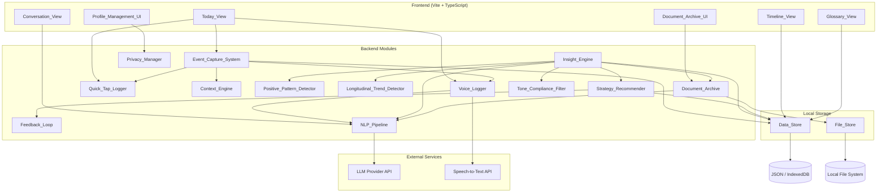
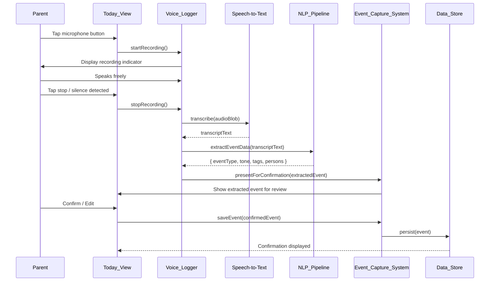
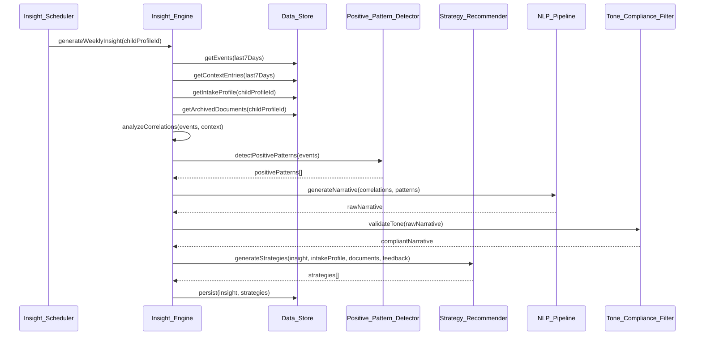
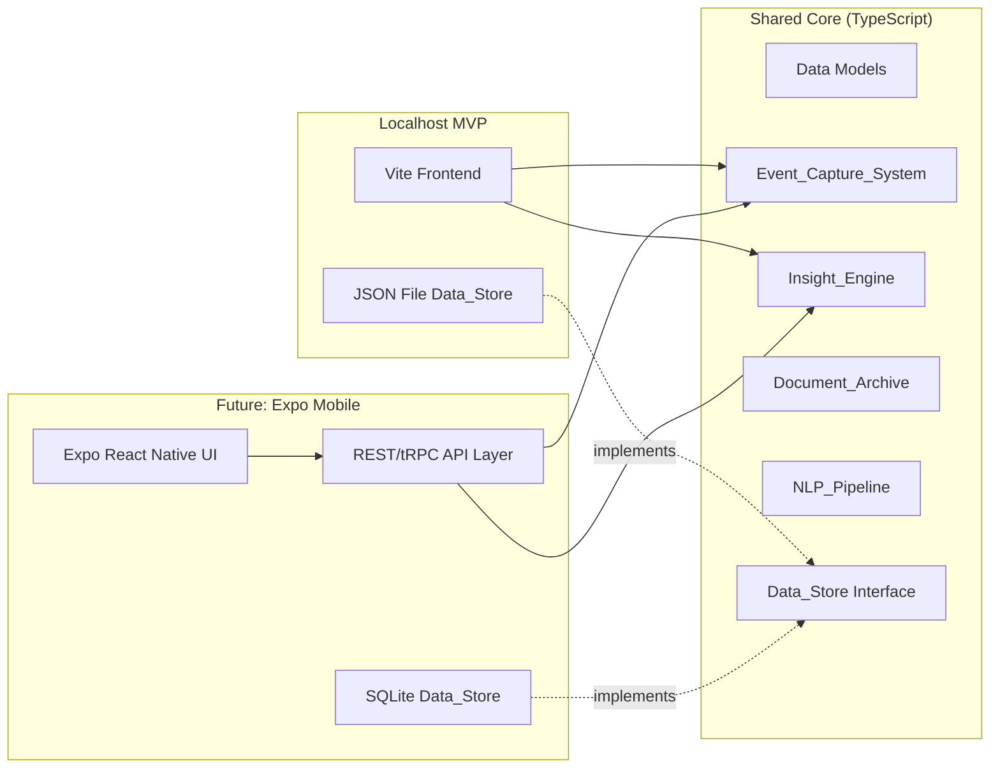

# Technical Design Document — Attune MVP

## Overview

Attune is a local-first, insight-driven caregiving assistant for parents of neurodivergent children. The MVP delivers voice-first and quick-tap event logging, a timeline and today view, weekly and longitudinal insight generation with positive pattern detection, strategy recommendations with a feedback loop, a document archive with cross-document synthesis, a conversational natural language interface, and an in-app neurodiversity glossary. All outputs use neuro-affirming language with explainability signals.

The application starts as a localhost prototype built with TypeScript, Vite, and a modular backend. The architecture separates event ingestion, insight generation, LLM orchestration, and data persistence into independent modules with clean interfaces, enabling future migration to Expo mobile with a shared backend API.

Key architectural decisions:
- Local-first storage (JSON files or IndexedDB) — no external server required for MVP
- LLM orchestration layer abstracts AI provider (OpenAI, Anthropic, local models) behind a unified interface
- NLP pipeline handles voice transcription, tag extraction, insight narrative generation, and multi-turn dialogue
- Modular design: each subsystem (Event_Capture, Insight_Engine, Document_Archive, NLP_Pipeline) is independently testable
- All generated text passes through a tone compliance filter before display

## Architecture

### High-Level System Diagram



### Data Flow — Voice Event Logging



### Data Flow — Weekly Insight Generation



### Modular Backend for Future Mobile Migration



The shared core modules are pure TypeScript with no UI framework dependencies. The Data_Store is accessed through an interface, allowing the MVP to use JSON file storage while mobile uses SQLite. The frontend is a thin presentation layer.

## Components and Interfaces

### Event_Capture_System

```typescript
interface EventCaptureSystem {
  createEvent(input: EventInput): Event
  saveEvent(event: Event): void
  getEvents(filter: EventFilter): Event[]
  deleteEvent(eventId: string): void
}

interface EventInput {
  childProfileId: string
  eventType: EventType
  timestamp?: Date              // defaults to now
  severity?: number             // 1-5
  tags?: string[]
  notes?: string
  persons?: string[]
  source: 'voice' | 'quick-tap' | 'manual'
  transcript?: string           // voice source only
}

interface EventFilter {
  childProfileId: string
  eventTypes?: EventType[]
  tags?: string[]
  persons?: string[]
  dateRange?: { start: Date; end: Date }
  limit?: number
  offset?: number
}
```

### Voice_Logger

```typescript
interface VoiceLogger {
  startRecording(): void
  stopRecording(): Promise<VoiceTranscriptionResult>
  isRecording(): boolean
}

interface VoiceTranscriptionResult {
  transcript: string
  extractedEvent: ExtractedEventData
}

interface ExtractedEventData {
  eventType: EventType | null       // null if undetermined
  emotionalTone: string
  tags: string[]
  persons: string[]
}
```

### Quick_Tap_Logger

```typescript
interface QuickTapLogger {
  getButtons(childProfileId: string): QuickTapButton[]
  logQuickTap(childProfileId: string, buttonType: QuickTapEventType): Event
  customizeButtons(childProfileId: string, buttons: QuickTapButton[]): void
}

interface QuickTapButton {
  id: string
  eventType: QuickTapEventType
  label: string
  order: number
}

type QuickTapEventType =
  | 'meltdown' | 'shutdown' | 'conflict' | 'school_incident'
  | 'great_day' | 'good_sleep' | 'poor_sleep' | 'medication_given'
```

### Context_Engine

```typescript
interface ContextEngine {
  createContextEntry(input: ContextEntryInput): ContextEntry
  getActiveContextEntries(childProfileId: string): ContextEntry[]
  endContextEntry(entryId: string): void
  getContextEntries(filter: ContextFilter): ContextEntry[]
}

interface ContextEntryInput {
  childProfileId: string
  contextType: ContextType
  subType: string                   // e.g., 'travel', 'illness', 'visitors'
  person?: { name: string; role: string }
  startTime?: Date                  // defaults to now
  endTime?: Date                    // null = ongoing
  notes?: string
}

type ContextType = 'routine_disruption' | 'relationship_interaction' | 'parent_state'
```

### Insight_Engine

```typescript
interface InsightEngine {
  generateWeeklyInsight(childProfileId: string): Insight | null
  generateLongitudinalInsight(childProfileId: string): Insight | null
  detectPositivePatterns(childProfileId: string): Insight | null
  generateDocumentSynthesis(childProfileId: string): Insight | null
  answerQuery(session: ConversationSession, query: string): ConversationResponse
}

interface ConversationResponse {
  narrative: string
  supportingDataRefs: DataReference[]
  followUpSuggestions?: string[]
}

interface DataReference {
  type: 'event' | 'context_entry' | 'insight' | 'document'
  id: string
  summary: string
}
```

### Strategy_Recommender

```typescript
interface StrategyRecommender {
  generateStrategies(
    insight: Insight,
    intakeProfile: IntakeProfile | null,
    documents: ArchivedDocument[],
    feedbackHistory: StrategyFeedback[]
  ): Strategy[]

  recordFeedback(strategyId: string, feedback: 'helped' | 'didnt_help'): void
  changeFeedback(strategyId: string, newFeedback: 'helped' | 'didnt_help'): void
}

interface StrategyFeedback {
  strategyId: string
  feedback: 'helped' | 'didnt_help'
  timestamp: Date
}
```

### Document_Archive

```typescript
interface DocumentArchive {
  uploadDocument(file: File, metadata: DocumentMetadata, childProfileId: string): ArchivedDocument
  getDocuments(childProfileId: string, filter?: DocumentFilter): ArchivedDocument[]
  deleteDocument(documentId: string): void
  getExtractedText(documentId: string): string | null
}

interface DocumentMetadata {
  documentType: DocumentType
  sourceProvider?: string
  documentDate?: Date
}

type DocumentType = 'evaluation' | 'iep' | 'provider_report' | 'therapy_notes' | 'medical_record' | 'other'

interface DocumentFilter {
  documentType?: DocumentType
  sortBy?: 'date' | 'upload_date'
  sortOrder?: 'asc' | 'desc'
}
```

### NLP_Pipeline

```typescript
interface NLPPipeline {
  transcribeAudio(audio: Blob): Promise<string>
  extractEventData(transcript: string): Promise<ExtractedEventData>
  generateInsightNarrative(correlations: Correlation[], patterns: Pattern[]): Promise<string>
  generateStrategies(context: StrategyGenerationContext): Promise<string[]>
  interpretQuery(query: string, conversationHistory: ConversationTurn[]): Promise<QueryIntent>
  generateConversationalResponse(intent: QueryIntent, data: RelevantData): Promise<string>
  extractDocumentText(file: File): Promise<string | null>
}

interface QueryIntent {
  eventTypes: EventType[]
  timeRange: { start: Date; end: Date }
  dimensions: string[]
  followUpContext?: string        // resolved references from conversation history
}
```

### Privacy_Manager

```typescript
interface PrivacyManager {
  applyAlias(content: string, childProfile: ChildProfile): string
  stripPII(content: string, persons: Person[]): string
  exportWithPrivacy(data: ExportableData, options: PrivacyOptions): ExportableData
}

interface PrivacyOptions {
  useAlias: boolean
  stripPersonNames: boolean
}
```

### Tone_Compliance_Filter

```typescript
interface ToneComplianceFilter {
  validate(text: string): ToneValidationResult
  reframe(text: string): string
}

interface ToneValidationResult {
  compliant: boolean
  violations: ToneViolation[]
}

interface ToneViolation {
  term: string
  suggestion: string
  position: number
}
```

### Conversation_Session Manager

```typescript
interface ConversationSessionManager {
  startSession(childProfileId: string): ConversationSession
  getActiveSession(childProfileId: string): ConversationSession | null
  addTurn(sessionId: string, turn: ConversationTurn): void
  clearSession(sessionId: string): void
  getRecentQueries(childProfileId: string, limit: number): ConversationTurn[]
}

interface ConversationSession {
  id: string
  childProfileId: string
  turns: ConversationTurn[]
  createdAt: Date
  lastActivityAt: Date
}

interface ConversationTurn {
  role: 'parent' | 'assistant'
  content: string
  timestamp: Date
  dataRefs?: DataReference[]
}
```

### Data_Store

```typescript
interface DataStore {
  // Child Profiles
  createChildProfile(profile: ChildProfileInput): ChildProfile
  getChildProfile(id: string): ChildProfile | null
  updateChildProfile(id: string, updates: Partial<ChildProfileInput>): ChildProfile
  deleteChildProfile(id: string): void
  listChildProfiles(): ChildProfile[]

  // Events
  saveEvent(event: Event): void
  getEvent(id: string): Event | null
  getEvents(filter: EventFilter): Event[]
  deleteEvent(id: string): void

  // Context Entries
  saveContextEntry(entry: ContextEntry): void
  getContextEntries(filter: ContextFilter): ContextEntry[]
  endContextEntry(id: string, endTime: Date): void

  // Insights
  saveInsight(insight: Insight): void
  getInsights(childProfileId: string, filter?: InsightFilter): Insight[]

  // Strategies
  saveStrategy(strategy: Strategy): void
  getStrategies(insightId: string): Strategy[]
  updateStrategyFeedback(strategyId: string, feedback: StrategyFeedbackUpdate): void
  getStrategyFeedbackHistory(childProfileId: string): StrategyFeedback[]

  // Documents
  saveArchivedDocument(doc: ArchivedDocument): void
  getArchivedDocuments(childProfileId: string, filter?: DocumentFilter): ArchivedDocument[]
  deleteArchivedDocument(id: string): void

  // Conversations
  saveConversationSession(session: ConversationSession): void
  getConversationSession(id: string): ConversationSession | null
  getRecentConversationTurns(childProfileId: string, limit: number): ConversationTurn[]

  // Glossary
  getGlossaryTerms(category?: string): GlossaryTerm[]
  getGlossaryTerm(term: string): GlossaryTerm | null

  // Quick Tap Config
  getQuickTapButtons(childProfileId: string): QuickTapButton[]
  saveQuickTapButtons(childProfileId: string, buttons: QuickTapButton[]): void

  // Serialization
  serializeEvent(event: Event): string
  deserializeEvent(json: string): Event
  serializeInsight(insight: Insight): string
  deserializeInsight(json: string): Insight
  serializeStrategy(strategy: Strategy): string
  deserializeStrategy(json: string): Strategy
  serializeArchivedDocumentMeta(doc: ArchivedDocument): string
  deserializeArchivedDocumentMeta(json: string): ArchivedDocument
}
```

## Data Models

### Core Entities

```typescript
interface ChildProfile {
  id: string                          // UUID
  displayName: string
  alias?: string
  age: number
  diagnosis?: string
  intakeProfile?: IntakeProfile
  createdAt: Date
  updatedAt: Date
}

interface IntakeProfile {
  biographical: {
    grade?: string
    householdComposition?: string
  }
  diagnosis?: string
  traits: string[]
  strengths: string[]
  struggles: string[]
  sensoryPreferences: {
    sensitivities: string[]
    seekingBehaviors: string[]
  }
  communicationStyle: {
    type: 'verbal' | 'limited_verbal' | 'aac_user'
    preferredPatterns: string[]
  }
}

// Event types
type EventType = WellBeingEventType | BehavioralEventType

type WellBeingEventType =
  | 'mood' | 'sleep' | 'diet' | 'screen_time'
  | 'physical_wellness' | 'medication'

type BehavioralEventType =
  | 'meltdown' | 'shutdown' | 'conflict'
  | 'school_incident' | 'positive_behavior'

interface Event {
  id: string                          // UUID
  childProfileId: string
  eventType: EventType
  timestamp: Date
  severity?: number                   // 1-5
  tags: string[]
  notes?: string
  persons: string[]
  source: 'voice' | 'quick-tap' | 'manual'
  transcript?: string                 // voice events only
  contextEntryRefs: string[]          // IDs of active context entries at event time
  createdAt: Date
}

interface ContextEntry {
  id: string                          // UUID
  childProfileId: string
  contextType: ContextType
  subType: string
  person?: { name: string; role: string }
  startTime: Date
  endTime?: Date                      // null = ongoing
  notes?: string
  createdAt: Date
}

interface Insight {
  id: string                          // UUID
  childProfileId: string
  type: 'weekly' | 'positive_pattern' | 'longitudinal_trend' | 'document_synthesis'
  narrative: string
  supportingSignals: SupportingSignal[]
  confidenceScore: 'low' | 'medium' | 'high'
  explainabilityStatement: string
  timeSpan?: { start: Date; end: Date }
  communicationScripts?: CommunicationScript[]
  strategyIds: string[]
  createdAt: Date
}

interface SupportingSignal {
  description: string
  observationCount: number
  contributingFactors: string[]
}

interface CommunicationScript {
  topic: string
  script: string
  context: string
}

interface Strategy {
  id: string                          // UUID
  childProfileId: string
  insightId: string
  description: string
  sourceDocumentRef?: string          // ID of archived document if strategy references one
  effectiveness: {
    helpedCount: number
    didntHelpCount: number
  }
  createdAt: Date
}

interface ArchivedDocument {
  id: string                          // UUID
  childProfileId: string
  documentType: DocumentType
  sourceProvider?: string
  documentDate?: Date
  fileReference: string               // path to stored file
  extractedText?: string              // null if extraction failed
  extractionFailed: boolean
  uploadedAt: Date
}

interface Person {
  name: string
  role: string                        // 'sibling', 'teacher', 'therapist', etc.
}

interface GlossaryTerm {
  term: string
  definition: string
  category: GlossaryCategory
}

type GlossaryCategory =
  | 'general_concepts' | 'autism_related' | 'adhd_related'
  | 'school_and_services' | 'sensory'
```

### LLM Orchestration Layer

```typescript
interface LLMProvider {
  complete(prompt: string, options?: LLMOptions): Promise<string>
  completeWithSchema<T>(prompt: string, schema: JSONSchema, options?: LLMOptions): Promise<T>
}

interface LLMOptions {
  temperature?: number
  maxTokens?: number
  systemPrompt?: string
}

// Concrete implementations swap behind this interface:
// - OpenAIProvider
// - AnthropicProvider
// - LocalModelProvider (for offline/testing)
```


## Correctness Properties

*A property is a characteristic or behavior that should hold true across all valid executions of a system — essentially, a formal statement about what the system should do. Properties serve as the bridge between human-readable specifications and machine-verifiable correctness guarantees.*

### Property 1: Child Profile persistence round-trip

*For any* valid Child_Profile input (display name, age, optional diagnosis, optional alias, optional IntakeProfile with any subset of fields populated), creating the profile through the Data_Store and retrieving it by ID should produce an equivalent object with all provided fields intact and a unique non-empty ID assigned.

**Validates: Requirements 1.1, 1.3, 1.5, 1.6**

### Property 2: Child Profile update persistence

*For any* existing Child_Profile and any valid field update (display name, alias, age, diagnosis, or any IntakeProfile field), applying the update and retrieving the profile should reflect the new value while preserving all unchanged fields.

**Validates: Requirements 1.7**

### Property 3: Alias replacement in exported content

*For any* Child_Profile with an alias set and any text content containing the child's display name, applying the Privacy_Manager's alias replacement should replace all occurrences of the display name with the alias and contain zero occurrences of the original display name.

**Validates: Requirements 1.2, 14.1**

### Property 4: Cascading profile deletion

*For any* Child_Profile with associated Events, Context_Entries, Insights, Strategies, Archived_Documents, and Conversation_Sessions, deleting the profile should result in zero retrievable records of any associated type for that profile ID.

**Validates: Requirements 1.8, 14.4**

### Property 5: Profile data isolation

*For any* two Child_Profiles and any Event logged under one profile, querying Events filtered to the other profile should never return that Event.

**Validates: Requirements 1.9**

### Property 6: Voice event timestamp assignment

*For any* voice-logged Event, the Event's timestamp should be set at recording start time, and the Event's transcript field should contain the original transcription text.

**Validates: Requirements 2.5, 2.7**

### Property 7: Quick-tap event creation

*For any* Quick_Tap button type, logging a quick-tap event should create a persisted Event with the corresponding event type, a timestamp within 1 second of the current time, and the source set to 'quick-tap'.

**Validates: Requirements 3.2, 3.4**

### Property 8: Quick-tap button customization persistence

*For any* customization of quick-tap buttons (adding, removing, or reordering), saving the configuration and retrieving it should produce the same set of buttons in the same order.

**Validates: Requirements 3.5**

### Property 9: Manual event minimum fields

*For any* Event with only an event type specified (all other fields empty or at defaults), saving should succeed. For any Event input without an event type, saving should be rejected.

**Validates: Requirements 4.2**

### Property 10: Tag suggestion relevance

*For any* Child_Profile with previously tagged Events, the tag suggestions returned should be a subset of tags previously used for that profile.

**Validates: Requirements 4.3**

### Property 11: Context entry lifecycle

*For any* Context_Entry created with no end time, it should appear in the active entries query. After ending the entry (setting end time), it should no longer appear in the active entries query but should still be retrievable in the full history.

**Validates: Requirements 5.2, 5.3, 5.4, 5.5**

### Property 12: Today summary event grouping

*For any* set of Events on a given day for a Child_Profile, the Today_View summary should produce groups where the sum of all group counts equals the total number of events, and each group's event type matches all events in that group.

**Validates: Requirements 6.1**

### Property 13: Timeline reverse chronological ordering

*For any* set of Events for a Child_Profile, the Timeline_View query should return them in strictly non-increasing timestamp order.

**Validates: Requirements 7.1**

### Property 14: Timeline filtering correctness

*For any* filter combination (event types, tags, persons, date range) applied to a set of Events, every returned Event should match all specified filter criteria, and no Event matching all criteria should be excluded.

**Validates: Requirements 7.3**

### Property 15: Event detail includes active context

*For any* Event and the set of Context_Entries active at the Event's timestamp (start time <= event timestamp AND (end time is null OR end time >= event timestamp)), the Event detail view should include exactly those Context_Entries.

**Validates: Requirements 7.4**

### Property 16: Pagination batch size

*For any* query with a limit of 20 and an offset, the returned batch should contain at most 20 Events, and sequential batches should cover all Events without gaps or duplicates.

**Validates: Requirements 7.6**

### Property 17: Weekly insight generation threshold

*For any* Child_Profile, if fewer than 3 Events exist in the current 7-day period, no weekly Insight should be generated. If 3 or more Events exist and at least 7 days of data history exist, a weekly Insight should be generated.

**Validates: Requirements 8.1, 8.6**

### Property 18: Insight structure completeness

*For any* generated Insight, it should contain: a non-empty narrative, at least one SupportingSignal with observationCount > 0 and non-empty contributingFactors, a valid confidenceScore ('low', 'medium', or 'high'), and a non-empty explainabilityStatement.

**Validates: Requirements 8.3, 8.4, 8.5**

### Property 19: Positive pattern detection threshold

*For any* 14-day window of Events, if 3 or more days qualify as "good days" (having positive_behavior events and no meltdown, shutdown, or conflict events) and share at least one common condition, a positive pattern Insight should be generated. If fewer than 3 good days exist, no positive pattern Insight should be generated.

**Validates: Requirements 9.1, 9.2**

### Property 20: Strategy count per insight

*For any* generated Insight, the number of linked Strategy recommendations should be between 2 and 3 inclusive.

**Validates: Requirements 10.1**

### Property 21: Strategy feedback correctness

*For any* Strategy, recording "helped" feedback should increment helpedCount by exactly 1 without changing didntHelpCount. Recording "didnt_help" should increment didntHelpCount by exactly 1 without changing helpedCount. Changing feedback from "helped" to "didnt_help" should decrement helpedCount by 1 and increment didntHelpCount by 1 (and vice versa).

**Validates: Requirements 11.2, 11.3, 11.4**

### Property 22: Event serialization round-trip

*For any* valid Event object (including all field combinations: with/without severity, with/without tags, with/without persons, with/without transcript, with/without contextEntryRefs), serializing to JSON and deserializing back should produce an equivalent Event object.

**Validates: Requirements 12.1, 12.2, 12.3**

### Property 23: Insight serialization round-trip

*For any* valid Insight object (including all type variants, with/without communicationScripts, with/without timeSpan), serializing to JSON and deserializing back should produce an equivalent Insight object.

**Validates: Requirements 13.1, 13.3**

### Property 24: Strategy serialization round-trip

*For any* valid Strategy object (including with/without sourceDocumentRef, various effectiveness scores), serializing to JSON and deserializing back should produce an equivalent Strategy object.

**Validates: Requirements 13.2, 13.4**

### Property 25: Archived_Document metadata serialization round-trip

*For any* valid ArchivedDocument metadata object (including with/without sourceProvider, with/without documentDate, with/without extractedText), serializing to JSON and deserializing back should produce an equivalent ArchivedDocument metadata object.

**Validates: Requirements 20.1, 20.2, 20.3**

### Property 26: Malformed JSON resilience

*For any* array of JSON records where some are valid and some are malformed (missing required fields, wrong types, corrupted structure), batch deserialization should return all valid records and skip all malformed records without throwing.

**Validates: Requirements 12.4, 13.5, 20.4**

### Property 27: PII stripping completeness

*For any* text content and a set of Persons with names and roles, applying PII stripping should result in zero occurrences of any Person name in the output, with each name replaced by its corresponding role label.

**Validates: Requirements 14.2**

### Property 28: Tone compliance filter — clinical term exclusion

*For any* text passed through the Tone_Compliance_Filter, the output should contain zero occurrences of terms from the clinical blocklist (e.g., "deficit", "disorder symptoms", "non-compliant", "bad behavior", "acting out").

**Validates: Requirements 15.2, 15.3, 10.3, 17.7**

### Property 29: Conversation session lifecycle

*For any* Conversation_Session with N turns added, retrieving the session should return all N turns in order. Starting a new session should produce a session with zero turns. The "recent queries" function should return at most the specified limit of turns.

**Validates: Requirements 16.6, 16.7, 16.9**

### Property 30: Conversation response structure

*For any* conversational response generated by the Insight_Engine, it should contain a non-empty narrative string.

**Validates: Requirements 16.4**

### Property 31: Document archive filtering and sorting

*For any* set of Archived_Documents for a Child_Profile, filtering by document type should return only documents of that type, and sorting by date should return them in the specified order (ascending or descending).

**Validates: Requirements 17.4**

### Property 32: Document deletion removes all data

*For any* Archived_Document, deleting it should result in the document being unretrievable by ID and absent from list queries.

**Validates: Requirements 17.8**

### Property 33: Glossary category filtering

*For any* glossary category query, all returned GlossaryTerms should belong to the specified category, and no term of that category should be excluded.

**Validates: Requirements 18.5**

### Property 34: Glossary term linking in text

*For any* text containing a term that exists in the Neurodiversity_Glossary, the term-linking function should identify and mark all occurrences of glossary terms in the text.

**Validates: Requirements 18.4**

### Property 35: Longitudinal insight threshold and structure

*For any* Child_Profile with fewer than 30 days of Event data, no longitudinal trend Insight should be generated. For profiles with 30+ days, any generated longitudinal Insight should have type 'longitudinal_trend' and a non-null timeSpan.

**Validates: Requirements 19.1, 19.3, 19.5**

### Property 36: Communication scripts in longitudinal insights

*For any* longitudinal trend Insight about a sensitive recurring topic, the Insight should include at least one CommunicationScript with non-empty topic, script, and context fields.

**Validates: Requirements 19.4**

## Error Handling

### Deserialization Errors

- Malformed JSON records are skipped with a warning logged; remaining valid records continue loading
- Missing required fields in JSON cause the record to be treated as malformed
- Type mismatches (e.g., string where number expected) cause the record to be treated as malformed

### Voice Logger Errors

- If speech-to-text fails, display an error message and offer manual entry as fallback
- If NLP extraction fails, present the raw transcript and ask the Parent to manually classify the event
- If audio capture permission is denied, display a clear message explaining how to grant permission

### Document Archive Errors

- If text extraction fails for an uploaded file, store the file with `extractionFailed: true`, warn the Parent, and exclude from synthesis
- Unsupported file formats are rejected at upload time with a clear error message

### LLM Provider Errors

- If the LLM provider is unavailable, queue insight generation for retry and display a message that insights will be available shortly
- If the LLM returns an empty or malformed response, retry once; if still failing, log the error and skip the generation cycle
- Rate limiting: implement exponential backoff with a maximum of 3 retries

### Data Store Errors

- If local storage is full, display a warning and suggest archiving or deleting old data
- If a write operation fails, display an error and do not update the UI optimistically

### Privacy Manager Errors

- If alias replacement encounters an edge case (alias is empty string), fall back to the display name
- If PII stripping encounters an unknown person (no role assigned), replace with generic "Person" label

## Testing Strategy

### Dual Testing Approach

The application uses both unit tests and property-based tests for comprehensive coverage:

- **Unit tests** (Vitest): Verify specific examples, edge cases, integration points, and error conditions
- **Property-based tests** (fast-check + Vitest): Verify universal properties across randomized inputs

### Property-Based Testing Configuration

- **Library**: fast-check (already used in the running-app project)
- **Runner**: Vitest with `--run` flag for CI
- **Minimum iterations**: 100 per property test
- **Tag format**: Each property test includes a comment: `// Feature: attune-mvp, Property {N}: {title}`

### Test Organization

```
tests/
├── unit/
│   ├── event-capture.test.ts
│   ├── context-engine.test.ts
│   ├── insight-engine.test.ts
│   ├── strategy-recommender.test.ts
│   ├── document-archive.test.ts
│   ├── privacy-manager.test.ts
│   ├── tone-compliance.test.ts
│   ├── conversation-session.test.ts
│   └── glossary.test.ts
├── property/
│   ├── serialization.property.test.ts      // Properties 22-26
│   ├── child-profile.property.test.ts      // Properties 1-5
│   ├── event-capture.property.test.ts      // Properties 6-10, 12
│   ├── context-engine.property.test.ts     // Property 11
│   ├── timeline.property.test.ts           // Properties 13-16
│   ├── insight-engine.property.test.ts     // Properties 17-20, 35-36
│   ├── strategy-feedback.property.test.ts  // Property 21
│   ├── privacy.property.test.ts            // Properties 3, 27-28
│   ├── conversation.property.test.ts       // Properties 29-30
│   ├── document-archive.property.test.ts   // Properties 31-32
│   └── glossary.property.test.ts           // Properties 33-34
└── generators/
    ├── child-profile.gen.ts
    ├── event.gen.ts
    ├── context-entry.gen.ts
    ├── insight.gen.ts
    ├── strategy.gen.ts
    ├── archived-document.gen.ts
    ├── conversation.gen.ts
    └── glossary.gen.ts
```

### Unit Test Focus Areas

- Specific examples demonstrating correct behavior for each event source (voice, quick-tap, manual)
- Integration between Insight_Engine and Data_Store (correct data retrieval for analysis)
- Edge cases: empty profiles, zero events, malformed JSON, extraction failures
- Error conditions: LLM unavailability, storage full, permission denied
- Tone compliance filter with known clinical terms

### Property Test Focus Areas

- Serialization round-trips for all entity types (Events, Insights, Strategies, Documents)
- Data isolation between child profiles
- Filter correctness (timeline, documents, glossary)
- Feedback mechanism arithmetic
- Threshold-based behavior (weekly insight at 7 days/3 events, longitudinal at 30 days, positive pattern at 3 days)
- Privacy transformations (alias replacement, PII stripping)

### Each property test MUST:
1. Reference its design document property number
2. Run a minimum of 100 iterations
3. Use generators from the `tests/generators/` directory
4. Be tagged with: `// Feature: attune-mvp, Property {N}: {title}`
