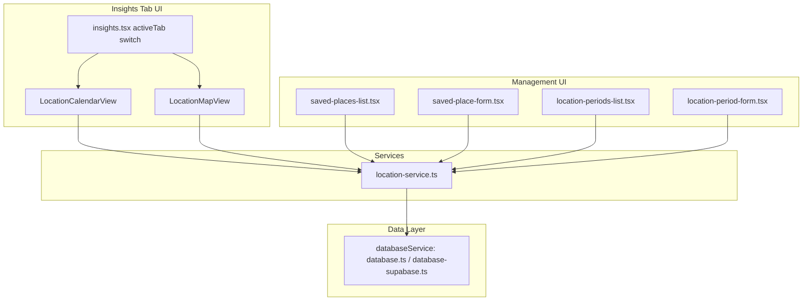

# Design Document: Family Location Tracking

## Overview

Family Location Tracking adds two new data models — `SavedPlace` and `LocationPeriod` — and two new Insights sub-views on top of them: a `LocationCalendar` (a month grid, matching the existing `WeatherView`/`HeatMapView` pattern) and a `LocationMap` (a static, non-interactive pin layout, no live map tiles). Both read the same derived per-day data: for each calendar day, which `SavedPlace` each `HouseholdMember` (the child, Mom, Dad) was at, and whether the child was co-located with each parent.

This follows the app's existing conventions rather than introducing new ones:
- New models under `mobile/models/`, following the `Behavior`/`Reward` shape (flat interfaces, `Input` variants for creation).
- New tables added to both `mobile/services/database.ts` (SQLite) and `mobile/services/database-supabase.ts` (Supabase), following the existing dual-implementation pattern every other entity uses.
- New views live in `mobile/components/`, added as a 5th tab inside `app/(tabs)/insights.tsx`'s existing `activeTab` switch, alongside `WeatherView`/`HeatMapView`/`DiaryView`/`EventsView`.
- Entry/management screens follow the existing "Manage" screen pattern (e.g. `behaviors-list.tsx`, `rewards-list.tsx`) rather than being crammed into the calendar view itself.
- Dates are stored as `'YYYY-MM-DD'` local-date strings, per `mobile/utils/local-date.ts` and `.kiro/specs/timezone-safe-dates/`, not recomputed from a `Date`/timestamp at query time.

No new npm dependencies are required for the Location Map — see "Location Map rendering" below for why a real map library is unnecessary for a static, non-interactive pin layout.

## Architecture



**Data flow:**
1. A Parent creates `SavedPlace` records (Home - Seattle, Grandma's House, ...) via `saved-place-form.tsx`, and designates one per `HouseholdMember` as that member's `Home_Place`.
2. A Parent creates `LocationPeriod` records (household member + saved place + start/end date) via `location-period-form.tsx`, including backfilled past ranges.
3. `location-service.ts` exposes a single `getDailyLocations(childProfileId, dateRange)` function that both `LocationCalendarView` and `LocationMapView` call — it resolves, for every day in range and every `HouseholdMember`, which `SavedPlace` applies (an overlapping `LocationPeriod`, or the member's `Home_Place` if none), and derives co-location. Centralizing this resolution logic in one service function (rather than duplicating it in both views, the way `computeAutoMoodFromEvents` is currently duplicated between `WeatherView` and `HeatMapView`) avoids repeating the same "which period wins" and "what happens with no Home_Place" logic in two places.
4. `LocationCalendarView` renders that data as a month grid; `LocationMapView` aggregates the same data by `SavedPlace` to size pins.

## Components and Interfaces

### 1. Models

**`mobile/models/saved-place.ts`**

```typescript
export type PlaceType = 'home' | 'family_visit' | 'vacation' | 'camp_or_school_trip' | 'other';

export interface SavedPlace {
  id: string;
  childProfileId: string;
  name: string;
  placeType: PlaceType;
  /**
   * Optional city/region text used to derive a static representative
   * coordinate for the Location Map (see "Location Map rendering"
   * below) - NOT used for anything requiring live geocoding accuracy.
   */
  regionHint?: string;
  latitude?: number;
  longitude?: number;
  createdAt: Date;
  updatedAt: Date;
}

export interface SavedPlaceInput {
  childProfileId: string;
  name: string;
  placeType: PlaceType;
  regionHint?: string;
}
```

**`mobile/models/location-period.ts`**

```typescript
export type HouseholdMember = 'child' | 'mom' | 'dad';

export interface LocationPeriod {
  id: string;
  childProfileId: string;
  householdMember: HouseholdMember;
  savedPlaceId: string;
  /** 'YYYY-MM-DD', see utils/local-date.ts */
  startDate: string;
  /** 'YYYY-MM-DD', or undefined/null if ongoing */
  endDate?: string;
  createdAt: Date;
  updatedAt: Date;
}

export interface LocationPeriodInput {
  childProfileId: string;
  householdMember: HouseholdMember;
  savedPlaceId: string;
  startDate: string;
  endDate?: string;
}
```

**`HomePlace` designation** is stored as a field on the profile-level settings rather than a new table — see "Home Place storage" below for the two options considered.

### 2. Home Place storage

Two options were considered for recording which `SavedPlace` is each `HouseholdMember`'s home:

- **Option A (chosen): a `home_place_id` column per household member**, stored as three nullable foreign-key columns on a new small `household_location_settings` table (one row per `childProfileId`): `child_home_place_id`, `mom_home_place_id`, `dad_home_place_id`. This matches Requirement 9.4's constraint (fixed to exactly 3 household members) and keeps the "is this place anyone's home" check (Requirement 1.5/1.6) a simple 3-column lookup instead of a query across a generic table.
- **Option B (rejected): a `isHomePlace: boolean` flag directly on `SavedPlace`**, one per household member via a `homePlaceFor: HouseholdMember[]` array field. Rejected because enforcing "exactly one Home_Place per household member" (Requirement 1.4) is harder to guarantee with a flag scattered across many rows than with three dedicated nullable columns on one settings row — Option A gets that invariant "for free" from the column being singular, not a list.

### 3. `location-service.ts`

```typescript
export interface DailyLocationEntry {
  householdMember: HouseholdMember;
  savedPlace: SavedPlace | null; // null only if no Home_Place and no covering period (Req 2.9)
  isHomePlace: boolean; // true if this day resolved via the Home_Place default, not an explicit period
}

export interface DailyLocations {
  dateKey: string; // 'YYYY-MM-DD'
  entries: DailyLocationEntry[]; // one per HouseholdMember (child, mom, dad)
  /** true if the child's savedPlace this day differs from the child's Home_Place (Req 3.5) */
  isTransitionDay: boolean;
  /** which household members are NOT at the same SavedPlace as the child this day */
  separatedFrom: HouseholdMember[];
}

export async function getDailyLocations(
  childProfileId: string,
  dateRange: { start: string; end: string }, // 'YYYY-MM-DD'
): Promise<DailyLocations[]>;

export async function getPlaceVisitCounts(
  childProfileId: string,
): Promise<Map<string, { savedPlace: SavedPlace; dayCount: number }>>; // for the Location_Map, Req 4.3

export async function getOverlappingPeriods(
  childProfileId: string,
  householdMember: HouseholdMember,
  startDate: string,
  endDate: string | undefined,
  excludePeriodId?: string, // when editing an existing period
): Promise<LocationPeriod[]>; // for the overlap warning, Req 2.7
```

**Resolution algorithm for a single day + household member** (used by `getDailyLocations`):
1. Fetch all `LocationPeriod`s for this `childProfileId` + `householdMember` where `startDate <= day` AND (`endDate` is null OR `endDate >= day`).
2. If exactly one matches, use its `savedPlaceId`.
3. If more than one matches (an overlap that was warned about but saved anyway — Requirement 2.7 warns, it does not block), the most-recently-created `LocationPeriod` wins, consistent with "the latest edit reflects the parent's most current understanding."
4. If none match, fall back to that household member's designated Home_Place (Requirement 2.8); if no Home_Place is designated, `savedPlace` is `null` (Requirement 2.9) and the UI renders this cell/entry as "unknown," not silently as home.

### 4. `LocationCalendarView` (`mobile/components/LocationCalendarView.tsx`)

Same month-grid skeleton as `WeatherView`/`HeatMapView` (day-of-week header row, week rows, month nav, `currentMonth` state, `useFocusEffect` reload) — reusing that structure rather than inventing a new grid component, per the requirement that this view be "consistent with the existing Weather and Heat Map views' month navigation and layout" (Requirement 3.2).

Each day cell shows:
- A small icon/label for the child's resolved `SavedPlace` for that day (place-type icon, e.g. 🏠 for home, ✈️ for vacation, 👵 for family visit, 🏕️ for camp/school trip, 📍 for other).
- A visual marker (e.g. a colored dot or border) distinguishing "transition/away day" (`isTransitionDay: true`) from an ordinary home day (Requirement 3.5) — reusing the tint-overlay pattern `WeatherView` already uses for mood color, but keyed off `isTransitionDay` instead of mood.
- A small per-parent indicator (e.g. two tiny dots/icons for Mom/Dad) showing co-located vs. separated (Requirement 3.4) — this is the piece with no existing analog in `WeatherView`/`HeatMapView`, since neither of those views has any concept of a second/third tracked person.

Tapping a day opens a detail sheet (Requirement 3.6) listing each `HouseholdMember`'s `SavedPlace` and `placeType` for that day — a lightweight modal, not a navigation to another screen, consistent with `HeatMapView`'s existing tap-to-popover pattern for that day's event breakdown.

A "Manage Locations" link (Requirement 3.8) navigates to `saved-places-list.tsx`, mirroring the existing "Manage" link pattern in `RewardsTabScreen.tsx` that navigates to `behaviors-list.tsx`/`rewards-list.tsx`.

### 5. `LocationMapView` (`mobile/components/LocationMapView.tsx`)

**Rendering approach — no map library needed.** Since Requirement 4.2 explicitly rules out pan/zoom/live tiles, this is not a `react-native-maps` integration. Instead:
- Each `SavedPlace` with at least one day of usage (from `getPlaceVisitCounts`) is rendered as a labeled pin/card in a simple absolute-positioned or flex-wrapped layout — visually evoking a map (a light background illustration/gradient, pins scattered by rough relative position) without requiring real geographic projection math or a tile provider.
- **Placement**: if a `SavedPlace` has `latitude`/`longitude` (derived once at creation time from `regionHint` via a one-time geocoding lookup — see "Geocoding" below), its pin is positioned using a simple linear projection of lat/long onto the view's bounding box (min/max lat/long across all placed pins), which is sufficient for "relative position on a stylized map" without needing an actual Mercator projection or map tiles. If a `SavedPlace` has no coordinate, it's rendered in a distinct "Other places" list/section below the visual layout (Requirement 4.6) rather than positioned arbitrarily on the pseudo-map.
- **Pin sizing**: proportional to `dayCount` from `getPlaceVisitCounts`, e.g. `Math.max(MIN_PIN_SIZE, Math.min(MAX_PIN_SIZE, MIN_PIN_SIZE + dayCount * SCALE_FACTOR))` — same clamped-linear-scale approach as sizing patterns already used elsewhere in the app (e.g. `HeatMapView`'s `computeCellOpacity`).
- **Home Place distinction**: each `HouseholdMember`'s Home_Place pin renders with a distinct visual treatment (e.g. a house icon badge, different border color) per Requirement 4.4.
- Tapping a pin shows that place's day list (Requirement 4.5) — the same detail-sheet component used by `LocationCalendarView`'s day-tap (item 4 above), reused here filtered to one `SavedPlace` instead of one day, so the two views share one detail-rendering component instead of duplicating it.

**Geocoding.** `regionHint` (a free-text city/region string) is resolved to `latitude`/`longitude` once, when a `SavedPlace` is created or its `regionHint` is edited — not on every render, and not via a live/paid geocoding API tied to app usage. Options:
- Expo's `Location.geocodeAsync()` (already part of the Expo SDK family, no new native dependency, uses the OS's built-in geocoder) is the simplest fit given "no new dependency" and "not a live map" constraints, and only runs once per `SavedPlace` create/edit, not per view-render.
- If `geocodeAsync` fails or returns nothing (no network, ambiguous region text), `latitude`/`longitude` stay `undefined` and the place falls into the "Other places" fallback grouping (Requirement 1.7, Requirement 4.6) — this is treated as an expected, non-error outcome, not a failure state requiring retry logic.

### 6. Management screens

Following the existing `behaviors-list.tsx` / `behavior-form.tsx` pattern:

- `app/(rewards-forms)/...`-style route group is Rewards-specific; a new route group (e.g. `app/(location-forms)/`) holds:
  - `saved-places-list.tsx` — list of `SavedPlace`s for the active profile, with edit/delete, and a per-household-member "Home Place" picker (Requirement 1.4).
  - `saved-place-form.tsx` — create/edit a `SavedPlace` (name, placeType, optional regionHint).
  - `location-periods-list.tsx` — list of `LocationPeriod`s (grouped by household member or chronologically), with edit/delete/close-out-ongoing actions.
  - `location-period-form.tsx` — create/edit a `LocationPeriod` (household member picker, saved place picker, start date, end date or "ongoing" toggle), showing the overlap warning (Requirement 2.7) inline before save via `getOverlappingPeriods`.

### 7. Today Tab Location Indicator (`app/(tabs)/index.tsx`)

A small tappable indicator rendered near the top of the Today tab (below the date picker row, above the mood strip is the natural slot given the existing layout order in `index.tsx`), showing the child's resolved location for `selectedDate` (not always the real-world "today" - the Today tab already supports navigating to past dates via `CalendarDatePicker`, and this indicator must track that same selected date, per Requirement 7.7).

- **Data source**: calls `location-service.ts`'s `getDailyLocations(childProfileId, { start: selectedDateKey, end: selectedDateKey })` for the single selected day, reusing the exact same resolution logic the Location_Calendar uses - no separate "quick lookup" implementation. Since this is a single-day query on a screen that's not itself a month grid, a lightweight `getDailyLocationForDay(childProfileId, dateKey)` convenience wrapper around `getDailyLocations` (querying a one-day range and returning that single `DailyLocations` entry, or `undefined` if none) is added to `location-service.ts` for this call site, rather than making Today either duplicate the resolution algorithm or reach for the month-oriented batch function to answer a single-day question.
- **Privacy default (Requirement 7.2)**: the indicator renders `null` (nothing) unless the profile has at least one `SavedPlace` configured - checked via a lightweight `getSavedPlacesByProfile` count, not by inferring "no data" from a null `getDailyLocations` result (a profile could have a Home_Place designated but the specific selected day still resolve to `null` for some other reason - Requirement 7.6 handles that day-specific case separately from the profile-wide opt-in check in 7.2).
- **Display (Requirement 7.3, 7.4)**: always shows the child's resolved place for the day, including an ordinary Home_Place day (e.g. "Home 🏠") - not hidden on non-transition days. Uses the same Place_Type icon mapping as `LocationCalendarView` (🏠/✈️/👵/🏕️/📍), sourced from one shared helper function (e.g. `getPlaceTypeIcon(placeType: PlaceType): string` in `location-service.ts` or a small shared constants file) so the Calendar, Map, and Today indicator never drift into three separate icon-mapping copies of the same lookup.
- **Transition-day styling (Requirement 7.5)**: when `isTransitionDay` is true for the resolved day, the indicator renders with the same accent/away-day visual treatment `LocationCalendarView` uses for transition days (exact color/style TBD at implementation time, matching whatever `LocationCalendarView`'s own transition marker ends up being, rather than inventing a second visual language for the same concept).
- **Null-resolution handling (Requirement 7.6)**: if the day's entry for the child resolves `savedPlace: null` (no Home_Place, no covering period), the indicator renders nothing for that day, same as the no-data-at-all case in 7.2 - both are "don't show a location we don't actually have."
- **Tap action (Requirement 7.8)**: navigates to the Insights tab with the Location view pre-selected. Since `activeTab`/`locationSubView` state lives locally in `insights.tsx` (per item 4 below) rather than in a shared navigation param, this is implemented via a query param on the route (e.g. `router.push('/(tabs)/insights?view=location')`) that `insights.tsx` reads once on mount/focus to set its initial `activeTab`, mirroring how other cross-tab deep-links already work in this app (check `useLocalSearchParams` usage in `insights.tsx` if any exists already, otherwise this is a new but small addition to that screen).

### 8. Glossary Migration into Insights Tab

Glossary's existing screen (`app/(tabs)/glossary.tsx`) becomes a 6th view inside `insights.tsx`'s `activeTab` switch, alongside Weather/Heat Map/Diary/Events/Location, rather than its own bottom tab - reducing the tab bar from 8 entries to 7 (Today, Insights, Chat, Rewards, Circle, Docs, Profile).

- **Component extraction**: `glossary.tsx`'s body (category state, `loadTerms`/seeding logic, category pill row, term list/search) moves into a new `mobile/components/GlossaryView.tsx`, following the exact same "screen becomes a view component taking no navigation-specific props, rendered inside `insights.tsx`'s content area" pattern already used for `WeatherView`/`HeatMapView`/`DiaryView`/`EventsView`. `app/(tabs)/glossary.tsx` itself is deleted, not left as a redirect stub, per Requirement 8.3 (the tab bar entry is removed outright).
- **Nested pill row**: Glossary's existing category filter (`CATEGORIES` + the `ALL_CATEGORY` "All" pill) is preserved as-is inside `GlossaryView`, and only rendered while Insights' own top-level `activeTab === 'glossary'` - the exact same "top-level pill selects a view, that view's own nested pill row appears only while active" pattern the Location view's Calendar/Map toggle already introduces (item 4 below), so Insights ends up with two views (Location, Glossary) that both have a nested sub-selector, using one shared visual convention rather than two different ones invented independently.
- **No functional changes**: seeding behavior, search/filter logic, and term-detail navigation are moved, not rewritten - `GlossaryView` still calls `router.push` to the same term-detail route Glossary's screen already uses (confirm the target of that navigation still resolves correctly once triggered from within the Insights tab's route rather than the Glossary tab's route - `expo-router` routes by path, not by originating tab, so this should be a non-issue, but worth confirming on-device at the checkpoint for this task).
- **Tab bar removal**: `app/(tabs)/_layout.tsx`'s `<Tabs.Screen name="glossary" .../>` entry is removed (not hidden via `href: null`, since there's no reason to keep the route registered once nothing links to it directly).

## Data Models

### SavedPlace table

| Field | Type | Notes |
|---|---|---|
| id | TEXT PRIMARY KEY | UUID |
| child_profile_id | TEXT NOT NULL | |
| name | TEXT NOT NULL | |
| place_type | TEXT NOT NULL | one of PlaceType |
| region_hint | TEXT | nullable |
| latitude | REAL | nullable, derived from region_hint |
| longitude | REAL | nullable |
| created_at | INTEGER / TIMESTAMPTZ | epoch ms (SQLite) / native (Supabase), matching existing convention |
| updated_at | INTEGER / TIMESTAMPTZ | |

### LocationPeriod table

| Field | Type | Notes |
|---|---|---|
| id | TEXT PRIMARY KEY | UUID |
| child_profile_id | TEXT NOT NULL | |
| household_member | TEXT NOT NULL | 'child' \| 'mom' \| 'dad' |
| saved_place_id | TEXT NOT NULL | FK to saved_places.id |
| start_date | TEXT NOT NULL | 'YYYY-MM-DD' |
| end_date | TEXT | nullable = ongoing |
| created_at | INTEGER / TIMESTAMPTZ | |
| updated_at | INTEGER / TIMESTAMPTZ | |

### HouseholdLocationSettings table

| Field | Type | Notes |
|---|---|---|
| child_profile_id | TEXT PRIMARY KEY | one row per profile |
| child_home_place_id | TEXT | nullable FK to saved_places.id |
| mom_home_place_id | TEXT | nullable FK to saved_places.id |
| dad_home_place_id | TEXT | nullable FK to saved_places.id |

Both `database.ts` (SQLite, `CREATE TABLE IF NOT EXISTS`) and `database-supabase.ts` (Supabase client calls against equivalent Postgres tables, created via a migration in the `backend`/Supabase project) get matching methods: `createSavedPlace`, `getSavedPlacesByProfile`, `updateSavedPlace`, `deleteSavedPlace`, `createLocationPeriod`, `getLocationPeriodsByProfile`, `updateLocationPeriod`, `deleteLocationPeriod`, `getHouseholdLocationSettings`, `setHomePlaceId`, following the exact method-naming and row-mapping (`rowToSavedPlace`/`rowToLocationPeriod`) conventions already used for `Behavior`/`Reward`.

### Cascade deletion

When a `SavedPlace` is deleted (Requirement 1.5/1.6), any referencing `LocationPeriod`s and `HouseholdLocationSettings` home-place columns must be handled — since deletion is blocked-with-warning while references exist (Requirement 1.5) rather than a silent cascade, no automatic cascade delete is needed; the delete operation itself checks for references first and refuses (surfacing the warning) rather than deleting and orphaning data.

## Correctness Properties

*A property is a characteristic or behavior that should hold true across all valid executions of a system.* No property-based test framework (e.g. fast-check) is currently set up in this project (confirmed: no test runner exists in `mobile/package.json`) — these properties describe intended invariants to verify via manual testing or a future test setup, not a runnable property-test suite for this spec.

### Property 1: Every day resolves to exactly one outcome per household member

*For any* `childProfileId`, `HouseholdMember`, and calendar day, `getDailyLocations` SHALL resolve exactly one of: a single explicit `LocationPeriod`'s `SavedPlace`, the most-recently-created `LocationPeriod`'s `SavedPlace` (if multiple overlap), the member's `Home_Place`, or `null` (if no period and no Home_Place) — never more than one simultaneously, and never an error.

**Validates: Requirements 2.8, 2.9**

### Property 2: Home Place uniqueness per household member

*For any* `childProfileId`, at most one `SavedPlace` SHALL be designated as a given `HouseholdMember`'s Home_Place at any time — setting a new Home_Place for a member SHALL replace, not add to, that member's prior designation.

**Validates: Requirement 1.4**

### Property 3: Saved Place deletion is blocked while referenced

*For any* `SavedPlace` referenced by at least one `LocationPeriod` or designated as any `HouseholdMember`'s Home_Place, an attempted delete SHALL be refused with a warning rather than silently deleting and orphaning references.

**Validates: Requirements 1.5, 1.6**

### Property 4: Ongoing periods extend to "today"

*For any* `LocationPeriod` with no `endDate`, `getDailyLocations` for any day from `startDate` through the current date SHALL resolve to that period's `SavedPlace`, for every query made before the period is closed out with an `endDate`.

**Validates: Requirement 2.2**

### Property 5: Transition day flag matches Home Place divergence

*For any* calendar day where the child's resolved `SavedPlace` differs from the child's designated Home_Place, `DailyLocations.isTransitionDay` SHALL be `true`; for any day where they match (including via Home_Place fallback), it SHALL be `false`.

**Validates: Requirement 3.5**

### Property 6: Visit counts sum to total resolved days

*For any* `childProfileId` and date range, the sum of `dayCount` across all entries returned by `getPlaceVisitCounts` SHALL equal the number of days in range where the child's location resolved to a non-null `SavedPlace`.

**Validates: Requirement 4.3**

### Property 7: Places without coordinates are never silently dropped

*For any* `SavedPlace` with no `latitude`/`longitude` (geocoding never ran, or failed), `LocationMapView` SHALL render it in the fallback grouping — it SHALL NOT be omitted from the view entirely.

**Validates: Requirements 1.7, 4.6**

### Property 8: Serialization round-trip

*For any* valid `SavedPlace` or `LocationPeriod` object, serializing to the database row shape and back (via the existing `rowToX` mapping convention) SHALL produce an equivalent object with all fields preserved.

**Validates: Requirement 5.4**

## Error Handling

| Scenario | Handling |
|---|---|
| Create Location_Period with overlapping range for same household member | Warn inline in the form (via `getOverlappingPeriods`) before save; Parent may proceed anyway (Requirement 2.7 warns, does not block) |
| Delete Saved_Place referenced by Location_Periods or a Home_Place | Refuse deletion; show which references exist so the Parent can reassign/delete them first (Requirement 1.5) |
| Geocoding (`Location.geocodeAsync`) fails or returns no result | Save the `SavedPlace` anyway with `latitude`/`longitude` left `undefined`; Location_Map renders it in the "Other places" fallback group, not as an error |
| No Home_Place designated for a household member, and no covering Location_Period | `getDailyLocations` resolves `savedPlace: null` for that member/day; Location_Calendar renders that entry as "unknown," never defaulting to a guessed place |
| No Location_Period or Saved_Place data exists yet for a profile | Both views render their own empty state prompting setup, consistent with existing empty-state patterns (e.g. `EmptyStateScreen` in Rewards) (Requirements 3.7, 4.7) |
| Malformed/legacy row missing new columns (e.g. `home_place_id` columns added via migration to existing installs) | Treat missing columns as `null`/no Home_Place, not a crash — same defensive-null pattern already used for optional columns like `sequence_order`/`local_date` on `events` |

## Testing Strategy

No test framework is currently configured in this project (confirmed via `mobile/package.json` — no `jest`/`vitest`/test script exists). Given that, verification for this spec is manual, following the same approach used for prior features in this codebase this session (`tsc --noEmit` for type-safety, then on-device verification via the SBDev Metro build):

- **Type-check**: `./node_modules/.bin/tsc --noEmit` after each implementation task, matching the verification step used throughout this project.
- **Manual scenarios to verify on-device**, covering the Correctness Properties above:
  - Create two Saved_Places, designate one as the child's Home_Place, verify a day with no Location_Period resolves to that Home_Place in both the Calendar and Map views.
  - Create an overlapping Location_Period for the same household member and confirm the inline warning appears (not a hard block).
  - Create an "ongoing" Location_Period, confirm it extends through today's date on the calendar, then close it out with an end date and confirm days after that date fall back to Home_Place.
  - Attempt to delete a Saved_Place that is a Home_Place or is referenced by a Location_Period; confirm it's refused with an explanation.
  - Create a Saved_Place with a nonsense/unresolvable `regionHint`; confirm it still appears on the Location_Map, in the fallback grouping.
  - Verify a transition day (child's place ≠ Home_Place) is visually distinguished on the calendar, and that co-location/separation indicators match the underlying Location_Period data for both parents.
  - On a fresh profile with zero Saved_Places/Location_Periods, confirm the Today tab shows no location indicator at all.
  - After designating a Home_Place, confirm the Today tab indicator shows that Home_Place (e.g. "Home 🏠") on an ordinary day, updates correctly when navigating Today's date picker to a different day, and switches to the transition-day visual treatment on a day covered by a non-Home_Place Location_Period.
  - Tap the Today tab indicator and confirm it navigates to Insights with the Location view active.
  - Confirm the Glossary tab no longer appears in the bottom tab bar, and that its category filters, search, seeding, and term-detail navigation all still work identically from within Insights.
- If this project later adds a test runner (Jest is the standard choice for React Native/Expo projects), the Correctness Properties above translate directly into either example-based unit tests against `location-service.ts` or property-based tests if a library like `fast-check` is introduced at that time.
