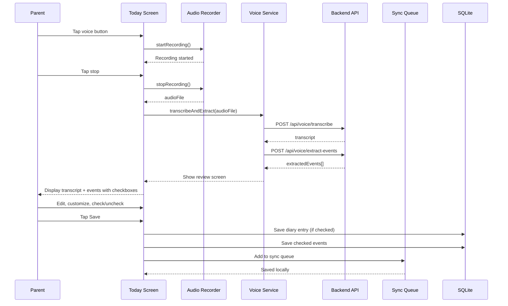
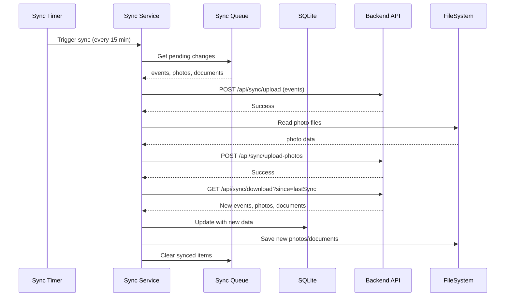
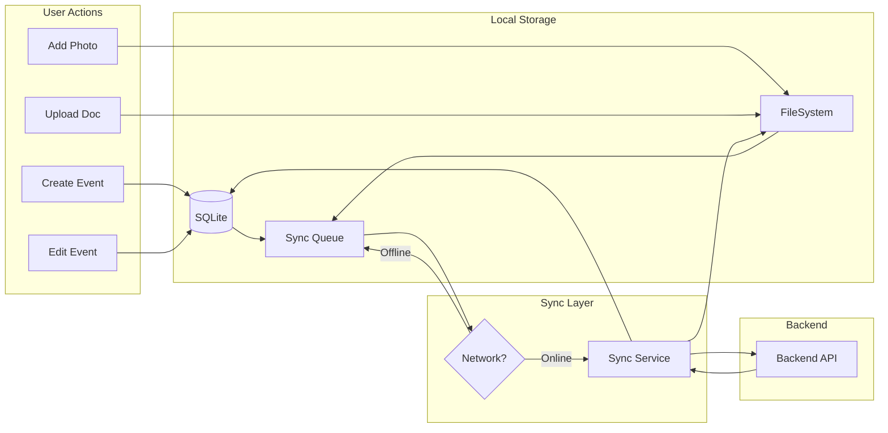

# Technical Design Document — Native iOS App

## Overview

This document describes the technical design for converting the Attune web application to a native iOS app using React Native and Expo. The native app eliminates browser storage quotas, provides automatic background sync, enables offline-first operation, and delivers a true mobile experience for parents tracking their neurodivergent child's journey.

The existing Attune web application is a TypeScript/Vite application with comprehensive event logging, AI insights, and document management. The backend is a Node.js/Express API deployed on Render with JWT authentication and sync endpoints. The native app will reuse the existing backend API without requiring backend changes, while providing unlimited photo/document storage, automatic multi-device sync, and offline support.

### Key Architectural Decisions

- **Platform**: React Native with Expo managed workflow (iOS 15+ only)
- **TypeScript**: Full type safety across the entire codebase
- **Offline-First**: SQLite for local data, Expo FileSystem for photos/documents
- **Sync Strategy**: 15-minute auto-sync + on app open + pull-to-refresh, last-write-wins conflict resolution
- **Photo Compression**: 80% JPEG quality for balance of quality and file size
- **Security**: Expo SecureStore for auth tokens, HTTPS for all API calls
- **Navigation**: React Navigation with tab-based structure (7 tabs)
- **Distribution**: TestFlight for 5-7 beta testers

### Migration from Web App

The native app preserves all existing data models and business logic from the web app:
- All TypeScript models (Event, ChildProfile, DiaryEntry, etc.) are reused
- Backend API endpoints remain unchanged
- Data migration via backend sync (upload from web, download to mobile)
- No backend modifications required

## Architecture

### High-Level System Diagram

```mermaid
graph TB
    subgraph "React Native App (Expo)"
        Nav[Tab Navigator]
        Today[Today Screen]
        Timeline[Timeline Screen]
        Circle[Circle Screen]
        Conv[Conversation Screen]
        Gloss[Glossary Screen]
        Docs[Documents Screen]
        Profile[Profile Screen]
        
        subgraph "Native Adapters"
            Camera[Camera/ImagePicker]
            DocPicker[DocumentPicker]
            Audio[Audio Recorder]
            SecStore[SecureStore]
        end
    end

    subgraph "Business Logic Layer"
        SyncSvc[Sync Service]
        EventSvc[Event Service]
        VoiceSvc[Voice Service]
        PhotoSvc[Photo Service]
        DocSvc[Document Service]
    end

    subgraph "Data Layer"
        SQLite[(SQLite DB)]
        FileSystem[Expo FileSystem]
        SyncQueue[Sync Queue]
    end

    subgraph "Backend API (Existing)"
        Auth[/api/auth]
        Sync[/api/sync]
        Backend[(JSON DB)]
    end

    Nav --> Today & Timeline & Circle & Conv & Gloss & Docs & Profile
    Today --> EventSvc & VoiceSvc
    Timeline --> EventSvc
    Docs --> DocSvc
    
    EventSvc --> SyncQueue
    VoiceSvc --> Audio
    PhotoSvc --> Camera
    DocSvc --> DocPicker
    
    SyncQueue --> SQLite
    PhotoSvc --> FileSystem
    DocSvc --> FileSystem
    
    SyncSvc --> SyncQueue
    SyncSvc --> Auth & Sync
    Auth & Sync --> Backend
```

### Data Flow — Voice Logging with Multi-Event Extraction



### Data Flow — Automatic Background Sync



### Offline-First Architecture



## Technology Stack

### Core Framework
- **React Native**: 0.74+
- **Expo SDK**: 51+
- **TypeScript**: 5.3+
- **Expo Router**: File-based routing with tabs

### Data & Storage
- **Expo SQLite**: Local database for structured data
- **Expo FileSystem**: Photo and document storage
- **Expo SecureStore**: Encrypted storage for auth tokens
- **AsyncStorage**: App preferences and settings

### Media & Files
- **Expo ImagePicker**: Camera and photo library access
- **Expo DocumentPicker**: File selection from Files app
- **Expo AV**: Audio recording for voice logging
- **Expo ImageManipulator**: Photo compression and resizing

### Navigation & UI
- **React Navigation**: Tab and stack navigation
- **React Native Paper**: Material Design components
- **React Native Gesture Handler**: Touch interactions
- **React Native Reanimated**: Smooth animations

### Networking & Sync
- **Axios**: HTTP client for API calls
- **NetInfo**: Network connectivity detection
- **Background Fetch**: Periodic background sync

### Development & Testing
- **Jest**: Unit testing
- **React Native Testing Library**: Component testing
- **Expo Dev Client**: Custom development builds
- **EAS Build**: Cloud build service for TestFlight

## Project Structure

```
attune-app/
├── mobile/                          # NEW — React Native app
│   ├── app/                         # Expo Router file-based routing
│   │   ├── _layout.tsx              # Root layout with providers
│   │   ├── (auth)/                  # Auth flow (login, signup)
│   │   │   ├── _layout.tsx
│   │   │   ├── login.tsx
│   │   │   └── signup.tsx
│   │   └── (tabs)/                  # Main app tabs
│   │       ├── _layout.tsx          # Tab bar configuration
│   │       ├── index.tsx            # Today tab (default)
│   │       ├── timeline.tsx         # Timeline tab
│   │       ├── circle.tsx           # Circle tab
│   │       ├── conversation.tsx     # Conversation tab
│   │       ├── glossary.tsx         # Glossary tab
│   │       ├── documents.tsx        # Documents tab
│   │       └── profile.tsx          # Profile tab
│   ├── components/                  # Reusable React Native components
│   │   ├── EventCard.tsx
│   │   ├── QuickTapButton.tsx
│   │   ├── VoiceRecorder.tsx
│   │   ├── PhotoGallery.tsx
│   │   ├── EventForm.tsx
│   │   ├── DiaryEntryCard.tsx
│   │   └── SyncStatusIndicator.tsx
│   ├── services/                    # Business logic services
│   │   ├── database.ts              # SQLite wrapper
│   │   ├── sync-service.ts          # Sync orchestration
│   │   ├── event-service.ts         # Event CRUD operations
│   │   ├── voice-service.ts         # Voice recording & transcription
│   │   ├── photo-service.ts         # Photo capture & compression
│   │   ├── document-service.ts      # Document upload & management
│   │   └── auth-service.ts          # Authentication
│   ├── models/                      # TypeScript data models (from web app)
│   │   ├── event.ts
│   │   ├── child-profile.ts
│   │   ├── diary-entry.ts
│   │   ├── document.ts
│   │   ├── person.ts
│   │   └── index.ts
│   ├── hooks/                       # Custom React hooks
│   │   ├── useDatabase.ts
│   │   ├── useSync.ts
│   │   ├── useEvents.ts
│   │   ├── useAuth.ts
│   │   └── useNetworkStatus.ts
│   ├── theme/                       # Design system
│   │   ├── colors.ts
│   │   ├── typography.ts
│   │   ├── spacing.ts
│   │   └── index.ts
│   ├── utils/                       # Utility functions
│   │   ├── date-utils.ts
│   │   ├── photo-compression.ts
│   │   ├── validation.ts
│   │   └── error-handling.ts
│   ├── constants/                   # App constants
│   │   ├── api.ts
│   │   ├── storage-keys.ts
│   │   └── event-types.ts
│   ├── app.json                     # Expo configuration
│   ├── package.json
│   ├── tsconfig.json
│   └── metro.config.js
├── backend/                         # Existing backend (UNCHANGED)
│   └── ...
└── src/                             # Existing web app (UNCHANGED)
    └── ...
```


## Data Layer

### SQLite Database Schema

```typescript
// Database initialization and schema
export interface DatabaseSchema {
  // Child profiles
  child_profiles: {
    id: string;                    // UUID
    display_name: string;
    alias: string | null;
    age: number;
    diagnosis: string | null;
    intake_profile: string | null; // JSON
    created_at: number;            // Unix timestamp
    updated_at: number;
  };

  // Events
  events: {
    id: string;
    child_profile_id: string;
    event_type: string;
    timestamp: number;
    severity: number | null;
    tags: string;                  // JSON array
    notes: string | null;
    persons: string;               // JSON array
    source: string;                // 'voice' | 'quick-tap' | 'manual' | 'custom'
    transcript: string | null;
    custom_label: string | null;
    custom_emoji: string | null;
    valence: string | null;        // 'positive' | 'neutral' | 'negative'
    context_entry_refs: string;    // JSON array
    sequence_order: number | null;
    created_at: number;
    synced: number;                // 0 = not synced, 1 = synced
  };

  // Diary entries
  diary_entries: {
    id: string;
    child_profile_id: string;
    date: number;                  // Unix timestamp (day)
    content: string;
    timestamp: number;             // When created
    source: string;                // 'voice' | 'manual'
    created_at: number;
    synced: number;
  };

  // Photos (metadata only, files stored in FileSystem)
  photos: {
    id: string;
    event_id: string | null;       // Null for profile photos
    child_profile_id: string | null;
    file_path: string;             // Local file path
    remote_url: string | null;     // Backend URL after sync
    file_size: number;             // Bytes
    width: number;
    height: number;
    created_at: number;
    synced: number;
  };

  // Documents (metadata only, files stored in FileSystem)
  documents: {
    id: string;
    child_profile_id: string;
    document_type: string;
    source_provider: string | null;
    document_date: number | null;
    file_path: string;
    remote_url: string | null;
    file_name: string;
    file_size: number;
    mime_type: string;
    extracted_text: string | null;
    extraction_failed: number;     // 0 = false, 1 = true
    uploaded_at: number;
    synced: number;
  };

  // Relationship persons
  relationship_persons: {
    id: string;
    child_profile_id: string;
    name: string;
    role: string;
    relationship_strength: number | null;
    photo_path: string | null;
    notes: string | null;
    created_at: number;
    synced: number;
  };

  // Context entries
  context_entries: {
    id: string;
    child_profile_id: string;
    context_type: string;
    sub_type: string;
    person_name: string | null;
    person_role: string | null;
    start_time: number;
    end_time: number | null;
    notes: string | null;
    created_at: number;
    synced: number;
  };

  // Insights
  insights: {
    id: string;
    child_profile_id: string;
    type: string;                  // 'weekly' | 'positive_pattern' | 'longitudinal_trend'
    narrative: string;
    supporting_signals: string;    // JSON
    confidence_score: string;      // 'low' | 'medium' | 'high'
    explainability_statement: string;
    time_span_start: number | null;
    time_span_end: number | null;
    communication_scripts: string | null; // JSON
    strategy_ids: string;          // JSON array
    created_at: number;
  };

  // Strategies
  strategies: {
    id: string;
    child_profile_id: string;
    insight_id: string;
    description: string;
    source_document_ref: string | null;
    helped_count: number;
    didnt_help_count: number;
    created_at: number;
  };

  // Conversation sessions
  conversation_sessions: {
    id: string;
    child_profile_id: string;
    turns: string;                 // JSON array
    created_at: number;
    last_activity_at: number;
  };

  // Glossary terms (read-only, seeded on install)
  glossary_terms: {
    term: string;                  // Primary key
    definition: string;
    category: string;
  };

  // Quick tap buttons
  quick_tap_buttons: {
    id: string;
    child_profile_id: string;
    event_type: string;
    label: string;
    order_index: number;
    created_at: number;
    synced: number;
  };

  // Sync metadata
  sync_metadata: {
    key: string;                   // Primary key
    value: string;
  };
}
```

### Database Service Interface

```typescript
// services/database.ts
import * as SQLite from 'expo-sqlite';

export class DatabaseService {
  private db: SQLite.SQLiteDatabase;

  async initialize(): Promise<void> {
    this.db = await SQLite.openDatabaseAsync('attune.db');
    await this.createTables();
    await this.seedGlossary();
  }

  private async createTables(): Promise<void> {
    // Create all tables with indexes
    await this.db.execAsync(`
      CREATE TABLE IF NOT EXISTS child_profiles (
        id TEXT PRIMARY KEY,
        display_name TEXT NOT NULL,
        alias TEXT,
        age INTEGER NOT NULL,
        diagnosis TEXT,
        intake_profile TEXT,
        created_at INTEGER NOT NULL,
        updated_at INTEGER NOT NULL
      );

      CREATE TABLE IF NOT EXISTS events (
        id TEXT PRIMARY KEY,
        child_profile_id TEXT NOT NULL,
        event_type TEXT NOT NULL,
        timestamp INTEGER NOT NULL,
        severity INTEGER,
        tags TEXT NOT NULL,
        notes TEXT,
        persons TEXT NOT NULL,
        source TEXT NOT NULL,
        transcript TEXT,
        custom_label TEXT,
        custom_emoji TEXT,
        valence TEXT,
        context_entry_refs TEXT NOT NULL,
        sequence_order INTEGER,
        created_at INTEGER NOT NULL,
        synced INTEGER NOT NULL DEFAULT 0,
        FOREIGN KEY (child_profile_id) REFERENCES child_profiles(id) ON DELETE CASCADE
      );

      CREATE INDEX IF NOT EXISTS idx_events_child_profile ON events(child_profile_id);
      CREATE INDEX IF NOT EXISTS idx_events_timestamp ON events(timestamp DESC);
      CREATE INDEX IF NOT EXISTS idx_events_synced ON events(synced);

      CREATE TABLE IF NOT EXISTS diary_entries (
        id TEXT PRIMARY KEY,
        child_profile_id TEXT NOT NULL,
        date INTEGER NOT NULL,
        content TEXT NOT NULL,
        timestamp INTEGER NOT NULL,
        source TEXT NOT NULL,
        created_at INTEGER NOT NULL,
        synced INTEGER NOT NULL DEFAULT 0,
        FOREIGN KEY (child_profile_id) REFERENCES child_profiles(id) ON DELETE CASCADE
      );

      CREATE INDEX IF NOT EXISTS idx_diary_entries_child_profile ON diary_entries(child_profile_id);
      CREATE INDEX IF NOT EXISTS idx_diary_entries_date ON diary_entries(date DESC);

      CREATE TABLE IF NOT EXISTS photos (
        id TEXT PRIMARY KEY,
        event_id TEXT,
        child_profile_id TEXT,
        file_path TEXT NOT NULL,
        remote_url TEXT,
        file_size INTEGER NOT NULL,
        width INTEGER NOT NULL,
        height INTEGER NOT NULL,
        created_at INTEGER NOT NULL,
        synced INTEGER NOT NULL DEFAULT 0,
        FOREIGN KEY (event_id) REFERENCES events(id) ON DELETE CASCADE,
        FOREIGN KEY (child_profile_id) REFERENCES child_profiles(id) ON DELETE CASCADE
      );

      CREATE INDEX IF NOT EXISTS idx_photos_event ON photos(event_id);
      CREATE INDEX IF NOT EXISTS idx_photos_synced ON photos(synced);

      CREATE TABLE IF NOT EXISTS documents (
        id TEXT PRIMARY KEY,
        child_profile_id TEXT NOT NULL,
        document_type TEXT NOT NULL,
        source_provider TEXT,
        document_date INTEGER,
        file_path TEXT NOT NULL,
        remote_url TEXT,
        file_name TEXT NOT NULL,
        file_size INTEGER NOT NULL,
        mime_type TEXT NOT NULL,
        extracted_text TEXT,
        extraction_failed INTEGER NOT NULL DEFAULT 0,
        uploaded_at INTEGER NOT NULL,
        synced INTEGER NOT NULL DEFAULT 0,
        FOREIGN KEY (child_profile_id) REFERENCES child_profiles(id) ON DELETE CASCADE
      );

      CREATE INDEX IF NOT EXISTS idx_documents_child_profile ON documents(child_profile_id);
      CREATE INDEX IF NOT EXISTS idx_documents_synced ON documents(synced);

      -- Additional tables follow same pattern...
    `);
  }

  // Event operations
  async createEvent(event: Event): Promise<void> {
    await this.db.runAsync(
      `INSERT INTO events (id, child_profile_id, event_type, timestamp, severity, tags, notes, persons, source, transcript, custom_label, custom_emoji, valence, context_entry_refs, sequence_order, created_at, synced)
       VALUES (?, ?, ?, ?, ?, ?, ?, ?, ?, ?, ?, ?, ?, ?, ?, ?, 0)`,
      [
        event.id,
        event.childProfileId,
        event.eventType,
        event.timestamp.getTime(),
        event.severity ?? null,
        JSON.stringify(event.tags),
        event.notes ?? null,
        JSON.stringify(event.persons),
        event.source,
        event.transcript ?? null,
        event.customLabel ?? null,
        event.customEmoji ?? null,
        event.valence ?? null,
        JSON.stringify(event.contextEntryRefs),
        event.sequenceOrder ?? null,
        event.createdAt.getTime(),
      ]
    );
  }

  async getEvents(childProfileId: string, filter?: EventFilter): Promise<Event[]> {
    let query = 'SELECT * FROM events WHERE child_profile_id = ?';
    const params: any[] = [childProfileId];

    if (filter?.eventTypes && filter.eventTypes.length > 0) {
      query += ` AND event_type IN (${filter.eventTypes.map(() => '?').join(',')})`;
      params.push(...filter.eventTypes);
    }

    if (filter?.dateRange) {
      query += ' AND timestamp >= ? AND timestamp <= ?';
      params.push(filter.dateRange.start.getTime(), filter.dateRange.end.getTime());
    }

    query += ' ORDER BY timestamp DESC';

    if (filter?.limit) {
      query += ' LIMIT ?';
      params.push(filter.limit);
      if (filter.offset) {
        query += ' OFFSET ?';
        params.push(filter.offset);
      }
    }

    const rows = await this.db.getAllAsync(query, params);
    return rows.map(this.rowToEvent);
  }

  async updateEvent(id: string, updates: Partial<Event>): Promise<void> {
    const fields: string[] = [];
    const values: any[] = [];

    if (updates.eventType !== undefined) {
      fields.push('event_type = ?');
      values.push(updates.eventType);
    }
    if (updates.timestamp !== undefined) {
      fields.push('timestamp = ?');
      values.push(updates.timestamp.getTime());
    }
    if (updates.notes !== undefined) {
      fields.push('notes = ?');
      values.push(updates.notes);
    }
    // ... handle other fields

    fields.push('synced = 0'); // Mark as unsynced
    values.push(id);

    await this.db.runAsync(
      `UPDATE events SET ${fields.join(', ')} WHERE id = ?`,
      values
    );
  }

  async deleteEvent(id: string): Promise<void> {
    await this.db.runAsync('DELETE FROM events WHERE id = ?', [id]);
  }

  // Sync operations
  async getUnsyncedEvents(): Promise<Event[]> {
    const rows = await this.db.getAllAsync(
      'SELECT * FROM events WHERE synced = 0 ORDER BY created_at ASC'
    );
    return rows.map(this.rowToEvent);
  }

  async markEventsSynced(ids: string[]): Promise<void> {
    if (ids.length === 0) return;
    await this.db.runAsync(
      `UPDATE events SET synced = 1 WHERE id IN (${ids.map(() => '?').join(',')})`,
      ids
    );
  }

  async getLastSyncTimestamp(): Promise<number> {
    const row = await this.db.getFirstAsync(
      'SELECT value FROM sync_metadata WHERE key = ?',
      ['last_sync_timestamp']
    );
    return row ? parseInt(row.value) : 0;
  }

  async setLastSyncTimestamp(timestamp: number): Promise<void> {
    await this.db.runAsync(
      'INSERT OR REPLACE INTO sync_metadata (key, value) VALUES (?, ?)',
      ['last_sync_timestamp', timestamp.toString()]
    );
  }

  // Helper methods
  private rowToEvent(row: any): Event {
    return {
      id: row.id,
      childProfileId: row.child_profile_id,
      eventType: row.event_type,
      timestamp: new Date(row.timestamp),
      severity: row.severity,
      tags: JSON.parse(row.tags),
      notes: row.notes,
      persons: JSON.parse(row.persons),
      source: row.source,
      transcript: row.transcript,
      customLabel: row.custom_label,
      customEmoji: row.custom_emoji,
      valence: row.valence,
      contextEntryRefs: JSON.parse(row.context_entry_refs),
      sequenceOrder: row.sequence_order,
      createdAt: new Date(row.created_at),
    };
  }

  // Similar methods for diary entries, photos, documents, etc.
}
```

### File Storage Structure

```
Expo FileSystem (DocumentDirectory)
├── photos/
│   ├── {uuid}.jpg                 # Compressed event photos
│   ├── {uuid}.jpg
│   └── profile-{profileId}.jpg    # Profile photos
├── documents/
│   ├── {uuid}.pdf
│   ├── {uuid}.jpg
│   └── {uuid}.png
└── temp/
    └── {uuid}.{ext}               # Temporary files during upload
```

### Photo Service

```typescript
// services/photo-service.ts
import * as ImagePicker from 'expo-image-picker';
import * as ImageManipulator from 'expo-image-manipulator';
import * as FileSystem from 'expo-file-system';
import { v4 as uuidv4 } from 'uuid';

export class PhotoService {
  private photosDir = `${FileSystem.documentDirectory}photos/`;

  async initialize(): Promise<void> {
    await FileSystem.makeDirectoryAsync(this.photosDir, { intermediates: true });
  }

  async capturePhoto(): Promise<string | null> {
    const permission = await ImagePicker.requestCameraPermissionsAsync();
    if (!permission.granted) {
      throw new Error('Camera permission denied');
    }

    const result = await ImagePicker.launchCameraAsync({
      mediaTypes: ImagePicker.MediaTypeOptions.Images,
      quality: 1, // Full quality, we'll compress manually
      allowsEditing: true,
      aspect: [4, 3],
    });

    if (result.canceled) return null;

    return await this.compressAndSave(result.assets[0].uri);
  }

  async pickFromLibrary(): Promise<string | null> {
    const permission = await ImagePicker.requestMediaLibraryPermissionsAsync();
    if (!permission.granted) {
      throw new Error('Photo library permission denied');
    }

    const result = await ImagePicker.launchImageLibraryAsync({
      mediaTypes: ImagePicker.MediaTypeOptions.Images,
      quality: 1,
      allowsEditing: true,
      aspect: [4, 3],
    });

    if (result.canceled) return null;

    return await this.compressAndSave(result.assets[0].uri);
  }

  private async compressAndSave(uri: string): Promise<string> {
    // Compress to 80% JPEG quality
    const compressed = await ImageManipulator.manipulateAsync(
      uri,
      [{ resize: { width: 1920 } }], // Max width 1920px, maintain aspect ratio
      { compress: 0.8, format: ImageManipulator.SaveFormat.JPEG }
    );

    // Save to app's document directory
    const photoId = uuidv4();
    const fileName = `${photoId}.jpg`;
    const filePath = `${this.photosDir}${fileName}`;

    await FileSystem.copyAsync({
      from: compressed.uri,
      to: filePath,
    });

    return filePath;
  }

  async deletePhoto(filePath: string): Promise<void> {
    try {
      await FileSystem.deleteAsync(filePath, { idempotent: true });
    } catch (error) {
      console.warn('Failed to delete photo:', error);
    }
  }

  async getPhotoInfo(filePath: string): Promise<FileSystem.FileInfo> {
    return await FileSystem.getInfoAsync(filePath);
  }
}
```


## Sync Strategy

### Sync Service Architecture

```typescript
// services/sync-service.ts
import * as BackgroundFetch from 'expo-background-fetch';
import * as TaskManager from 'expo-task-manager';
import NetInfo from '@react-native-community/netinfo';
import axios from 'axios';
import { DatabaseService } from './database';
import { PhotoService } from './photo-service';
import { DocumentService } from './document-service';
import { AuthService } from './auth-service';

const SYNC_TASK_NAME = 'attune-background-sync';
const SYNC_INTERVAL = 15 * 60; // 15 minutes in seconds

export class SyncService {
  private db: DatabaseService;
  private photoService: PhotoService;
  private documentService: DocumentService;
  private authService: AuthService;
  private isSyncing = false;
  private syncListeners: Array<(status: SyncStatus) => void> = [];

  constructor(
    db: DatabaseService,
    photoService: PhotoService,
    documentService: DocumentService,
    authService: AuthService
  ) {
    this.db = db;
    this.photoService = photoService;
    this.documentService = documentService;
    this.authService = authService;
  }

  async initialize(): Promise<void> {
    // Register background sync task
    await this.registerBackgroundSync();

    // Sync on app open
    await this.sync();

    // Listen for network changes
    NetInfo.addEventListener(state => {
      if (state.isConnected && !this.isSyncing) {
        this.sync();
      }
    });
  }

  private async registerBackgroundSync(): Promise<void> {
    TaskManager.defineTask(SYNC_TASK_NAME, async () => {
      try {
        await this.sync();
        return BackgroundFetch.BackgroundFetchResult.NewData;
      } catch (error) {
        console.error('Background sync failed:', error);
        return BackgroundFetch.BackgroundFetchResult.Failed;
      }
    });

    await BackgroundFetch.registerTaskAsync(SYNC_TASK_NAME, {
      minimumInterval: SYNC_INTERVAL,
      stopOnTerminate: false,
      startOnBoot: true,
    });
  }

  async sync(): Promise<SyncResult> {
    if (this.isSyncing) {
      return { success: false, message: 'Sync already in progress' };
    }

    const netInfo = await NetInfo.fetch();
    if (!netInfo.isConnected) {
      return { success: false, message: 'No network connection' };
    }

    if (!this.authService.isAuthenticated()) {
      return { success: false, message: 'Not authenticated' };
    }

    this.isSyncing = true;
    this.notifyListeners({ status: 'syncing', progress: 0 });

    try {
      // Phase 1: Upload local changes
      await this.uploadChanges();
      this.notifyListeners({ status: 'syncing', progress: 50 });

      // Phase 2: Download remote changes
      await this.downloadChanges();
      this.notifyListeners({ status: 'syncing', progress: 100 });

      // Update last sync timestamp
      await this.db.setLastSyncTimestamp(Date.now());

      this.notifyListeners({ status: 'success', lastSync: Date.now() });
      return { success: true, message: 'Sync completed' };
    } catch (error) {
      console.error('Sync failed:', error);
      this.notifyListeners({ status: 'error', error: error.message });
      return { success: false, message: error.message };
    } finally {
      this.isSyncing = false;
    }
  }

  private async uploadChanges(): Promise<void> {
    const token = await this.authService.getToken();
    const baseURL = 'https://attune-backend-5hke.onrender.com/api';

    // Upload events
    const unsyncedEvents = await this.db.getUnsyncedEvents();
    if (unsyncedEvents.length > 0) {
      await axios.post(
        `${baseURL}/sync/events`,
        { events: unsyncedEvents },
        { headers: { Authorization: `Bearer ${token}` } }
      );
      await this.db.markEventsSynced(unsyncedEvents.map(e => e.id));
    }

    // Upload diary entries
    const unsyncedDiaries = await this.db.getUnsyncedDiaryEntries();
    if (unsyncedDiaries.length > 0) {
      await axios.post(
        `${baseURL}/sync/diary-entries`,
        { diaryEntries: unsyncedDiaries },
        { headers: { Authorization: `Bearer ${token}` } }
      );
      await this.db.markDiaryEntriesSynced(unsyncedDiaries.map(d => d.id));
    }

    // Upload photos
    const unsyncedPhotos = await this.db.getUnsyncedPhotos();
    for (const photo of unsyncedPhotos) {
      const formData = new FormData();
      formData.append('photo', {
        uri: photo.filePath,
        type: 'image/jpeg',
        name: `${photo.id}.jpg`,
      } as any);
      formData.append('photoId', photo.id);
      formData.append('eventId', photo.eventId || '');
      formData.append('childProfileId', photo.childProfileId || '');

      const response = await axios.post(
        `${baseURL}/sync/photos`,
        formData,
        {
          headers: {
            Authorization: `Bearer ${token}`,
            'Content-Type': 'multipart/form-data',
          },
        }
      );

      await this.db.updatePhotoRemoteUrl(photo.id, response.data.url);
      await this.db.markPhotoSynced(photo.id);
    }

    // Upload documents (similar to photos)
    const unsyncedDocuments = await this.db.getUnsyncedDocuments();
    for (const doc of unsyncedDocuments) {
      const formData = new FormData();
      formData.append('document', {
        uri: doc.filePath,
        type: doc.mimeType,
        name: doc.fileName,
      } as any);
      formData.append('documentId', doc.id);
      formData.append('childProfileId', doc.childProfileId);
      formData.append('documentType', doc.documentType);

      const response = await axios.post(
        `${baseURL}/sync/documents`,
        formData,
        {
          headers: {
            Authorization: `Bearer ${token}`,
            'Content-Type': 'multipart/form-data',
          },
        }
      );

      await this.db.updateDocumentRemoteUrl(doc.id, response.data.url);
      await this.db.markDocumentSynced(doc.id);
    }
  }

  private async downloadChanges(): Promise<void> {
    const token = await this.authService.getToken();
    const baseURL = 'https://attune-backend-5hke.onrender.com/api';
    const lastSync = await this.db.getLastSyncTimestamp();

    // Download new events
    const eventsResponse = await axios.get(
      `${baseURL}/sync/events?since=${lastSync}`,
      { headers: { Authorization: `Bearer ${token}` } }
    );

    for (const event of eventsResponse.data.events) {
      await this.resolveConflictAndSave('event', event);
    }

    // Download new diary entries
    const diariesResponse = await axios.get(
      `${baseURL}/sync/diary-entries?since=${lastSync}`,
      { headers: { Authorization: `Bearer ${token}` } }
    );

    for (const diary of diariesResponse.data.diaryEntries) {
      await this.resolveConflictAndSave('diary', diary);
    }

    // Download new photos
    const photosResponse = await axios.get(
      `${baseURL}/sync/photos?since=${lastSync}`,
      { headers: { Authorization: `Bearer ${token}` } }
    );

    for (const photoMeta of photosResponse.data.photos) {
      // Download photo file
      const localPath = await this.photoService.downloadPhoto(photoMeta.url);
      await this.db.createPhoto({
        ...photoMeta,
        filePath: localPath,
        synced: 1,
      });
    }

    // Download new documents (similar to photos)
    const documentsResponse = await axios.get(
      `${baseURL}/sync/documents?since=${lastSync}`,
      { headers: { Authorization: `Bearer ${token}` } }
    );

    for (const docMeta of documentsResponse.data.documents) {
      const localPath = await this.documentService.downloadDocument(docMeta.url);
      await this.db.createDocument({
        ...docMeta,
        filePath: localPath,
        synced: 1,
      });
    }
  }

  private async resolveConflictAndSave(
    type: 'event' | 'diary',
    remoteData: any
  ): Promise<void> {
    // Last-write-wins conflict resolution
    const localData = type === 'event'
      ? await this.db.getEvent(remoteData.id)
      : await this.db.getDiaryEntry(remoteData.id);

    if (!localData) {
      // No local copy, just save remote
      if (type === 'event') {
        await this.db.createEvent({ ...remoteData, synced: 1 });
      } else {
        await this.db.createDiaryEntry({ ...remoteData, synced: 1 });
      }
      return;
    }

    // Compare timestamps
    const localTimestamp = localData.updatedAt || localData.createdAt;
    const remoteTimestamp = remoteData.updatedAt || remoteData.createdAt;

    if (remoteTimestamp > localTimestamp) {
      // Remote is newer, overwrite local
      if (type === 'event') {
        await this.db.updateEvent(remoteData.id, { ...remoteData, synced: 1 });
      } else {
        await this.db.updateDiaryEntry(remoteData.id, { ...remoteData, synced: 1 });
      }
      console.log(`Conflict resolved: remote wins for ${type} ${remoteData.id}`);
    } else {
      // Local is newer or equal, keep local and mark for re-upload
      console.log(`Conflict resolved: local wins for ${type} ${remoteData.id}`);
    }
  }

  onSyncStatusChange(listener: (status: SyncStatus) => void): () => void {
    this.syncListeners.push(listener);
    return () => {
      this.syncListeners = this.syncListeners.filter(l => l !== listener);
    };
  }

  private notifyListeners(status: SyncStatus): void {
    this.syncListeners.forEach(listener => listener(status));
  }
}

interface SyncStatus {
  status: 'idle' | 'syncing' | 'success' | 'error';
  progress?: number;
  lastSync?: number;
  error?: string;
}

interface SyncResult {
  success: boolean;
  message: string;
}
```

### Incremental Sync Protocol

The sync protocol uses timestamps to minimize data transfer:

1. **Upload Phase**:
   - Query local database for all records where `synced = 0`
   - Batch upload events, diary entries, photos, documents
   - Mark uploaded records as `synced = 1`

2. **Download Phase**:
   - Send `lastSyncTimestamp` to backend
   - Backend returns only records created/updated after that timestamp
   - Apply conflict resolution (last-write-wins)
   - Save new records with `synced = 1`

3. **Conflict Resolution**:
   - Compare `updatedAt` timestamps (or `createdAt` if no updates)
   - Keep the record with the later timestamp
   - Log conflicts for debugging

### Sync Queue Management

```typescript
// Sync queue is implicit in the database schema via the `synced` column
// All write operations automatically set synced = 0

// Example: Creating an event
async function createEvent(event: Event): Promise<void> {
  await db.createEvent(event); // Automatically sets synced = 0
  // Event will be uploaded on next sync
}

// Example: Querying unsynced items
async function getUnsyncedCount(): Promise<number> {
  const events = await db.getUnsyncedEvents();
  const diaries = await db.getUnsyncedDiaryEntries();
  const photos = await db.getUnsyncedPhotos();
  const documents = await db.getUnsyncedDocuments();
  return events.length + diaries.length + photos.length + documents.length;
}
```


## Component Architecture

### Screen Components

#### Today Screen

```typescript
// app/(tabs)/index.tsx
import React, { useState, useEffect } from 'react';
import { View, ScrollView, StyleSheet, RefreshControl } from 'react-native';
import { Text, Button, Card } from 'react-native-paper';
import { useDatabase } from '../../hooks/useDatabase';
import { useSync } from '../../hooks/useSync';
import { QuickTapButton } from '../../components/QuickTapButton';
import { VoiceRecorder } from '../../components/VoiceRecorder';
import { EventCard } from '../../components/EventCard';
import { DiaryEntryCard } from '../../components/DiaryEntryCard';
import { SyncStatusIndicator } from '../../components/SyncStatusIndicator';

export default function TodayScreen() {
  const db = useDatabase();
  const { sync, isSyncing } = useSync();
  const [todayEvents, setTodayEvents] = useState<Event[]>([]);
  const [todayDiary, setTodayDiary] = useState<DiaryEntry | null>(null);
  const [quickTapButtons, setQuickTapButtons] = useState<QuickTapButton[]>([]);

  useEffect(() => {
    loadTodayData();
  }, []);

  const loadTodayData = async () => {
    const today = new Date();
    today.setHours(0, 0, 0, 0);
    const tomorrow = new Date(today);
    tomorrow.setDate(tomorrow.getDate() + 1);

    const events = await db.getEvents(childProfileId, {
      dateRange: { start: today, end: tomorrow },
    });
    setTodayEvents(events);

    const diary = await db.getDiaryEntryByDate(childProfileId, today);
    setTodayDiary(diary);

    const buttons = await db.getQuickTapButtons(childProfileId);
    setQuickTapButtons(buttons);
  };

  const handleQuickTap = async (eventType: string) => {
    const event: Event = {
      id: uuidv4(),
      childProfileId,
      eventType,
      timestamp: new Date(),
      tags: [],
      persons: [],
      source: 'quick-tap',
      contextEntryRefs: [],
      createdAt: new Date(),
    };
    await db.createEvent(event);
    await loadTodayData();
  };

  const handleVoiceComplete = async (result: VoiceResult) => {
    // Navigate to voice review screen
    navigation.navigate('VoiceReview', { result });
  };

  return (
    <ScrollView
      style={styles.container}
      refreshControl={
        <RefreshControl refreshing={isSyncing} onRefresh={sync} />
      }
    >
      <SyncStatusIndicator />

      <Card style={styles.section}>
        <Card.Title title="Quick Log" />
        <Card.Content>
          <View style={styles.quickTapGrid}>
            {quickTapButtons.map(button => (
              <QuickTapButton
                key={button.id}
                label={button.label}
                eventType={button.eventType}
                onPress={() => handleQuickTap(button.eventType)}
              />
            ))}
          </View>
        </Card.Content>
      </Card>

      <Card style={styles.section}>
        <Card.Title title="Voice Log" />
        <Card.Content>
          <VoiceRecorder onComplete={handleVoiceComplete} />
        </Card.Content>
      </Card>

      {todayDiary && (
        <Card style={styles.section}>
          <Card.Title title="Today's Diary" />
          <Card.Content>
            <DiaryEntryCard entry={todayDiary} />
          </Card.Content>
        </Card>
      )}

      <Card style={styles.section}>
        <Card.Title title={`Today's Events (${todayEvents.length})`} />
        <Card.Content>
          {todayEvents.map(event => (
            <EventCard key={event.id} event={event} />
          ))}
        </Card.Content>
      </Card>

      <Button
        mode="contained"
        onPress={() => navigation.navigate('EventForm')}
        style={styles.manualEntryButton}
      >
        Manual Entry
      </Button>
    </ScrollView>
  );
}

const styles = StyleSheet.create({
  container: {
    flex: 1,
    backgroundColor: '#f5f5f5',
  },
  section: {
    margin: 16,
  },
  quickTapGrid: {
    flexDirection: 'row',
    flexWrap: 'wrap',
    gap: 8,
  },
  manualEntryButton: {
    margin: 16,
  },
});
```

#### Timeline Screen

```typescript
// app/(tabs)/timeline.tsx
import React, { useState, useEffect } from 'react';
import { FlatList, View, StyleSheet, RefreshControl } from 'react-native';
import { Searchbar, Chip, FAB } from 'react-native-paper';
import { useDatabase } from '../../hooks/useDatabase';
import { useSync } from '../../hooks/useSync';
import { EventCard } from '../../components/EventCard';
import { EventFilter } from '../../models/event';

export default function TimelineScreen() {
  const db = useDatabase();
  const { sync, isSyncing } = useSync();
  const [events, setEvents] = useState<Event[]>([]);
  const [filter, setFilter] = useState<EventFilter>({ childProfileId });
  const [searchQuery, setSearchQuery] = useState('');
  const [selectedTypes, setSelectedTypes] = useState<string[]>([]);

  useEffect(() => {
    loadEvents();
  }, [filter]);

  const loadEvents = async () => {
    const result = await db.getEvents(childProfileId, filter);
    setEvents(result);
  };

  const handleRefresh = async () => {
    await sync();
    await loadEvents();
  };

  const handleFilterByType = (eventType: string) => {
    const newTypes = selectedTypes.includes(eventType)
      ? selectedTypes.filter(t => t !== eventType)
      : [...selectedTypes, eventType];
    
    setSelectedTypes(newTypes);
    setFilter({
      ...filter,
      eventTypes: newTypes.length > 0 ? newTypes : undefined,
    });
  };

  const renderEvent = ({ item }: { item: Event }) => (
    <EventCard
      event={item}
      onPress={() => navigation.navigate('EventDetail', { eventId: item.id })}
    />
  );

  return (
    <View style={styles.container}>
      <Searchbar
        placeholder="Search events..."
        onChangeText={setSearchQuery}
        value={searchQuery}
        style={styles.searchBar}
      />

      <View style={styles.filterChips}>
        {['meltdown', 'positive_behavior', 'sleep', 'school_incident'].map(type => (
          <Chip
            key={type}
            selected={selectedTypes.includes(type)}
            onPress={() => handleFilterByType(type)}
            style={styles.chip}
          >
            {type.replace('_', ' ')}
          </Chip>
        ))}
      </View>

      <FlatList
        data={events}
        renderItem={renderEvent}
        keyExtractor={item => item.id}
        refreshControl={
          <RefreshControl refreshing={isSyncing} onRefresh={handleRefresh} />
        }
        contentContainerStyle={styles.list}
      />

      <FAB
        icon="plus"
        style={styles.fab}
        onPress={() => navigation.navigate('EventForm')}
      />
    </View>
  );
}

const styles = StyleSheet.create({
  container: {
    flex: 1,
    backgroundColor: '#f5f5f5',
  },
  searchBar: {
    margin: 16,
  },
  filterChips: {
    flexDirection: 'row',
    flexWrap: 'wrap',
    paddingHorizontal: 16,
    gap: 8,
  },
  chip: {
    marginBottom: 8,
  },
  list: {
    padding: 16,
  },
  fab: {
    position: 'absolute',
    right: 16,
    bottom: 16,
  },
});
```

### Reusable Components

#### Voice Recorder Component

```typescript
// components/VoiceRecorder.tsx
import React, { useState } from 'react';
import { View, StyleSheet } from 'react-native';
import { Button, Text, ActivityIndicator } from 'react-native-paper';
import { Audio } from 'expo-av';
import { VoiceService } from '../services/voice-service';

interface VoiceRecorderProps {
  onComplete: (result: VoiceResult) => void;
}

export function VoiceRecorder({ onComplete }: VoiceRecorderProps) {
  const [recording, setRecording] = useState<Audio.Recording | null>(null);
  const [isRecording, setIsRecording] = useState(false);
  const [isProcessing, setIsProcessing] = useState(false);
  const voiceService = new VoiceService();

  const startRecording = async () => {
    try {
      const permission = await Audio.requestPermissionsAsync();
      if (!permission.granted) {
        alert('Microphone permission is required for voice logging');
        return;
      }

      await Audio.setAudioModeAsync({
        allowsRecordingIOS: true,
        playsInSilenceModeIOS: true,
      });

      const { recording } = await Audio.Recording.createAsync(
        Audio.RecordingOptionsPresets.HIGH_QUALITY
      );

      setRecording(recording);
      setIsRecording(true);
    } catch (error) {
      console.error('Failed to start recording:', error);
      alert('Failed to start recording');
    }
  };

  const stopRecording = async () => {
    if (!recording) return;

    try {
      setIsRecording(false);
      setIsProcessing(true);

      await recording.stopAndUnloadAsync();
      const uri = recording.getURI();

      if (!uri) {
        throw new Error('No recording URI');
      }

      // Send to backend for transcription and event extraction
      const result = await voiceService.transcribeAndExtract(uri);
      
      setIsProcessing(false);
      onComplete(result);
    } catch (error) {
      console.error('Failed to process recording:', error);
      alert('Failed to process recording');
      setIsProcessing(false);
    } finally {
      setRecording(null);
    }
  };

  if (isProcessing) {
    return (
      <View style={styles.container}>
        <ActivityIndicator size="large" />
        <Text style={styles.processingText}>Processing voice log...</Text>
      </View>
    );
  }

  return (
    <View style={styles.container}>
      <Button
        mode={isRecording ? 'contained' : 'outlined'}
        onPress={isRecording ? stopRecording : startRecording}
        icon={isRecording ? 'stop' : 'microphone'}
        style={styles.button}
      >
        {isRecording ? 'Stop Recording' : 'Start Voice Log'}
      </Button>
      {isRecording && (
        <Text style={styles.recordingText}>Recording...</Text>
      )}
    </View>
  );
}

const styles = StyleSheet.create({
  container: {
    alignItems: 'center',
    padding: 16,
  },
  button: {
    minWidth: 200,
  },
  recordingText: {
    marginTop: 8,
    color: '#d32f2f',
    fontWeight: 'bold',
  },
  processingText: {
    marginTop: 8,
    color: '#666',
  },
});
```

#### Event Card Component

```typescript
// components/EventCard.tsx
import React from 'react';
import { View, StyleSheet, TouchableOpacity } from 'react-native';
import { Card, Text, Chip } from 'react-native-paper';
import { Event } from '../models/event';
import { format } from 'date-fns';

interface EventCardProps {
  event: Event;
  onPress?: () => void;
}

export function EventCard({ event, onPress }: EventCardProps) {
  const getEventColor = (valence?: string) => {
    switch (valence) {
      case 'positive': return '#4caf50';
      case 'negative': return '#f44336';
      default: return '#9e9e9e';
    }
  };

  const getEventEmoji = (eventType: string, customEmoji?: string) => {
    if (customEmoji) return customEmoji;
    
    const emojiMap: Record<string, string> = {
      meltdown: '😭',
      positive_behavior: '⭐',
      sleep: '😴',
      good_sleep: '😴',
      poor_sleep: '😫',
      school_incident: '🏫',
      great_day: '🎉',
      // ... more mappings
    };
    
    return emojiMap[eventType] || '📝';
  };

  return (
    <TouchableOpacity onPress={onPress} disabled={!onPress}>
      <Card style={styles.card}>
        <Card.Content>
          <View style={styles.header}>
            <Text style={styles.emoji}>
              {getEventEmoji(event.eventType, event.customEmoji)}
            </Text>
            <View style={styles.headerText}>
              <Text style={styles.eventType}>
                {event.customLabel || event.eventType.replace('_', ' ')}
              </Text>
              <Text style={styles.timestamp}>
                {format(event.timestamp, 'h:mm a')}
              </Text>
            </View>
            <View
              style={[
                styles.valenceIndicator,
                { backgroundColor: getEventColor(event.valence) },
              ]}
            />
          </View>

          {event.notes && (
            <Text style={styles.notes} numberOfLines={2}>
              {event.notes}
            </Text>
          )}

          {event.tags.length > 0 && (
            <View style={styles.tags}>
              {event.tags.map(tag => (
                <Chip key={tag} style={styles.tag} compact>
                  {tag}
                </Chip>
              ))}
            </View>
          )}

          {event.persons.length > 0 && (
            <Text style={styles.persons}>
              With: {event.persons.join(', ')}
            </Text>
          )}
        </Card.Content>
      </Card>
    </TouchableOpacity>
  );
}

const styles = StyleSheet.create({
  card: {
    marginBottom: 12,
  },
  header: {
    flexDirection: 'row',
    alignItems: 'center',
    marginBottom: 8,
  },
  emoji: {
    fontSize: 32,
    marginRight: 12,
  },
  headerText: {
    flex: 1,
  },
  eventType: {
    fontSize: 16,
    fontWeight: 'bold',
    textTransform: 'capitalize',
  },
  timestamp: {
    fontSize: 12,
    color: '#666',
  },
  valenceIndicator: {
    width: 12,
    height: 12,
    borderRadius: 6,
  },
  notes: {
    fontSize: 14,
    color: '#333',
    marginBottom: 8,
  },
  tags: {
    flexDirection: 'row',
    flexWrap: 'wrap',
    gap: 4,
    marginBottom: 8,
  },
  tag: {
    height: 24,
  },
  persons: {
    fontSize: 12,
    color: '#666',
    fontStyle: 'italic',
  },
});
```

#### Quick Tap Button Component

```typescript
// components/QuickTapButton.tsx
import React from 'react';
import { TouchableOpacity, StyleSheet } from 'react-native';
import { Text } from 'react-native-paper';

interface QuickTapButtonProps {
  label: string;
  eventType: string;
  onPress: () => void;
}

export function QuickTapButton({ label, eventType, onPress }: QuickTapButtonProps) {
  const getButtonColor = (eventType: string) => {
    if (eventType.includes('positive') || eventType.includes('great')) {
      return '#4caf50';
    }
    if (eventType.includes('meltdown') || eventType.includes('conflict')) {
      return '#f44336';
    }
    return '#2196f3';
  };

  return (
    <TouchableOpacity
      style={[styles.button, { backgroundColor: getButtonColor(eventType) }]}
      onPress={onPress}
    >
      <Text style={styles.label}>{label}</Text>
    </TouchableOpacity>
  );
}

const styles = StyleSheet.create({
  button: {
    paddingHorizontal: 16,
    paddingVertical: 12,
    borderRadius: 8,
    minWidth: 100,
    alignItems: 'center',
  },
  label: {
    color: '#fff',
    fontWeight: 'bold',
    fontSize: 14,
  },
});
```


## Voice Logging with Multi-Event Extraction

### Voice Service

```typescript
// services/voice-service.ts
import axios from 'axios';
import * as FileSystem from 'expo-file-system';
import { AuthService } from './auth-service';

export interface VoiceResult {
  transcript: string;
  extractedEvents: ExtractedEvent[];
}

export interface ExtractedEvent {
  id: string;
  eventType: string;
  customLabel?: string;
  customEmoji?: string;
  timestamp: Date;
  notes?: string;
  valence?: 'positive' | 'neutral' | 'negative';
  tags: string[];
  persons: string[];
  checked: boolean; // For UI checkbox state
}

export class VoiceService {
  private authService: AuthService;
  private baseURL = 'https://attune-backend-5hke.onrender.com/api';

  constructor(authService: AuthService) {
    this.authService = authService;
  }

  async transcribeAndExtract(audioUri: string): Promise<VoiceResult> {
    const token = await this.authService.getToken();

    // Step 1: Upload audio and get transcription
    const formData = new FormData();
    formData.append('audio', {
      uri: audioUri,
      type: 'audio/m4a',
      name: 'voice-log.m4a',
    } as any);

    const transcribeResponse = await axios.post(
      `${this.baseURL}/voice/transcribe`,
      formData,
      {
        headers: {
          Authorization: `Bearer ${token}`,
          'Content-Type': 'multipart/form-data',
        },
      }
    );

    const transcript = transcribeResponse.data.transcript;

    // Step 2: Extract events from transcript
    const extractResponse = await axios.post(
      `${this.baseURL}/voice/extract-events`,
      { transcript },
      {
        headers: {
          Authorization: `Bearer ${token}`,
          'Content-Type': 'application/json',
        },
      }
    );

    const extractedEvents: ExtractedEvent[] = extractResponse.data.events.map(
      (event: any) => ({
        ...event,
        id: uuidv4(),
        timestamp: new Date(event.timestamp),
        checked: true, // Default to checked
      })
    );

    return {
      transcript,
      extractedEvents,
    };
  }
}
```

### Voice Review Screen

```typescript
// app/voice-review.tsx
import React, { useState } from 'react';
import { View, ScrollView, StyleSheet } from 'react-native';
import { Text, TextInput, Button, Checkbox, Card, IconButton } from 'react-native-paper';
import { useDatabase } from '../hooks/useDatabase';
import { VoiceResult, ExtractedEvent } from '../services/voice-service';
import { EmojiPicker } from '../components/EmojiPicker';

interface VoiceReviewScreenProps {
  route: {
    params: {
      result: VoiceResult;
    };
  };
  navigation: any;
}

export default function VoiceReviewScreen({ route, navigation }: VoiceReviewScreenProps) {
  const { result } = route.params;
  const db = useDatabase();
  
  const [transcript, setTranscript] = useState(result.transcript);
  const [saveDiary, setSaveDiary] = useState(true);
  const [events, setEvents] = useState<ExtractedEvent[]>(result.extractedEvents);
  const [showEmojiPicker, setShowEmojiPicker] = useState<string | null>(null);

  const handleToggleEvent = (eventId: string) => {
    setEvents(events.map(e =>
      e.id === eventId ? { ...e, checked: !e.checked } : e
    ));
  };

  const handleUpdateEvent = (eventId: string, updates: Partial<ExtractedEvent>) => {
    setEvents(events.map(e =>
      e.id === eventId ? { ...e, ...updates } : e
    ));
  };

  const handleEmojiSelect = (eventId: string, emoji: string) => {
    handleUpdateEvent(eventId, { customEmoji: emoji });
    setShowEmojiPicker(null);
  };

  const handleReExtract = async () => {
    // Re-run event extraction with edited transcript
    const voiceService = new VoiceService(authService);
    const extractResponse = await axios.post(
      `${baseURL}/voice/extract-events`,
      { transcript },
      { headers: { Authorization: `Bearer ${token}` } }
    );
    
    const newEvents = extractResponse.data.events.map((event: any) => ({
      ...event,
      id: uuidv4(),
      timestamp: new Date(event.timestamp),
      checked: true,
    }));
    
    setEvents(newEvents);
  };

  const handleSave = async () => {
    try {
      // Save diary entry if checked
      if (saveDiary) {
        const diaryEntry: DiaryEntry = {
          id: uuidv4(),
          childProfileId,
          date: new Date(),
          content: transcript,
          timestamp: new Date(),
          source: 'voice',
          createdAt: new Date(),
        };
        await db.createDiaryEntry(diaryEntry);
      }

      // Save checked events
      const checkedEvents = events.filter(e => e.checked);
      for (const extractedEvent of checkedEvents) {
        const event: Event = {
          id: extractedEvent.id,
          childProfileId,
          eventType: extractedEvent.eventType,
          timestamp: extractedEvent.timestamp,
          tags: extractedEvent.tags,
          notes: extractedEvent.notes,
          persons: extractedEvent.persons,
          source: 'voice',
          customLabel: extractedEvent.customLabel,
          customEmoji: extractedEvent.customEmoji,
          valence: extractedEvent.valence,
          contextEntryRefs: [],
          createdAt: new Date(),
        };
        await db.createEvent(event);
      }

      navigation.goBack();
    } catch (error) {
      console.error('Failed to save voice log:', error);
      alert('Failed to save voice log');
    }
  };

  return (
    <ScrollView style={styles.container}>
      <Card style={styles.section}>
        <Card.Title title="Transcript" />
        <Card.Content>
          <TextInput
            value={transcript}
            onChangeText={setTranscript}
            multiline
            numberOfLines={6}
            mode="outlined"
            style={styles.transcriptInput}
          />
          <Button
            mode="outlined"
            onPress={handleReExtract}
            style={styles.reExtractButton}
          >
            Re-extract Events
          </Button>
        </Card.Content>
      </Card>

      <Card style={styles.section}>
        <Card.Content>
          <View style={styles.diaryCheckbox}>
            <Checkbox
              status={saveDiary ? 'checked' : 'unchecked'}
              onPress={() => setSaveDiary(!saveDiary)}
            />
            <Text style={styles.diaryLabel}>Save as diary entry</Text>
          </View>
        </Card.Content>
      </Card>

      <Card style={styles.section}>
        <Card.Title title={`Extracted Events (${events.length})`} />
        <Card.Content>
          {events.map(event => (
            <View key={event.id} style={styles.eventItem}>
              <View style={styles.eventHeader}>
                <Checkbox
                  status={event.checked ? 'checked' : 'unchecked'}
                  onPress={() => handleToggleEvent(event.id)}
                />
                <IconButton
                  icon={event.customEmoji || 'emoticon'}
                  size={24}
                  onPress={() => setShowEmojiPicker(event.id)}
                />
                <View style={styles.eventDetails}>
                  <TextInput
                    value={event.customLabel || event.eventType}
                    onChangeText={(text) => handleUpdateEvent(event.id, { customLabel: text })}
                    mode="flat"
                    dense
                    style={styles.eventTypeInput}
                  />
                  <Text style={styles.eventTime}>
                    {format(event.timestamp, 'h:mm a')}
                  </Text>
                </View>
              </View>

              <TextInput
                value={event.notes || ''}
                onChangeText={(text) => handleUpdateEvent(event.id, { notes: text })}
                placeholder="Add notes..."
                mode="outlined"
                dense
                multiline
                style={styles.eventNotes}
              />

              <View style={styles.valenceSelector}>
                {['positive', 'neutral', 'negative'].map(valence => (
                  <Button
                    key={valence}
                    mode={event.valence === valence ? 'contained' : 'outlined'}
                    onPress={() => handleUpdateEvent(event.id, { valence: valence as any })}
                    compact
                    style={styles.valenceButton}
                  >
                    {valence}
                  </Button>
                ))}
              </View>
            </View>
          ))}
        </Card.Content>
      </Card>

      <Button
        mode="contained"
        onPress={handleSave}
        style={styles.saveButton}
      >
        Save ({events.filter(e => e.checked).length} events
        {saveDiary ? ' + diary' : ''})
      </Button>

      {showEmojiPicker && (
        <EmojiPicker
          visible={!!showEmojiPicker}
          onSelect={(emoji) => handleEmojiSelect(showEmojiPicker, emoji)}
          onDismiss={() => setShowEmojiPicker(null)}
        />
      )}
    </ScrollView>
  );
}

const styles = StyleSheet.create({
  container: {
    flex: 1,
    backgroundColor: '#f5f5f5',
  },
  section: {
    margin: 16,
  },
  transcriptInput: {
    marginBottom: 8,
  },
  reExtractButton: {
    marginTop: 8,
  },
  diaryCheckbox: {
    flexDirection: 'row',
    alignItems: 'center',
  },
  diaryLabel: {
    fontSize: 16,
    marginLeft: 8,
  },
  eventItem: {
    marginBottom: 16,
    padding: 12,
    backgroundColor: '#fff',
    borderRadius: 8,
    borderWidth: 1,
    borderColor: '#e0e0e0',
  },
  eventHeader: {
    flexDirection: 'row',
    alignItems: 'center',
    marginBottom: 8,
  },
  eventDetails: {
    flex: 1,
  },
  eventTypeInput: {
    backgroundColor: 'transparent',
  },
  eventTime: {
    fontSize: 12,
    color: '#666',
  },
  eventNotes: {
    marginBottom: 8,
  },
  valenceSelector: {
    flexDirection: 'row',
    gap: 8,
  },
  valenceButton: {
    flex: 1,
  },
  saveButton: {
    margin: 16,
  },
});
```

### Backend Voice Endpoints (Reference)

The backend needs these endpoints (to be implemented):

```typescript
// backend/src/routes/voice.ts
router.post('/transcribe', authenticateToken, async (req, res) => {
  // 1. Receive audio file
  // 2. Send to OpenAI Whisper API
  // 3. Return transcript
});

router.post('/extract-events', authenticateToken, async (req, res) => {
  // 1. Receive transcript
  // 2. Send to OpenAI GPT-4 with event extraction prompt
  // 3. Parse structured response
  // 4. Return array of extracted events with:
  //    - eventType
  //    - timestamp (inferred from transcript)
  //    - notes (description)
  //    - valence (positive/neutral/negative)
  //    - tags (extracted keywords)
  //    - persons (mentioned people)
});
```

## Navigation Structure

### Expo Router Configuration

```typescript
// app/_layout.tsx
import React, { useEffect, useState } from 'react';
import { Stack } from 'expo-router';
import { PaperProvider } from 'react-native-paper';
import { DatabaseService } from '../services/database';
import { SyncService } from '../services/sync-service';
import { AuthService } from '../services/auth-service';
import { PhotoService } from '../services/photo-service';
import { DocumentService } from '../services/document-service';
import { AppProvider } from '../hooks/useAppContext';
import { theme } from '../theme';

export default function RootLayout() {
  const [isReady, setIsReady] = useState(false);
  const [services, setServices] = useState<any>(null);

  useEffect(() => {
    initializeApp();
  }, []);

  const initializeApp = async () => {
    try {
      // Initialize services
      const db = new DatabaseService();
      await db.initialize();

      const authService = new AuthService();
      const photoService = new PhotoService();
      await photoService.initialize();

      const documentService = new DocumentService();
      await documentService.initialize();

      const syncService = new SyncService(db, photoService, documentService, authService);
      await syncService.initialize();

      setServices({
        db,
        authService,
        photoService,
        documentService,
        syncService,
      });

      setIsReady(true);
    } catch (error) {
      console.error('Failed to initialize app:', error);
    }
  };

  if (!isReady || !services) {
    return null; // Show splash screen
  }

  return (
    <AppProvider value={services}>
      <PaperProvider theme={theme}>
        <Stack>
          <Stack.Screen name="(auth)" options={{ headerShown: false }} />
          <Stack.Screen name="(tabs)" options={{ headerShown: false }} />
          <Stack.Screen name="voice-review" options={{ title: 'Review Voice Log' }} />
          <Stack.Screen name="event-form" options={{ title: 'Log Event' }} />
          <Stack.Screen name="event-detail" options={{ title: 'Event Details' }} />
        </Stack>
      </PaperProvider>
    </AppProvider>
  );
}
```

### Tab Navigation

```typescript
// app/(tabs)/_layout.tsx
import React from 'react';
import { Tabs } from 'expo-router';
import { MaterialCommunityIcons } from '@expo/vector-icons';
import { useTheme } from 'react-native-paper';

export default function TabLayout() {
  const theme = useTheme();

  return (
    <Tabs
      screenOptions={{
        tabBarActiveTintColor: theme.colors.primary,
        tabBarInactiveTintColor: '#666',
        tabBarStyle: {
          backgroundColor: '#fff',
          borderTopColor: '#e0e0e0',
        },
      }}
    >
      <Tabs.Screen
        name="index"
        options={{
          title: 'Today',
          tabBarIcon: ({ color, size }) => (
            <MaterialCommunityIcons name="home" size={size} color={color} />
          ),
        }}
      />
      <Tabs.Screen
        name="timeline"
        options={{
          title: 'Timeline',
          tabBarIcon: ({ color, size }) => (
            <MaterialCommunityIcons name="timeline" size={size} color={color} />
          ),
        }}
      />
      <Tabs.Screen
        name="circle"
        options={{
          title: 'Circle',
          tabBarIcon: ({ color, size }) => (
            <MaterialCommunityIcons name="account-group" size={size} color={color} />
          ),
        }}
      />
      <Tabs.Screen
        name="conversation"
        options={{
          title: 'Chat',
          tabBarIcon: ({ color, size }) => (
            <MaterialCommunityIcons name="chat" size={size} color={color} />
          ),
        }}
      />
      <Tabs.Screen
        name="glossary"
        options={{
          title: 'Glossary',
          tabBarIcon: ({ color, size }) => (
            <MaterialCommunityIcons name="book-open" size={size} color={color} />
          ),
        }}
      />
      <Tabs.Screen
        name="documents"
        options={{
          title: 'Documents',
          tabBarIcon: ({ color, size }) => (
            <MaterialCommunityIcons name="file-document" size={size} color={color} />
          ),
        }}
      />
      <Tabs.Screen
        name="profile"
        options={{
          title: 'Profile',
          tabBarIcon: ({ color, size }) => (
            <MaterialCommunityIcons name="account" size={size} color={color} />
          ),
        }}
      />
    </Tabs>
  );
}
```


## Security & Authentication

### Auth Service

```typescript
// services/auth-service.ts
import * as SecureStore from 'expo-secure-store';
import axios from 'axios';

const TOKEN_KEY = 'attune-auth-token';
const USER_KEY = 'attune-user';
const BACKEND_URL = 'https://attune-backend-5hke.onrender.com/api';

export interface User {
  id: string;
  email: string;
  name: string;
}

export class AuthService {
  private token: string | null = null;
  private user: User | null = null;

  async initialize(): Promise<void> {
    // Load saved token and user from secure storage
    this.token = await SecureStore.getItemAsync(TOKEN_KEY);
    const userJson = await SecureStore.getItemAsync(USER_KEY);
    if (userJson) {
      this.user = JSON.parse(userJson);
    }
  }

  isAuthenticated(): boolean {
    return !!this.token;
  }

  async getToken(): Promise<string | null> {
    if (!this.token) {
      this.token = await SecureStore.getItemAsync(TOKEN_KEY);
    }
    return this.token;
  }

  getUser(): User | null {
    return this.user;
  }

  async login(email: string, password: string): Promise<User> {
    const response = await axios.post(`${BACKEND_URL}/auth/login`, {
      email,
      password,
    });

    const { token, user } = response.data;

    // Save to secure storage
    await SecureStore.setItemAsync(TOKEN_KEY, token);
    await SecureStore.setItemAsync(USER_KEY, JSON.stringify(user));

    this.token = token;
    this.user = user;

    return user;
  }

  async signup(email: string, password: string, name: string): Promise<User> {
    const response = await axios.post(`${BACKEND_URL}/auth/signup`, {
      email,
      password,
      name,
    });

    const { token, user } = response.data;

    // Save to secure storage
    await SecureStore.setItemAsync(TOKEN_KEY, token);
    await SecureStore.setItemAsync(USER_KEY, JSON.stringify(user));

    this.token = token;
    this.user = user;

    return user;
  }

  async logout(): Promise<void> {
    // Clear secure storage
    await SecureStore.deleteItemAsync(TOKEN_KEY);
    await SecureStore.deleteItemAsync(USER_KEY);

    this.token = null;
    this.user = null;
  }

  async refreshToken(): Promise<void> {
    if (!this.token) return;

    try {
      const response = await axios.post(
        `${BACKEND_URL}/auth/refresh`,
        {},
        { headers: { Authorization: `Bearer ${this.token}` } }
      );

      const { token } = response.data;
      await SecureStore.setItemAsync(TOKEN_KEY, token);
      this.token = token;
    } catch (error) {
      // Token refresh failed, logout
      await this.logout();
      throw new Error('Session expired. Please login again.');
    }
  }
}
```

### Login Screen

```typescript
// app/(auth)/login.tsx
import React, { useState } from 'react';
import { View, StyleSheet, KeyboardAvoidingView, Platform } from 'react-native';
import { Text, TextInput, Button, HelperText } from 'react-native-paper';
import { useAuth } from '../../hooks/useAuth';
import { router } from 'expo-router';

export default function LoginScreen() {
  const { login } = useAuth();
  const [email, setEmail] = useState('');
  const [password, setPassword] = useState('');
  const [error, setError] = useState('');
  const [loading, setLoading] = useState(false);

  const handleLogin = async () => {
    setError('');
    setLoading(true);

    try {
      await login(email, password);
      router.replace('/(tabs)');
    } catch (err: any) {
      setError(err.message || 'Login failed');
    } finally {
      setLoading(false);
    }
  };

  return (
    <KeyboardAvoidingView
      style={styles.container}
      behavior={Platform.OS === 'ios' ? 'padding' : 'height'}
    >
      <View style={styles.content}>
        <Text style={styles.title}>Welcome to Attune</Text>
        <Text style={styles.subtitle}>Track your child's journey</Text>

        <TextInput
          label="Email"
          value={email}
          onChangeText={setEmail}
          autoCapitalize="none"
          keyboardType="email-address"
          mode="outlined"
          style={styles.input}
        />

        <TextInput
          label="Password"
          value={password}
          onChangeText={setPassword}
          secureTextEntry
          mode="outlined"
          style={styles.input}
        />

        {error && (
          <HelperText type="error" visible={!!error}>
            {error}
          </HelperText>
        )}

        <Button
          mode="contained"
          onPress={handleLogin}
          loading={loading}
          disabled={loading || !email || !password}
          style={styles.button}
        >
          Login
        </Button>

        <Button
          mode="text"
          onPress={() => router.push('/(auth)/signup')}
          style={styles.signupButton}
        >
          Don't have an account? Sign up
        </Button>
      </View>
    </KeyboardAvoidingView>
  );
}

const styles = StyleSheet.create({
  container: {
    flex: 1,
    backgroundColor: '#fff',
  },
  content: {
    flex: 1,
    justifyContent: 'center',
    padding: 24,
  },
  title: {
    fontSize: 32,
    fontWeight: 'bold',
    marginBottom: 8,
    textAlign: 'center',
  },
  subtitle: {
    fontSize: 16,
    color: '#666',
    marginBottom: 32,
    textAlign: 'center',
  },
  input: {
    marginBottom: 16,
  },
  button: {
    marginTop: 16,
  },
  signupButton: {
    marginTop: 8,
  },
});
```

## Theme & Design System

```typescript
// theme/index.ts
import { MD3LightTheme } from 'react-native-paper';

export const theme = {
  ...MD3LightTheme,
  colors: {
    ...MD3LightTheme.colors,
    primary: '#6200ee',
    secondary: '#03dac6',
    error: '#f44336',
    background: '#f5f5f5',
    surface: '#ffffff',
    onSurface: '#000000',
    // Custom colors
    positive: '#4caf50',
    negative: '#f44336',
    neutral: '#9e9e9e',
  },
};

export const spacing = {
  xs: 4,
  sm: 8,
  md: 16,
  lg: 24,
  xl: 32,
};

export const typography = {
  title: {
    fontSize: 24,
    fontWeight: 'bold' as const,
  },
  subtitle: {
    fontSize: 18,
    fontWeight: '600' as const,
  },
  body: {
    fontSize: 16,
  },
  caption: {
    fontSize: 12,
    color: '#666',
  },
};
```

## Performance Considerations

### Lazy Loading & Pagination

```typescript
// Timeline screen with pagination
const EVENTS_PER_PAGE = 20;

export default function TimelineScreen() {
  const [events, setEvents] = useState<Event[]>([]);
  const [offset, setOffset] = useState(0);
  const [hasMore, setHasMore] = useState(true);

  const loadEvents = async (reset = false) => {
    const newOffset = reset ? 0 : offset;
    const result = await db.getEvents(childProfileId, {
      limit: EVENTS_PER_PAGE,
      offset: newOffset,
    });

    if (reset) {
      setEvents(result);
    } else {
      setEvents([...events, ...result]);
    }

    setOffset(newOffset + result.length);
    setHasMore(result.length === EVENTS_PER_PAGE);
  };

  const handleLoadMore = () => {
    if (hasMore && !loading) {
      loadEvents();
    }
  };

  return (
    <FlatList
      data={events}
      renderItem={renderEvent}
      onEndReached={handleLoadMore}
      onEndReachedThreshold={0.5}
    />
  );
}
```

### Image Caching

```typescript
// Use expo-image for automatic caching
import { Image } from 'expo-image';

<Image
  source={{ uri: photo.filePath }}
  style={styles.photo}
  contentFit="cover"
  cachePolicy="memory-disk" // Automatic caching
/>
```

### Database Indexing

All frequently queried columns have indexes:
- `events.child_profile_id`
- `events.timestamp`
- `events.synced`
- `photos.event_id`
- `documents.child_profile_id`

## Migration Strategy

### Data Migration from Web App

```typescript
// Migration flow:
// 1. User exports data from web app
// 2. Web app uploads to backend via /api/sync/upload
// 3. User logs into mobile app
// 4. Mobile app downloads data via /api/sync/download
// 5. Mobile app saves to SQLite and FileSystem

// services/migration-service.ts
export class MigrationService {
  async migrateFromBackend(db: DatabaseService): Promise<void> {
    const syncService = new SyncService(db, photoService, documentService, authService);
    
    // Download all data from backend
    await syncService.downloadChanges();
    
    // Mark as initial sync complete
    await db.setLastSyncTimestamp(Date.now());
  }
}
```

### Web App Export Function

```typescript
// Web app: Export all data to backend
async function exportToBackend() {
  const data = {
    childProfiles: await dataStore.listChildProfiles(),
    events: await dataStore.getEvents(childProfileId, {}),
    diaryEntries: await dataStore.getDiaryEntries(childProfileId),
    documents: await dataStore.getArchivedDocuments(childProfileId, {}),
    relationshipPersons: await dataStore.getRelationshipPersons(childProfileId),
    // ... other data
  };

  await syncService.uploadData(data, 'My Family');
  alert('Data uploaded! You can now login on your mobile app.');
}
```

## Testing Strategy

### Unit Tests

```typescript
// __tests__/services/database.test.ts
import { DatabaseService } from '../../services/database';

describe('DatabaseService', () => {
  let db: DatabaseService;

  beforeEach(async () => {
    db = new DatabaseService();
    await db.initialize();
  });

  it('should create and retrieve an event', async () => {
    const event: Event = {
      id: 'test-1',
      childProfileId: 'child-1',
      eventType: 'meltdown',
      timestamp: new Date(),
      tags: ['home'],
      persons: [],
      source: 'manual',
      contextEntryRefs: [],
      createdAt: new Date(),
    };

    await db.createEvent(event);
    const retrieved = await db.getEvent('test-1');

    expect(retrieved).toBeDefined();
    expect(retrieved?.eventType).toBe('meltdown');
  });

  it('should mark events as synced', async () => {
    const event: Event = { /* ... */ };
    await db.createEvent(event);

    const unsynced = await db.getUnsyncedEvents();
    expect(unsynced.length).toBe(1);

    await db.markEventsSynced([event.id]);

    const stillUnsynced = await db.getUnsyncedEvents();
    expect(stillUnsynced.length).toBe(0);
  });
});
```

### Integration Tests

```typescript
// __tests__/integration/sync.test.ts
import { SyncService } from '../../services/sync-service';
import { DatabaseService } from '../../services/database';

describe('Sync Integration', () => {
  it('should upload and download events', async () => {
    const db = new DatabaseService();
    await db.initialize();

    const syncService = new SyncService(db, photoService, documentService, authService);

    // Create local event
    const event: Event = { /* ... */ };
    await db.createEvent(event);

    // Upload
    await syncService.uploadChanges();

    // Verify marked as synced
    const unsynced = await db.getUnsyncedEvents();
    expect(unsynced.length).toBe(0);
  });
});
```

## Deployment

### Expo Configuration

```json
// app.json
{
  "expo": {
    "name": "Attune",
    "slug": "attune-app",
    "version": "1.0.0",
    "orientation": "portrait",
    "icon": "./assets/icon.png",
    "userInterfaceStyle": "light",
    "splash": {
      "image": "./assets/splash.png",
      "resizeMode": "contain",
      "backgroundColor": "#ffffff"
    },
    "ios": {
      "supportsTablet": false,
      "bundleIdentifier": "com.attune.app",
      "buildNumber": "1",
      "infoPlist": {
        "NSCameraUsageDescription": "Attune needs camera access to capture photos of events",
        "NSPhotoLibraryUsageDescription": "Attune needs photo library access to attach photos to events",
        "NSMicrophoneUsageDescription": "Attune needs microphone access for voice logging",
        "UIBackgroundModes": ["fetch"]
      }
    },
    "plugins": [
      "expo-router",
      "expo-secure-store",
      "expo-sqlite",
      [
        "expo-image-picker",
        {
          "photosPermission": "Attune needs access to your photos to attach them to events"
        }
      ],
      [
        "expo-document-picker",
        {
          "iCloudContainerEnvironment": "Production"
        }
      ]
    ],
    "extra": {
      "router": {
        "origin": false
      },
      "eas": {
        "projectId": "your-project-id"
      }
    }
  }
}
```

### EAS Build Configuration

```json
// eas.json
{
  "cli": {
    "version": ">= 5.0.0"
  },
  "build": {
    "development": {
      "developmentClient": true,
      "distribution": "internal",
      "ios": {
        "simulator": true
      }
    },
    "preview": {
      "distribution": "internal",
      "ios": {
        "simulator": false
      }
    },
    "production": {
      "distribution": "store",
      "ios": {
        "simulator": false
      }
    }
  },
  "submit": {
    "production": {
      "ios": {
        "appleId": "your-apple-id@example.com",
        "ascAppId": "your-asc-app-id",
        "appleTeamId": "your-team-id"
      }
    }
  }
}
```

### TestFlight Deployment

```bash
# Build for TestFlight
eas build --platform ios --profile production

# Submit to TestFlight
eas submit --platform ios --profile production

# Add testers in App Store Connect
# - Navigate to TestFlight tab
# - Add internal testers (up to 100)
# - Add external testers (requires App Review)
```

## Error Handling & Recovery

### Global Error Boundary

```typescript
// components/ErrorBoundary.tsx
import React from 'react';
import { View, Text, Button, StyleSheet } from 'react-native';

interface Props {
  children: React.ReactNode;
}

interface State {
  hasError: boolean;
  error: Error | null;
}

export class ErrorBoundary extends React.Component<Props, State> {
  constructor(props: Props) {
    super(props);
    this.state = { hasError: false, error: null };
  }

  static getDerivedStateFromError(error: Error): State {
    return { hasError: true, error };
  }

  componentDidCatch(error: Error, errorInfo: React.ErrorInfo) {
    console.error('Error caught by boundary:', error, errorInfo);
    // Log to error tracking service (e.g., Sentry)
  }

  handleReset = () => {
    this.setState({ hasError: false, error: null });
  };

  render() {
    if (this.state.hasError) {
      return (
        <View style={styles.container}>
          <Text style={styles.title}>Something went wrong</Text>
          <Text style={styles.message}>
            {this.state.error?.message || 'An unexpected error occurred'}
          </Text>
          <Button title="Try Again" onPress={this.handleReset} />
        </View>
      );
    }

    return this.props.children;
  }
}

const styles = StyleSheet.create({
  container: {
    flex: 1,
    justifyContent: 'center',
    alignItems: 'center',
    padding: 24,
  },
  title: {
    fontSize: 24,
    fontWeight: 'bold',
    marginBottom: 16,
  },
  message: {
    fontSize: 16,
    color: '#666',
    textAlign: 'center',
    marginBottom: 24,
  },
});
```

### Database Corruption Recovery

```typescript
// services/database.ts
async initialize(): Promise<void> {
  try {
    this.db = await SQLite.openDatabaseAsync('attune.db');
    await this.createTables();
  } catch (error) {
    console.error('Database initialization failed:', error);
    
    // Attempt recovery
    try {
      await this.recoverDatabase();
    } catch (recoveryError) {
      console.error('Database recovery failed:', recoveryError);
      // Last resort: delete and recreate
      await this.resetDatabase();
    }
  }
}

private async recoverDatabase(): Promise<void> {
  // Try to export data before reset
  const backup = await this.exportAllData();
  
  // Delete corrupted database
  await SQLite.deleteDatabaseAsync('attune.db');
  
  // Recreate
  this.db = await SQLite.openDatabaseAsync('attune.db');
  await this.createTables();
  
  // Restore data
  await this.importAllData(backup);
}
```

## Summary

This technical design provides a comprehensive blueprint for converting the Attune web application to a native iOS app using React Native and Expo. The design addresses all 41 requirements from the requirements document, including:

1. **Offline-First Architecture**: SQLite database with sync queue for reliable offline operation
2. **Automatic Sync**: Background sync every 15 minutes + on app open + pull-to-refresh
3. **Voice Logging**: Multi-event extraction with checkbox UI for selection
4. **Photo/Document Management**: Native pickers, 80% JPEG compression, unlimited storage
5. **Seven Tabs**: Today, Timeline, Circle, Conversation, Glossary, Documents, Profile
6. **Security**: Expo SecureStore for auth tokens, HTTPS for all API calls
7. **Migration**: Seamless data migration from web app via backend sync

The architecture is modular, testable, and maintainable, with clear separation between data layer, business logic, and UI components. The sync strategy ensures data consistency across multiple devices while handling conflicts gracefully with last-write-wins resolution.

