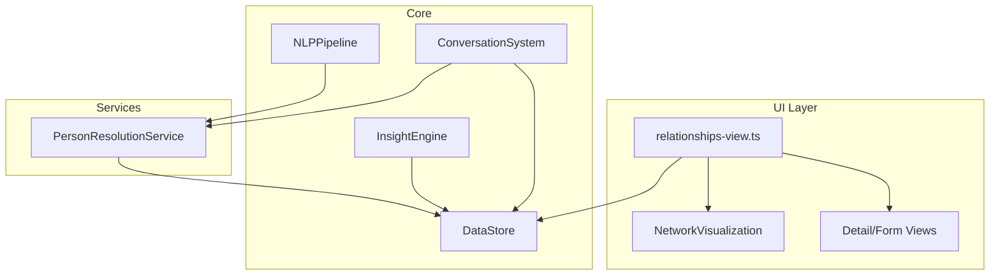

# Design Document: Relationship Network

## Overview

The Relationship Network feature introduces a structured relationship model to the Attune app, replacing the existing unstructured `persons: string[]` on Events with rich, contextual person records. It adds a dedicated "Relationships" tab displaying an interactive radial network graph, a Person Resolution service that matches mentioned names to defined persons, and integration points with the Insight Engine and Conversation system for context-enriched analysis.

The design follows existing patterns: a new `RelationshipPerson` model, DataStore interface extensions with InMemoryDataStore implementation, a standalone `PersonResolutionService`, a `relationships-view.ts` UI renderer, and additions to `index.html` and `app-shell.ts` for tab navigation.

## Architecture



**Data flow:**
1. Parent creates/edits RelationshipPersons via the Relationships tab → persisted to DataStore → serialized to localStorage.
2. When NLPPipeline extracts names from transcripts, PersonResolutionService matches them against defined RelationshipPersons for the active profile.
3. InsightEngine and ConversationSystem query RelationshipPersons from DataStore to enrich narratives and responses.

## Components and Interfaces

### 1. RelationshipPerson Model (`src/models/relationship-person.ts`)

```typescript
export type RelationshipCategory = 'Family' | 'Friends' | 'Childcare' | 'Professional';

export interface RelationshipPerson {
  id: string;
  childProfileId: string;
  name: string;
  category: RelationshipCategory;
  roleLabel: string;
  notes?: string;
  photoBase64?: string; // base64-encoded JPEG or PNG
  createdAt: Date;
  updatedAt: Date;
}

export interface RelationshipPersonInput {
  childProfileId: string;
  name: string;
  category: RelationshipCategory;
  roleLabel?: string; // defaults to category name if omitted
  notes?: string;
  photoBase64?: string;
}
```

### 2. DataStore Interface Extensions (`src/data-store/data-store.ts`)

```typescript
// Added to the DataStore interface:
interface DataStore {
  // ... existing methods ...

  // Relationship Persons
  saveRelationshipPerson(person: RelationshipPerson): void;
  getRelationshipPerson(id: string): RelationshipPerson | null;
  getRelationshipPersons(childProfileId: string): RelationshipPerson[];
  deleteRelationshipPerson(id: string): void;

  // Serialization
  serializeRelationshipPerson(person: RelationshipPerson): string;
  deserializeRelationshipPerson(json: string): RelationshipPerson;
}
```

### 3. InMemoryDataStore Implementation Additions

```typescript
// New private Map:
private relationshipPersons = new Map<string, RelationshipPerson>();

// CRUD methods follow the same pattern as existing entity methods.
// persistToLocalStorage() and loadFromLocalStorage() extended to include
// the relationshipPersons Map in the serialized data object.
```

### 4. PersonResolutionService (`src/person-resolution/person-resolution-service.ts`)

```typescript
export interface ResolvedPerson {
  personId: string;
  name: string;
  category: RelationshipCategory;
  roleLabel: string;
  notes?: string;
}

export interface PersonResolutionResult {
  resolved: Map<string, ResolvedPerson>; // raw name → resolved person
  unresolved: string[]; // names that didn't match
}

export interface PersonResolutionService {
  resolve(
    extractedNames: string[],
    childProfileId: string,
  ): PersonResolutionResult;
}
```

**Matching algorithm:**
1. Normalize both the extracted name and all defined person names/role labels to lowercase, trimmed.
2. Exact match on `name` (case-insensitive).
3. Exact match on `roleLabel` (case-insensitive) — handles "grandma", "nanny", "OT" etc.
4. Partial match: extracted name is a substring of the person's full name or vice versa (e.g., "Meg" matching "Margaret").
5. First match wins (priority: name exact > roleLabel exact > partial).

### 5. Network Visualization Component

The visualization is rendered as an SVG element within the relationships view. It uses a radial layout algorithm.

**Layout Algorithm (`src/ui/network-layout.ts`):**

```typescript
export interface NetworkNode {
  id: string;
  name: string;
  roleLabel: string;
  category: RelationshipCategory;
  photoBase64?: string;
  x: number;
  y: number;
  radius: number; // node size
}

export interface NetworkLayout {
  centerNode: { x: number; y: number; radius: number };
  personNodes: NetworkNode[];
  width: number;
  height: number;
}

export function computeNetworkLayout(
  persons: RelationshipPerson[],
  containerWidth: number,
  containerHeight: number,
): NetworkLayout;
```

**Radial layout rules:**
- Child is placed at center `(width/2, height/2)` with a fixed radius of 28px.
- Categories are assigned angular sectors: Family (315°–45°, top), Friends (45°–135°, right), Childcare (135°–225°, bottom), Professional (225°–315°, left).
- Within each sector, persons are evenly distributed along the angular range.
- Distance from center: 100px (fixed orbit radius for the phone-frame size).
- Node radius: Family = 24px, others = 18px.
- If a sector has no persons, its angular space is not redistributed (keeps spatial consistency).

**Category colors:**
- Family: `var(--sage)` (#7FBF9F)
- Friends: `var(--accent)` (#4A90E2)
- Childcare: `var(--warm)` (#F2C94C)
- Professional: `var(--lavender)` (#9b8ec4)

### 6. Relationships View (`src/ui/relationships-view.ts`)

```typescript
export interface RelationshipsViewDeps {
  dataStore: DataStore;
  activeChildProfileId: () => string | null;
  onDataChange: () => void;
}

export function renderRelationshipsView(
  container: HTMLElement,
  deps: RelationshipsViewDeps,
): void;
```

**View states:**
- **Empty state**: No persons defined → shows placeholder with "Add your first person" prompt.
- **Network view**: SVG radial graph + "Add Person" floating button.
- **Detail view**: Shown on node tap → full person info with edit/delete actions.
- **Form view**: Add/edit person form with name, category picker, role label, notes textarea, photo upload.

**Initials extraction** (for placeholder when no photo):
```typescript
function getInitials(name: string): string {
  return name
    .split(/\s+/)
    .filter(Boolean)
    .map(word => word[0].toUpperCase())
    .slice(0, 2)
    .join('');
}
```

### 7. Integration Points

#### NLP Pipeline Integration

The `extractEventData` method in `NLPPipelineImpl` currently returns `persons: string[]`. After extraction, the event capture flow will call `PersonResolutionService.resolve()` to match names:

```typescript
// In event-capture-system.ts or a new orchestration layer:
const extracted = await nlpPipeline.extractEventData(transcript);
const resolution = personResolutionService.resolve(
  extracted.persons,
  activeChildProfileId,
);

// Event.persons stores: resolved person IDs + unresolved raw strings
// Convention: resolved IDs are prefixed with "id:" to distinguish from raw names
// e.g., ["id:abc-123", "Dr. Unknown"]
```

**Backward compatibility:** Existing events with raw name strings continue to work. The `persons` field remains `string[]`. Resolved persons are stored as `"id:<uuid>"` strings. Display logic checks for the `"id:"` prefix and looks up the RelationshipPerson for rich display.

#### Insight Engine Integration

The InsightEngine's `analyzeCorrelations` and `buildSupportingSignals` methods will be enhanced to:
1. Check if a person reference in an event is a resolved ID (`"id:"` prefix).
2. If so, look up the RelationshipPerson from DataStore.
3. Include `name (roleLabel)` in narrative generation prompts.
4. Group person-related patterns by `category` for weighted analysis.

#### Conversation System Integration

The `answerQuery` method in InsightEngine will:
1. Before calling `nlpPipeline.interpretQuery`, run PersonResolutionService on the query text to identify mentioned persons.
2. Include resolved person context (category, role, notes) in the prompt to `generateConversationalResponse`.
3. When the query is about a specific person, filter events by that person's ID.

## Data Models

### RelationshipPerson Entity

| Field | Type | Required | Description |
|-------|------|----------|-------------|
| id | string (UUID) | Yes | Unique identifier |
| childProfileId | string | Yes | Associated child profile |
| name | string | Yes | Person's display name |
| category | RelationshipCategory | Yes | One of: Family, Friends, Childcare, Professional |
| roleLabel | string | Yes | Short descriptor (defaults to category if not provided) |
| notes | string | No | Private contextual notes |
| photoBase64 | string | No | Base64-encoded image data (JPEG/PNG) |
| createdAt | Date | Yes | Record creation timestamp |
| updatedAt | Date | Yes | Last modification timestamp |

### Storage Schema

The `relationshipPersons` Map is added to the `persistToLocalStorage()` / `loadFromLocalStorage()` cycle in `InMemoryDataStore`, following the same `[key, value][]` array-of-entries pattern used by all other Maps.

Photo data is stored inline as `photoBase64` within the RelationshipPerson JSON. For the localStorage prototype, this is acceptable. A production version would use IndexedDB or a blob store.

### Cascade Deletion

When a ChildProfile is deleted via `deleteChildProfile()`, all associated RelationshipPersons are also deleted (following the existing cascade pattern for events, context entries, etc.).

## Correctness Properties

*A property is a characteristic or behavior that should hold true across all valid executions of a system — essentially, a formal statement about what the system should do. Properties serve as the bridge between human-readable specifications and machine-verifiable correctness guarantees.*

### Property 1: Create and retrieve round-trip

*For any* valid RelationshipPersonInput (with non-empty name and valid category), creating a RelationshipPerson and then retrieving it by ID SHALL produce a record with all input fields preserved, a generated unique ID, and valid timestamps.

**Validates: Requirements 1.1, 1.3**

### Property 2: Role label defaults to category name

*For any* valid RelationshipPersonInput where roleLabel is omitted (undefined), the created RelationshipPerson SHALL have its roleLabel equal to the category name string.

**Validates: Requirements 1.2**

### Property 3: Update modifies fields correctly

*For any* existing RelationshipPerson and any valid partial update (new name, category, roleLabel, or notes), applying the update and retrieving the person SHALL reflect the new values while preserving unchanged fields and the original ID and createdAt.

**Validates: Requirements 1.4, 1.7, 1.8**

### Property 4: Delete removes record completely

*For any* existing RelationshipPerson (with or without photo), deleting it SHALL cause subsequent retrieval by ID to return null, and the person SHALL not appear in the list for that childProfileId.

**Validates: Requirements 1.5**

### Property 5: Photo storage round-trip and replacement

*For any* RelationshipPerson and any base64 string representing photo data, storing the photo and retrieving the person SHALL return the same base64 data. Storing a new photo SHALL replace the previous one entirely.

**Validates: Requirements 2.2, 2.3**

### Property 6: Initials extraction

*For any* non-empty name string, the initials function SHALL return the uppercase first character of each whitespace-separated word, limited to at most 2 characters.

**Validates: Requirements 2.5**

### Property 7: Person resolution matches correctly

*For any* set of defined RelationshipPersons and any extracted name that is a case-variant of a defined person's name or roleLabel, the PersonResolutionService SHALL resolve it to the correct person and provide the person's ID, category, roleLabel, and notes.

**Validates: Requirements 5.1, 5.2, 5.3, 5.5**

### Property 8: Unmatched names pass through without error

*For any* extracted name that does not match any defined RelationshipPerson (by name or roleLabel), the PersonResolutionService SHALL return it in the unresolved list without throwing an error.

**Validates: Requirements 5.4**

### Property 9: Serialization round-trip

*For any* valid RelationshipPerson object (including optional photoBase64 and notes), serializing to JSON then deserializing back SHALL produce an equivalent RelationshipPerson object with all fields preserved.

**Validates: Requirements 8.1, 8.2, 8.3, 8.5**

### Property 10: Malformed JSON handled gracefully

*For any* string that is not valid RelationshipPerson JSON (missing required fields, invalid types, or unparseable), the deserializer SHALL throw a descriptive error (or return null) without crashing, allowing the caller to skip and continue.

**Validates: Requirements 8.4**

### Property 11: Family nodes are larger than other categories

*For any* set of RelationshipPersons containing at least one Family member and one non-Family member, the computed layout SHALL assign a larger node radius to all Family nodes than to any non-Family node.

**Validates: Requirements 3.3**

### Property 12: Layout produces non-overlapping positions

*For any* set of 1 or more RelationshipPersons, the computed network layout SHALL produce node positions where no two nodes overlap (distance between centers > sum of radii).

**Validates: Requirements 3.5**

### Property 13: Same-category nodes grouped in same angular sector

*For any* set of RelationshipPersons, all nodes of the same category SHALL be positioned within the same angular sector of the radial layout (relative to center).

**Validates: Requirements 3.7**

## Error Handling

| Scenario | Handling |
|----------|----------|
| Create with empty name | Throw validation error; UI shows inline error message |
| Create with invalid category | Throw validation error; category picker prevents this in UI |
| Photo upload non-JPEG/PNG | Reject at file input level (accept attribute); show toast if bypassed |
| Photo too large for localStorage | Catch QuotaExceededError on persist; show warning toast suggesting smaller image |
| Malformed JSON during load | Skip record, log `console.warn`, continue loading remaining records |
| Person resolution with no defined persons | Return all names as unresolved (no error) |
| Delete person referenced by existing events | Events retain the `"id:<uuid>"` string; display falls back to showing the raw ID or "Unknown Person" |
| localStorage unavailable | Catch errors in persist/load; app continues with in-memory data only |

## Testing Strategy

### Property-Based Tests (fast-check)

The project will use [fast-check](https://github.com/dubzzz/fast-check) for property-based testing. Each property test runs a minimum of 100 iterations with generated inputs.

**Test file:** `tests/unit/relationship-network.property.test.ts`

Properties to implement:
- Property 1–5: DataStore CRUD operations with generated RelationshipPersonInput
- Property 6: Initials extraction with generated name strings
- Property 7–8: PersonResolutionService with generated person sets and name queries
- Property 9–10: Serialization round-trip with generated RelationshipPerson objects
- Property 11–13: Network layout algorithm with generated person sets

**Tag format:** `Feature: relationship-network, Property {N}: {title}`

### Unit Tests (example-based)

- Confirmation dialog shown before delete (Req 1.6)
- Photo format validation accepts JPEG/PNG only (Req 2.1)
- Photo deletion reverts to placeholder (Req 2.4)
- Empty state rendering (Req 3.8)
- Tab navigation shows correct view (Req 4.1, 4.2)
- Category color mapping returns distinct colors (Req 3.2)
- Node tap shows detail view (Req 3.6)

### Integration Tests

- NLP Pipeline → PersonResolution → Event storage flow (Req 5.1–5.4)
- InsightEngine uses resolved person context in narratives (Req 6.1–6.4)
- ConversationSystem resolves names and enriches responses (Req 7.1–7.4)
- Profile switch refreshes relationship data (Req 4.4)
- Cascade deletion removes persons when profile deleted

### Test Configuration

```typescript
// fast-check configuration
fc.assert(
  fc.property(/* arbitraries */, (input) => {
    // property assertion
  }),
  { numRuns: 100 }
);
```
