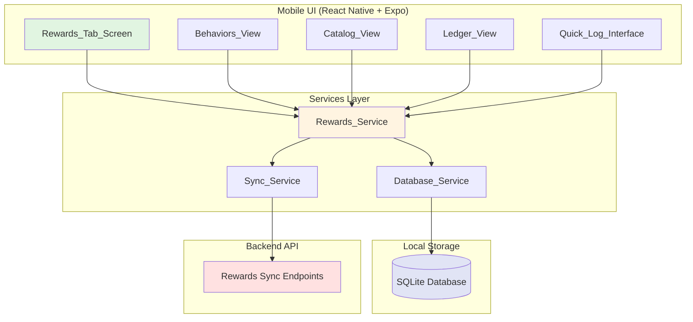
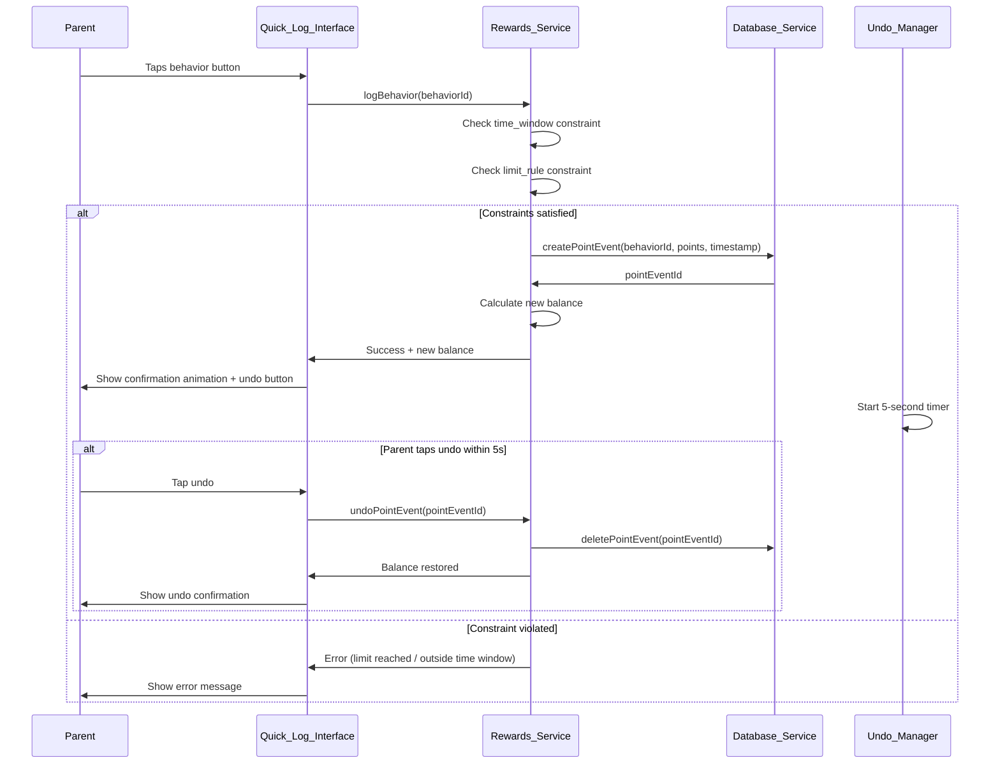
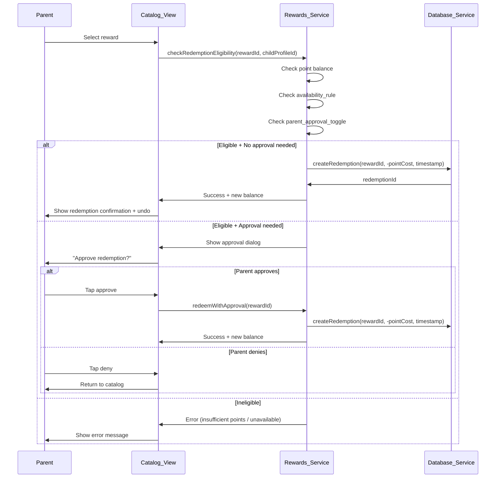
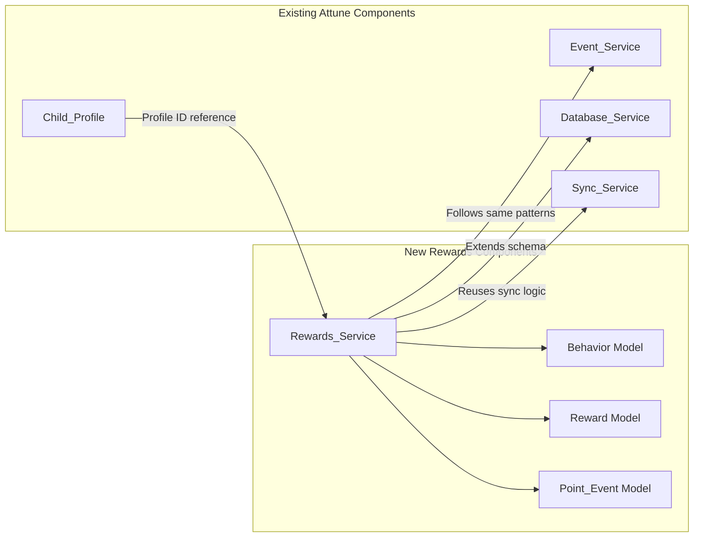

# Technical Design Document — Rewards Tab

## Overview

The Rewards tab is a lightweight positive reinforcement system integrated into the Attune mobile app. It allows parents to define incentivized behaviors (positive and demerit), track point balances per child, manage a rewards catalog, and maintain a complete historical ledger of point activity. The design emphasizes fast logging (< 500ms), multi-device sync support, and visual alignment with Attune's existing calm, emoji-forward design language.

The system reduces daily parent "accounting" by providing:
- **Quick point logging**: Single-tap behavior logging creates point events immediately
- **Clear accountability**: Full ledger with daily summaries and filtering
- **Behavioral clarity**: Exit criteria, time windows, and limit rules prevent disputes
- **Encouragement focus**: Visual design emphasizes positive reinforcement over punishment
- **Multi-child isolation**: Separate point balances and configurations per child profile

Key architectural decisions:
- Extend existing Attune SQLite database schema with rewards-specific tables
- Reuse existing sync infrastructure for multi-device support
- Follow existing event logging patterns for consistency
- Maintain strict child profile isolation for all rewards data
- Use undo pattern (5-second window) for rapid correction of logging mistakes


## Architecture

### High-Level System Diagram




### Data Flow — Fast Behavior Logging




### Data Flow — Reward Redemption




### Integration with Existing Attune Architecture

The Rewards system integrates seamlessly with existing Attune components:



**Reused Patterns:**
- Child profile isolation (same as Events, Documents, Insights)
- SQLite schema extension (same pattern as adding Events, Photos, Documents)
- Sync service integration (same sync queue and conflict resolution)
- Service layer architecture (follows Event_Service, Document_Service patterns)
- Database timestamps and ID generation (UUID v4, Unix timestamps)


## Components and Interfaces

### Rewards_Service

```typescript
interface RewardsService {
  // Behavior Management
  createBehavior(input: BehaviorInput): Promise<Behavior>
  getBehaviors(childProfileId: string): Promise<Behavior[]>
  getBehaviorsByCategory(childProfileId: string, category: string): Promise<Behavior[]>
  updateBehavior(id: string, updates: Partial<BehaviorInput>): Promise<void>
  deleteBehavior(id: string): Promise<void>
  
  // Reward Management
  createReward(input: RewardInput): Promise<Reward>
  getRewards(childProfileId: string): Promise<Reward[]>
  updateReward(id: string, updates: Partial<RewardInput>): Promise<void>
  deleteReward(id: string): Promise<void>
  
  // Point Event Logging
  logBehavior(behaviorId: string, timestamp?: Date): Promise<PointEvent>
  redeemReward(rewardId: string, timestamp?: Date): Promise<PointEvent>
  undoPointEvent(pointEventId: string): Promise<void>
  
  // Point Event Management
  getPointEvents(childProfileId: string, filter?: PointEventFilter): Promise<PointEvent[]>
  updatePointEvent(id: string, updates: Partial<PointEvent>): Promise<void>
  deletePointEvent(id: string): Promise<void>
  
  // Point Balance Calculation
  calculatePointBalance(childProfileId: string): Promise<number>
  getDailySummary(childProfileId: string, date: Date): Promise<DailySummary>
  
  // Constraint Validation
  checkBehaviorEligibility(behaviorId: string, timestamp: Date): Promise<EligibilityResult>
  checkRedemptionEligibility(rewardId: string, childProfileId: string): Promise<EligibilityResult>
}
```


### Database_Service Extensions

```typescript
interface DatabaseService {
  // ... existing methods ...
  
  // Behavior Operations
  createBehavior(behavior: Behavior): Promise<void>
  getBehavior(id: string): Promise<Behavior | null>
  getBehaviorsByProfile(childProfileId: string): Promise<Behavior[]>
  updateBehavior(id: string, updates: Partial<Behavior>): Promise<void>
  deleteBehavior(id: string): Promise<void>
  
  // Reward Operations
  createReward(reward: Reward): Promise<void>
  getReward(id: string): Promise<Reward | null>
  getRewardsByProfile(childProfileId: string): Promise<Reward[]>
  updateReward(id: string, updates: Partial<Reward>): Promise<void>
  deleteReward(id: string): Promise<void>
  
  // Point Event Operations
  createPointEvent(pointEvent: PointEvent): Promise<void>
  getPointEvent(id: string): Promise<PointEvent | null>
  getPointEvents(filter: PointEventFilter): Promise<PointEvent[]>
  updatePointEvent(id: string, updates: Partial<PointEvent>): Promise<void>
  deletePointEvent(id: string): Promise<void>
  
  // Point Balance Queries
  calculatePointBalance(childProfileId: string): Promise<number>
  getDailyPointEvents(childProfileId: string, date: Date): Promise<PointEvent[]>
  
  // Sync Support
  getUnsyncedBehaviors(): Promise<Behavior[]>
  getUnsyncedRewards(): Promise<Reward[]>
  getUnsyncedPointEvents(): Promise<PointEvent[]>
  markBehaviorsSynced(ids: string[]): Promise<void>
  markRewardsSynced(ids: string[]): Promise<void>
  markPointEventsSynced(ids: string[]): Promise<void>
}
```


### Sync_Service Extensions

```typescript
interface SyncService {
  // ... existing methods ...
  
  // Rewards Sync
  syncRewardsData(): Promise<SyncResult>
  uploadBehaviors(behaviors: Behavior[]): Promise<number>
  uploadRewards(rewards: Reward[]): Promise<number>
  uploadPointEvents(pointEvents: PointEvent[]): Promise<number>
  downloadBehaviors(since: number): Promise<Behavior[]>
  downloadRewards(since: number): Promise<Reward[]>
  downloadPointEvents(since: number): Promise<PointEvent[]>
  
  // Conflict Resolution (Last-Write-Wins)
  processDownloadedBehavior(behaviorData: any): Promise<void>
  processDownloadedReward(rewardData: any): Promise<void>
  processDownloadedPointEvent(pointEventData: any): Promise<void>
}
```

### Undo_Manager

```typescript
interface UndoManager {
  registerUndoableAction(action: UndoableAction): void
  undo(actionId: string): Promise<void>
  clearExpiredActions(): void
}

interface UndoableAction {
  id: string
  type: 'point_event' | 'redemption'
  entityId: string
  timestamp: Date
  expiresAt: Date  // timestamp + 5 seconds
  undoFn: () => Promise<void>
}
```


## Data Models

### Core Entities

```typescript
interface Behavior {
  id: string                          // UUID
  childProfileId: string
  title: string
  emoji: string
  pointValue: number                  // positive for rewards, negative for demerits
  category: string
  timeWindow?: TimeWindow
  limitRule?: LimitRule
  exitCriteria?: string               // Up to 500 chars
  notes?: string
  createdAt: Date
  updatedAt: Date
  synced: boolean                     // For sync tracking
}

interface BehaviorInput {
  childProfileId: string
  title: string
  emoji: string
  pointValue: number
  category: string
  timeWindow?: TimeWindow
  limitRule?: LimitRule
  exitCriteria?: string
  notes?: string
}

interface TimeWindow {
  startTime: string                   // HH:MM format (e.g., "18:00")
  endTime: string                     // HH:MM format (e.g., "20:30")
}

interface LimitRule {
  frequency: 'unlimited' | 'daily' | 'weekly'
  maxCount?: number                   // Required if frequency is not 'unlimited'
}
```


```typescript
interface Reward {
  id: string                          // UUID
  childProfileId: string
  title: string
  emoji: string
  pointCost: number                   // Always positive
  availabilityRule?: AvailabilityRule
  parentApprovalRequired: boolean
  createdAt: Date
  updatedAt: Date
  synced: boolean
}

interface RewardInput {
  childProfileId: string
  title: string
  emoji: string
  pointCost: number
  availabilityRule?: AvailabilityRule
  parentApprovalRequired: boolean
}

interface AvailabilityRule {
  type: 'always' | 'weekends_only' | 'after_consecutive_days'
  consecutiveDays?: number            // Required if type is 'after_consecutive_days'
}

interface PointEvent {
  id: string                          // UUID
  childProfileId: string
  type: 'behavior' | 'redemption'
  behaviorId?: string                 // Present if type is 'behavior'
  rewardId?: string                   // Present if type is 'redemption'
  pointValue: number                  // Positive or negative
  timestamp: Date
  parentId?: string                   // Optional: which parent logged this
  createdAt: Date
  synced: boolean
}
```


```typescript
interface PointEventFilter {
  childProfileId: string
  type?: 'behavior' | 'redemption'
  dateRange?: { start: Date; end: Date }
  limit?: number
  offset?: number
}

interface DailySummary {
  date: Date
  pointsEarned: number               // Sum of positive point values
  pointsSpent: number                // Absolute value of negative point values
  netPoints: number                  // pointsEarned - pointsSpent
  eventCount: number
}

interface EligibilityResult {
  eligible: boolean
  reason?: string                    // Error message if not eligible
}
```

### SQLite Schema Extensions

```sql
-- Behaviors Table
CREATE TABLE IF NOT EXISTS behaviors (
  id TEXT PRIMARY KEY,
  child_profile_id TEXT NOT NULL,
  title TEXT NOT NULL,
  emoji TEXT NOT NULL,
  point_value INTEGER NOT NULL,
  category TEXT NOT NULL,
  time_window_start TEXT,
  time_window_end TEXT,
  limit_frequency TEXT,
  limit_max_count INTEGER,
  exit_criteria TEXT,
  notes TEXT,
  created_at INTEGER NOT NULL,
  updated_at INTEGER NOT NULL,
  synced INTEGER NOT NULL DEFAULT 0,
  FOREIGN KEY (child_profile_id) REFERENCES child_profiles(id) ON DELETE CASCADE
);

CREATE INDEX idx_behaviors_child_profile ON behaviors(child_profile_id);
CREATE INDEX idx_behaviors_synced ON behaviors(synced);
```


```sql
-- Rewards Table
CREATE TABLE IF NOT EXISTS rewards (
  id TEXT PRIMARY KEY,
  child_profile_id TEXT NOT NULL,
  title TEXT NOT NULL,
  emoji TEXT NOT NULL,
  point_cost INTEGER NOT NULL,
  availability_type TEXT,
  availability_consecutive_days INTEGER,
  parent_approval_required INTEGER NOT NULL DEFAULT 0,
  created_at INTEGER NOT NULL,
  updated_at INTEGER NOT NULL,
  synced INTEGER NOT NULL DEFAULT 0,
  FOREIGN KEY (child_profile_id) REFERENCES child_profiles(id) ON DELETE CASCADE
);

CREATE INDEX idx_rewards_child_profile ON rewards(child_profile_id);
CREATE INDEX idx_rewards_synced ON rewards(synced);

-- Point Events Table
CREATE TABLE IF NOT EXISTS point_events (
  id TEXT PRIMARY KEY,
  child_profile_id TEXT NOT NULL,
  type TEXT NOT NULL,
  behavior_id TEXT,
  reward_id TEXT,
  point_value INTEGER NOT NULL,
  timestamp INTEGER NOT NULL,
  parent_id TEXT,
  created_at INTEGER NOT NULL,
  synced INTEGER NOT NULL DEFAULT 0,
  FOREIGN KEY (child_profile_id) REFERENCES child_profiles(id) ON DELETE CASCADE,
  FOREIGN KEY (behavior_id) REFERENCES behaviors(id) ON DELETE SET NULL,
  FOREIGN KEY (reward_id) REFERENCES rewards(id) ON DELETE SET NULL
);

CREATE INDEX idx_point_events_child_profile ON point_events(child_profile_id);
CREATE INDEX idx_point_events_timestamp ON point_events(timestamp DESC);
CREATE INDEX idx_point_events_type ON point_events(type);
CREATE INDEX idx_point_events_synced ON point_events(synced);
```


## State Management

The Rewards tab uses React Native's Context API + useReducer pattern, consistent with existing Attune components.

### Rewards Context

```typescript
interface RewardsState {
  selectedChildProfileId: string | null
  behaviors: Behavior[]
  rewards: Reward[]
  pointEvents: PointEvent[]
  pointBalance: number
  todaysSummary: DailySummary | null
  recentActivity: PointEvent[]       // Last 5 events
  loading: boolean
  error: string | null
  undoableActions: Map<string, UndoableAction>
}

interface RewardsContextValue extends RewardsState {
  // Behavior Actions
  createBehavior: (input: BehaviorInput) => Promise<void>
  updateBehavior: (id: string, updates: Partial<BehaviorInput>) => Promise<void>
  deleteBehavior: (id: string) => Promise<void>
  
  // Reward Actions
  createReward: (input: RewardInput) => Promise<void>
  updateReward: (id: string, updates: Partial<RewardInput>) => Promise<void>
  deleteReward: (id: string) => Promise<void>
  
  // Point Event Actions
  logBehavior: (behaviorId: string) => Promise<void>
  redeemReward: (rewardId: string) => Promise<void>
  undoPointEvent: (pointEventId: string) => Promise<void>
  
  // Refresh Actions
  refreshData: () => Promise<void>
  switchChildProfile: (childProfileId: string) => Promise<void>
}
```


### Reducer Actions

```typescript
type RewardsAction =
  | { type: 'SET_LOADING'; loading: boolean }
  | { type: 'SET_ERROR'; error: string | null }
  | { type: 'SET_CHILD_PROFILE'; childProfileId: string }
  | { type: 'SET_BEHAVIORS'; behaviors: Behavior[] }
  | { type: 'ADD_BEHAVIOR'; behavior: Behavior }
  | { type: 'UPDATE_BEHAVIOR'; id: string; updates: Partial<Behavior> }
  | { type: 'DELETE_BEHAVIOR'; id: string }
  | { type: 'SET_REWARDS'; rewards: Reward[] }
  | { type: 'ADD_REWARD'; reward: Reward }
  | { type: 'UPDATE_REWARD'; id: string; updates: Partial<Reward> }
  | { type: 'DELETE_REWARD'; id: string }
  | { type: 'SET_POINT_EVENTS'; pointEvents: PointEvent[] }
  | { type: 'ADD_POINT_EVENT'; pointEvent: PointEvent }
  | { type: 'DELETE_POINT_EVENT'; id: string }
  | { type: 'SET_POINT_BALANCE'; balance: number }
  | { type: 'SET_TODAYS_SUMMARY'; summary: DailySummary }
  | { type: 'SET_RECENT_ACTIVITY'; pointEvents: PointEvent[] }
  | { type: 'ADD_UNDOABLE_ACTION'; action: UndoableAction }
  | { type: 'REMOVE_UNDOABLE_ACTION'; actionId: string }
  | { type: 'CLEAR_EXPIRED_UNDO_ACTIONS' };
```


## UI Component Breakdown

### Rewards_Tab_Screen (Main)

**Responsibility**: Root screen for Rewards tab, displays point balance, daily summary, quick actions, and recent activity.

**Visual Layout**:
```
┌─────────────────────────────────────┐
│  👤 Child Name              🎯      │ ← Header with balance
│                                     │
│  ╭───────────────────────────────╮  │
│  │   🌟 125 Points                │  │ ← Point balance (large, centered)
│  ╰───────────────────────────────╯  │
│                                     │
│  Today's Summary                    │
│  ╭───────────────────────────────╮  │
│  │  +45 earned   -20 spent       │  │ ← Daily summary
│  │  Net: +25 points today        │  │
│  ╰───────────────────────────────╯  │
│                                     │
│  ╭──────────────╮ ╭──────────────╮  │
│  │ ⭐ Earn      │ │ 🎁 Redeem    │  │ ← Quick action buttons
│  │   Points     │ │   Reward     │  │
│  ╰──────────────╯ ╰──────────────╯  │
│                                     │
│  Recent Activity                    │
│  ┌─────────────────────────────┐   │
│  │ 🧹 Cleaned room     +10 pts │   │
│  │ 🍎 Ate breakfast    +5 pts  │   │
│  │ 🎮 Video game      -15 pts  │   │ ← Last 5 events
│  │ 😊 Kindness         +8 pts  │   │
│  │ 📚 Homework done    +10 pts │   │
│  └─────────────────────────────┘   │
│                                     │
│  [View Full Ledger]                 │
└─────────────────────────────────────┘
```

**Props**: None (reads from RewardsContext)

**State Management**: 
- Subscribes to RewardsContext
- Auto-refreshes when child profile switches
- Updates in real-time after point events


### Behaviors_View

**Responsibility**: Display and manage all behavior records, grouped by category.

**Visual Layout**:
```
┌─────────────────────────────────────┐
│  Behaviors              [+ Add New] │ ← Header with add button
│                                     │
│  Self-Care                          │ ← Category header
│  ╭───────────────────────────────╮  │
│  │ 🧹 Clean room          +10 pts│  │
│  │ 🪥 Brushed teeth       +5 pts │  │ ← Positive behaviors
│  │ 🛏️  Made bed            +5 pts │  │
│  ╰───────────────────────────────╯  │
│                                     │
│  School                             │
│  ╭───────────────────────────────╮  │
│  │ 📚 Homework done       +15 pts│  │
│  │ ✏️  Good focus          +10 pts│  │
│  ╰───────────────────────────────╯  │
│                                     │
│  Needs Work                         │ ← Demerit category (muted)
│  ╭───────────────────────────────╮  │
│  │ 😤 Sibling conflict    -10 pts│  │ ← Demerits (orange/neutral)
│  │ 🗣️  Bad language        -5 pts │  │
│  ╰───────────────────────────────╯  │
│                                     │
│  [Manage Categories]                │
└─────────────────────────────────────┘
```

**Interactions**:
- Tap behavior → Show detail/edit modal
- Long press → Delete confirmation
- Tap category → Expand/collapse
- Visual distinction: positive behaviors (green accent), demerits (muted orange)


### Catalog_View

**Responsibility**: Display and manage all rewards, sorted by point cost.

**Visual Layout**:
```
┌─────────────────────────────────────┐
│  Rewards Catalog        [+ Add New] │
│                                     │
│  Available                          │
│  ╭───────────────────────────────╮  │
│  │ 🍦 Ice cream trip      20 pts │  │
│  │ 📱 Extra screen time   30 pts │  │ ← Available rewards
│  │ 🎮 New game           100 pts │  │
│  │ 🎉 Party              200 pts │  │
│  ╰───────────────────────────────╯  │
│                                     │
│  Unavailable (muted)                │
│  ╭───────────────────────────────╮  │
│  │ 🎪 Weekend trip       150 pts │  │ ← Unavailable (grayed out)
│  │   Weekends only 🔒            │  │    with reason displayed
│  ╰───────────────────────────────╯  │
└─────────────────────────────────────┘
```

**Interactions**:
- Tap available reward → Redemption confirmation dialog
- Tap unavailable reward → Show unavailability reason
- Tap reward card → Edit modal
- Long press → Delete confirmation

**Visual Indicators**:
- 🔒 for parent approval required
- 📅 for weekend-only restrictions
- ⏳ for consecutive-day requirements


### Ledger_View

**Responsibility**: Display complete point history with calendar and filtering.

**Visual Layout**:
```
┌─────────────────────────────────────┐
│  Point Ledger          [Filter ⚙️]  │
│                                     │
│  ◀ January 2025 ▶                  │ ← Month navigation
│                                     │
│  S  M  T  W  T  F  S                │
│     1  2  3  4  5  6                │
│  7  8  9 10 11 12 13                │ ← Calendar grid
│ 14 15 16 17 18 19 20                │   Green = net positive
│ 21 22 23 24 25 26 27                │   Orange = net negative
│ 28 29 30 31                         │   White = zero/no data
│                                     │
│  Tap a day to see details           │
│                                     │
│  [Day Detail View appears below]    │
│  ╭───────────────────────────────╮  │
│  │ Friday, Jan 17, 2025          │  │
│  │                               │  │
│  │ 🧹 Cleaned room      +10 pts  │  │
│  │ 🍎 Ate breakfast     +5 pts   │  │
│  │ 📚 Homework done     +15 pts  │  │ ← Day's transactions
│  │ 🎮 Video game        -15 pts  │  │
│  │                               │  │
│  │ Total: +15 points             │  │
│  ╰───────────────────────────────╯  │
└─────────────────────────────────────┘
```

**Filtering Options**:
- All Activity (default)
- Points Earned (behavior logs only)
- Points Spent (redemptions only)
- Date range selector


### Quick_Log_Interface

**Responsibility**: Rapid behavior logging with single-tap interaction.

**Visual Layout**:
```
┌─────────────────────────────────────┐
│  Log Points                    [✕]  │
│                                     │
│  Self-Care                          │
│  ╭───╮ ╭───╮ ╭───╮                 │
│  │🧹 │ │🪥 │ │🛏️ │                 │ ← Behavior buttons
│  │+10│ │+5 │ │+5 │                 │   (emoji + point value)
│  ╰───╯ ╰───╯ ╰───╯                 │
│                                     │
│  School                             │
│  ╭───╮ ╭───╮                       │
│  │📚 │ │✏️ │                       │
│  │+15│ │+10│                       │
│  ╰───╯ ╰───╯                       │
│                                     │
│  [After tapping a behavior]         │
│  ╭───────────────────────────────╮  │
│  │ ✓ +10 points logged!          │  │ ← Success toast with undo
│  │   [Undo]                      │  │
│  ╰───────────────────────────────╯  │
└─────────────────────────────────────┘
```

**Interactions**:
- Tap behavior → Immediate point event creation
- Show success animation + undo button (5 seconds)
- If limit reached or outside time window → Show error toast
- Disabled behaviors are grayed out with reason displayed


### Empty_State_Screen

**Responsibility**: Guide first-time setup when no behaviors or rewards exist.

**Visual Layout**:
```
┌─────────────────────────────────────┐
│                                     │
│         🎯                          │
│                                     │
│  Welcome to Rewards!                │
│                                     │
│  Track positive behaviors and       │
│  let your child earn rewards        │
│  for their achievements.            │
│                                     │
│  Get started by:                    │
│                                     │
│  ╭──────────────────────────────╮   │
│  │  ⭐ Add Your First Behavior  │   │ ← Primary action
│  ╰──────────────────────────────╯   │
│                                     │
│  ╭──────────────────────────────╮   │
│  │  🎁 Add Your First Reward    │   │ ← Secondary action
│  ╰──────────────────────────────╯   │
│                                     │
│  [Skip for now]                     │
└─────────────────────────────────────┘
```

**Tone**: Friendly, encouraging, supportive — aligned with Attune's overall language.


## Performance Considerations

### Fast Logging (<500ms requirement)

**Optimization Strategies**:

1. **Optimistic UI Updates**
   - Update local state immediately before database write
   - Show success feedback instantly
   - Queue database write asynchronously
   - Roll back on failure (rare)

2. **Constraint Pre-Validation**
   - Cache behavior metadata (time windows, limit rules) in memory
   - Check eligibility before database query
   - Only query database for limit count if needed

3. **Point Balance Caching**
   - Cache point balance in RewardsContext
   - Recalculate incrementally (add/subtract point value)
   - Only recompute from scratch on mount or sync

4. **Database Query Optimization**
   - Indexed queries on child_profile_id, timestamp, synced columns
   - Limit recent activity query to 5 records
   - Use prepared statements for repeated queries

5. **React Native Performance**
   - Memoize expensive components (FlatList items)
   - Use React.memo() for behavior/reward cards
   - Debounce ledger filtering
   - Virtualize long lists with FlatList


### Performance Benchmarks

| Operation | Target | Strategy |
|-----------|--------|----------|
| Log behavior | <500ms | Optimistic update + async DB write |
| Redeem reward | <500ms | Same as above |
| Load Rewards tab | <1s | Batch queries, cache balance |
| Switch child profile | <200ms | Cached queries, indexed lookups |
| Sync rewards data | <5s | Background, doesn't block UI |

### Memory Management

- **Limit in-memory point events**: Keep only last 30 days in state
- **Lazy-load ledger data**: Query by month, not entire history
- **Clear undo actions**: Auto-expire after 5 seconds
- **Avoid large object copies**: Use shallow updates in reducer


## Sync Strategy

### Multi-Device Sync Support

The Rewards system reuses Attune's existing sync infrastructure with the following approach:

**Upload Phase**:
1. Query unsynced behaviors, rewards, and point events (where `synced = 0`)
2. Batch upload to backend API
3. Mark records as synced (`synced = 1`) on success

**Download Phase**:
1. Query backend for changes since last sync timestamp
2. Process downloaded records with conflict resolution
3. Update local database

**Conflict Resolution Strategy**: Last-Write-Wins
- Compare `updated_at` (behaviors/rewards) or `created_at` (point events) timestamps
- Remote timestamp > local timestamp → Apply remote changes
- Local timestamp >= remote timestamp → Keep local version

### Sync Endpoints

```typescript
// Backend API endpoints (to be implemented)
POST /api/sync/behaviors          // Upload behaviors
POST /api/sync/rewards            // Upload rewards
POST /api/sync/point-events       // Upload point events

GET /api/sync/behaviors?since=<timestamp>      // Download behaviors
GET /api/sync/rewards?since=<timestamp>        // Download rewards
GET /api/sync/point-events?since=<timestamp>   // Download point events
```


### Sync Conflict Examples

**Example 1: Point Event Conflict**
- Device A logs behavior at 10:00 AM, syncs at 10:05 AM
- Device B logs same behavior at 10:01 AM (before sync), syncs at 10:06 AM
- Resolution: Both point events are valid, both preserved (different IDs, different timestamps)

**Example 2: Behavior Edit Conflict**
- Device A edits behavior title at 10:00 AM
- Device B edits same behavior point value at 10:01 AM (offline)
- Device B syncs at 10:05 AM
- Resolution: Device B's edit wins (later timestamp)
- Result: Device A gets Device B's changes on next sync

**Example 3: Deletion Conflict**
- Device A deletes reward at 10:00 AM
- Device B redeems same reward at 10:01 AM (offline)
- Device B syncs at 10:05 AM
- Resolution: Deletion timestamp is later, redemption is preserved but reward reference is NULL

### Sync Frequency

- **Automatic sync**: Every 15 minutes when online
- **Manual sync**: Pull-to-refresh on Rewards tab
- **On-demand sync**: Triggered after child profile switch
- **Background sync**: iOS/Android background fetch (platform-dependent)


## Visual Design Specifications

### Color Palette (Aligned with Attune)

**Positive Elements** (earned points, positive behaviors):
- Primary: `#4CAF50` (green)
- Light background: `#E8F5E9`
- Border: `#81C784`

**Neutral Elements** (balance, rewards):
- Primary: `#2196F3` (blue)
- Light background: `#E3F2FD`
- Border: `#64B5F6`

**Demerit Elements** (negative points, demerits):
- Primary: `#FF9800` (muted orange, not harsh red)
- Light background: `#FFF3E0`
- Border: `#FFB74D`

**Text Colors**:
- Primary text: `#212121`
- Secondary text: `#757575`
- Disabled text: `#BDBDBD`

**Background**:
- Screen background: `#FAFAFA`
- Card background: `#FFFFFF`
- Shadow: `rgba(0, 0, 0, 0.1)`


### Typography

**Headers**:
- Screen title: 24px, weight 600, color `#212121`
- Section header: 18px, weight 600, color `#212121`
- Card title: 16px, weight 500, color `#212121`

**Body Text**:
- Primary: 16px, weight 400, color `#212121`
- Secondary: 14px, weight 400, color `#757575`
- Caption: 12px, weight 400, color `#757575`

**Emoji Sizes**:
- Behavior/reward cards: 32px
- Point balance display: 48px
- Quick log buttons: 40px

### Spacing & Layout

**Card Styling** (consistent with Today tab):
- Border radius: 16px
- Padding: 16px
- Margin between cards: 12px
- Shadow: `0px 2px 4px rgba(0, 0, 0, 0.1)`

**Button Styling**:
- Border radius: 12px
- Padding: 12px 24px
- Minimum touch target: 44px × 44px

**Behavior/Reward Grid**:
- 3 columns on phone
- 4-5 columns on tablet
- 12px gap between items


### Animations & Transitions

**Success Feedback** (logging behavior):
- Scale animation: button scales to 1.1x then back to 1.0 (150ms)
- Bounce animation: point balance bounces slightly (200ms)
- Toast slide-in: success message slides up from bottom (250ms)

**Undo Timer**:
- Progress bar: 5-second countdown visual
- Color: muted gray → orange as time expires

**Navigation Transitions**:
- Screen transitions: 300ms ease-out
- Modal slide-up: 250ms ease-out

**Loading States**:
- Skeleton screens for initial load
- Spinner for sync operations
- Disabled state with opacity 0.5 during async operations

### Accessibility

**Color Contrast**:
- All text meets WCAG AA standards (4.5:1 for normal text)
- Interactive elements have 3:1 contrast with background

**Touch Targets**:
- Minimum 44px × 44px for all interactive elements
- Adequate spacing between tappable items (minimum 8px)

**Screen Reader Support**:
- All buttons have descriptive labels
- Point values announced as "plus X points" or "minus X points"
- Balance announced as "current balance: X points"


## Correctness Properties

*A property is a characteristic or behavior that should hold true across all valid executions of a system — essentially, a formal statement about what the system should do. Properties serve as the bridge between human-readable specifications and machine-verifiable correctness guarantees.*

### Redundancy Analysis

After analyzing all testable acceptance criteria, the following properties were identified. Several potential redundancies were resolved:

- Point event creation properties (10.1, 11.1) can be unified since demerits are just behaviors with negative values
- Daily summary calculation properties (3.1-3.4) can be combined into comprehensive calculation properties
- Data isolation properties (1.4, 20.1-20.6) share the same underlying concern and can be unified
- Serialization properties (21.1-21.7) follow the same round-trip pattern for all entity types

The consolidated properties below provide comprehensive correctness coverage without redundancy.


### Property 1: Point balance calculation correctness

*For any* set of Point_Event records associated with a Child_Profile, the calculated Point_Balance should equal the sum of all point_value fields across those events.

**Validates: Requirements 2.2, 2.3**

### Property 2: Daily summary calculation correctness

*For any* set of Point_Event records on a given date for a Child_Profile, the Daily_Summary calculations should satisfy:
- pointsEarned = sum of all positive point_value fields
- pointsSpent = absolute value of sum of all negative point_value fields  
- netPoints = pointsEarned - pointsSpent

**Validates: Requirements 3.1, 3.2, 3.3, 3.4**

### Property 3: Recent activity ordering and limiting

*For any* set of Point_Event records for a Child_Profile, querying recent activity should return at most 5 events in reverse chronological order (most recent first), where each event's timestamp is >= the next event's timestamp.

**Validates: Requirements 5.1, 5.2, 5.3**

### Property 4: Behavior logging creates point event

*For any* valid Behavior, logging that behavior should create a Point_Event with matching behaviorId, the correct point_value (positive or negative), current timestamp, and the child_profile_id.

**Validates: Requirements 10.1, 11.1, 11.4**


### Property 5: Undo point event reversal

*For any* Point_Event that was just created, invoking undo within 5 seconds should delete that Point_Event and restore the Point_Balance to its previous value.

**Validates: Requirements 10.5, 15.6**

### Property 6: Limit rule enforcement

*For any* Behavior with a limit_rule (daily or weekly frequency with max_count), attempting to log that behavior more than max_count times within the current limit period should be rejected with an error, and no Point_Event should be created.

**Validates: Requirements 7.2, 7.3, 7.4, 7.5**

### Property 7: Time window constraint enforcement

*For any* Behavior with a time_window constraint, attempting to log that behavior when the current time falls outside the specified [startTime, endTime] range should be rejected with an error, and no Point_Event should be created.

**Validates: Requirements 8.2, 8.3, 8.4**

### Property 8: Reward redemption balance validation

*For any* Reward redemption attempt, if the current Point_Balance is less than the Reward's point_cost, the redemption should be rejected with an error. If the balance is sufficient, a Point_Event with negative point_value equal to -point_cost should be created.

**Validates: Requirements 15.1, 15.2, 15.3, 15.4**


### Property 9: Availability rule enforcement

*For any* Reward with an availability_rule, redemption should be validated against that rule: "weekends_only" rewards should only be redeemable on Saturday/Sunday, "after_consecutive_days" rewards should only be redeemable after the specified number of consecutive positive-balance days. Redemption attempts violating the rule should be rejected.

**Validates: Requirements 13.2, 13.3, 13.4**

### Property 10: Parent approval requirement enforcement

*For any* Reward with parent_approval_required set to true, attempting redemption should trigger a confirmation dialog and should not create a Point_Event until explicit parent approval is given. Denial should cancel the redemption without point deduction.

**Validates: Requirements 14.2, 14.3, 14.4, 14.5**

### Property 11: Point event field immutability

*For any* existing Point_Event, attempting to update the behavior_id, reward_id, or point_value fields should be rejected. Only the timestamp and notes fields should be editable.

**Validates: Requirements 16.6**

### Property 12: Child profile data isolation

*For any* two distinct Child_Profile records, all Behavior, Reward, and Point_Event records associated with one profile should never appear in queries filtered to the other profile.

**Validates: Requirements 1.4, 1.5, 20.1, 20.2, 20.3, 20.4, 20.5, 20.6**


### Property 13: Scroll position persistence

*For any* scroll position on the Rewards_Tab, navigating away to another tab and returning should restore the exact scroll position.

**Validates: Requirements 1.3**

### Property 14: Behavior required fields validation

*For any* Behavior input, if title, emoji, or point_value fields are missing or empty, the save operation should be rejected. All other fields are optional and the behavior should save successfully if only required fields are present.

**Validates: Requirements 6.8**

### Property 15: Reward required fields validation

*For any* Reward input, if title, emoji, or point_cost fields are missing or empty, the save operation should be rejected. All other fields are optional and the reward should save successfully if only required fields are present.

**Validates: Requirements 12.7**

### Property 16: Ledger daily summary calculation

*For any* month displayed in the Ledger_View calendar, each day should display a Daily_Summary where pointsEarned, pointsSpent, and netPoints are correctly calculated from all Point_Events on that date.

**Validates: Requirements 17.1, 17.2, 17.6, 17.7, 17.8**


### Property 17: Point event filtering correctness

*For any* PointEventFilter with specified type ('behavior' or 'redemption'), date range, limit, and offset, all returned Point_Event records should match the filter criteria, and no matching records should be excluded.

**Validates: Requirements 18.1, 18.2, 18.3, 18.5**

### Property 18: Behavior category grouping

*For any* set of Behavior records for a Child_Profile, querying behaviors grouped by category should return groups where all behaviors in each group share the same category value, and the union of all groups contains all behaviors.

**Validates: Requirements 23.1, 23.2, 23.3**

### Property 19: Behavior serialization round-trip

*For any* valid Behavior object (including all field combinations: with/without time_window, with/without limit_rule, with/without exit_criteria, with/without notes), serializing to JSON and deserializing back should produce an equivalent Behavior object.

**Validates: Requirements 21.1, 21.4**

### Property 20: Reward serialization round-trip

*For any* valid Reward object (including all field combinations: with/without availability_rule, with/without parent_approval_required), serializing to JSON and deserializing back should produce an equivalent Reward object.

**Validates: Requirements 21.2, 21.5**


### Property 21: Point event serialization round-trip

*For any* valid Point_Event object (including all type variants, with/without behavior_id or reward_id, with/without parent_id), serializing to JSON and deserializing back should produce an equivalent Point_Event object.

**Validates: Requirements 21.3, 21.6**

### Property 22: Malformed JSON resilience

*For any* array of JSON records where some are valid Behavior/Reward/Point_Event records and some are malformed (missing required fields, wrong types, corrupted structure), batch deserialization should return all valid records and skip all malformed records without throwing.

**Validates: Requirements 21.7**

### Property 23: Sync correctness

*For any* set of unsyncedBehaviors, unsyncedRewards, and unsyncedPointEvents uploaded to the backend, and any set of remote changes downloaded from the backend, the local database after sync completion should reflect all local changes uploaded and all remote changes downloaded (with last-write-wins conflict resolution applied).

**Validates: Requirements 22.1, 22.2, 22.3, 22.4, 22.5**


## Error Handling

### Constraint Violation Errors

**Time Window Violations**:
- Error message: "This behavior can only be logged between [startTime] and [endTime]"
- UI response: Toast notification, behavior button temporarily disabled
- Logging: Warning logged to console

**Limit Rule Violations**:
- Error message: "You've already logged this behavior [maxCount] times today/this week"
- UI response: Toast notification showing limit and reset time
- Logging: Info logged to console

**Insufficient Points for Redemption**:
- Error message: "Not enough points. Need [pointCost] but only have [currentBalance]"
- UI response: Modal with error message and balance display
- Logging: Info logged to console

**Availability Rule Violations**:
- Error message: "This reward is only available on weekends" or "This reward requires [N] consecutive positive days"
- UI response: Toast notification, reward card shows unavailability indicator
- Logging: Info logged to console


### Database Errors

**Write Failures**:
- If createPointEvent fails, roll back optimistic UI update and show error toast
- If createBehavior/createReward fails, show error modal and allow retry
- Log full error stack to console for debugging

**Query Failures**:
- If balance calculation query fails, display cached balance with "⚠️" indicator
- If behavior/reward list query fails, show cached data with refresh button
- Display user-friendly error: "Could not load data. Tap to retry."

**Delete Constraint Violations**:
- Cannot delete behavior/reward referenced by point events
- Show modal: "This [behavior/reward] has been used and cannot be deleted. You can hide it instead."
- Offer "Hide" alternative that sets a hidden flag

### Sync Errors

**Network Errors**:
- Queue failed sync operations for retry
- Show banner: "Sync paused. Will retry when online."
- Continue allowing local operations

**Conflict Resolution Errors**:
- Log conflict details to console
- Apply last-write-wins strategy silently
- If conflict cannot be resolved, flag for manual review

**Backend Errors (4xx, 5xx)**:
- Show error banner with retry option
- Queue operations for later retry
- Log error details for debugging


### Validation Errors

**Missing Required Fields**:
- Behavior/Reward creation: highlight missing fields in red
- Show inline error: "This field is required"
- Disable save button until all required fields are filled

**Invalid Data Types**:
- Point values: must be integers (validation on input)
- Time windows: must be valid HH:MM format
- Show inline error with correct format example

**Malformed JSON During Deserialization**:
- Skip malformed records
- Log warning with record ID and error details
- Continue loading valid records
- Show notification: "Some data could not be loaded. Contact support if this persists."

### Performance Degradation

**Slow Logging (>500ms)**:
- Still complete the operation
- Log performance warning to console
- Investigate causes: database lock, too many records, device constraints

**Slow Sync (>10s)**:
- Show progress indicator
- Allow user to cancel and retry later
- Log sync performance metrics


## Testing Strategy

### Dual Testing Approach

The Rewards system requires both **unit tests** (specific examples, edge cases, error conditions) and **property tests** (universal properties across all inputs) for comprehensive coverage.

**Unit Tests** focus on:
- Specific UI interactions and navigation flows
- Edge cases like boundary times for time windows
- Error message formatting and display
- Visual styling and layout verification
- Integration between Rewards service and database

**Property Tests** focus on:
- Universal correctness of calculations (balance, daily summaries)
- Data isolation between child profiles
- Constraint enforcement across all possible inputs
- Serialization round-trips for all entity types
- Filtering and sorting logic for all combinations

### Property-Based Testing Configuration

**Library**: fast-check (JavaScript/TypeScript property-based testing)
**Minimum iterations**: 100 runs per property test
**Tag format**: Each property test must include a comment referencing the design document property

Example:
```typescript
// Feature: rewards-tab, Property 1: Point balance calculation correctness
test('point balance equals sum of all point event values', () => {
  fc.assert(
    fc.property(
      fc.array(pointEventArbitrary),
      (pointEvents) => {
        const calculatedBalance = calculateBalance(pointEvents);
        const expectedBalance = pointEvents.reduce((sum, e) => sum + e.pointValue, 0);
        expect(calculatedBalance).toBe(expectedBalance);
      }
    ),
    { numRuns: 100 }
  );
});
```


### Test Coverage by Category

**Behavior Management Tests**:
- Unit: Create, edit, delete behaviors with various field combinations
- Unit: Validate required fields (title, emoji, point_value)
- Property: Behavior serialization round-trip (Property 19)
- Property: Required fields validation (Property 14)
- Property: Category grouping correctness (Property 18)

**Reward Management Tests**:
- Unit: Create, edit, delete rewards with various field combinations
- Unit: Validate required fields (title, emoji, point_cost)
- Property: Reward serialization round-trip (Property 20)
- Property: Required fields validation (Property 15)

**Point Logging Tests**:
- Unit: Quick-tap logging creates events correctly
- Unit: Undo within 5 seconds reverses the event
- Property: Behavior logging creates point event (Property 4)
- Property: Undo reversal correctness (Property 5)
- Property: Point balance updates correctly (Property 2.3)

**Constraint Enforcement Tests**:
- Unit: Time window edge cases (midnight boundary, DST transitions)
- Unit: Limit rule edge cases (first of month, first of week)
- Property: Time window constraint enforcement (Property 7)
- Property: Limit rule enforcement (Property 6)
- Property: Availability rule enforcement (Property 9)
- Property: Parent approval requirement (Property 10)

**Redemption Tests**:
- Unit: Insufficient balance shows correct error
- Unit: Redemption success flow
- Property: Balance validation (Property 8)
- Property: Approval enforcement (Property 10)


**Balance and Summary Tests**:
- Unit: Balance display with zero, positive, negative values
- Property: Point balance calculation (Property 1)
- Property: Balance updates after events (Property 2.3)
- Property: Daily summary calculations (Property 2)
- Property: Ledger daily summaries (Property 16)

**Data Isolation Tests**:
- Unit: Switching child profiles updates displayed data
- Property: Child profile data isolation (Property 12)
- Property: Filtered queries respect child profile (Property 1.4, 1.5)

**Filtering and Sorting Tests**:
- Unit: Recent activity shows latest 5 events
- Property: Recent activity ordering (Property 3)
- Property: Point event filtering (Property 17)

**Serialization Tests**:
- Property: Behavior round-trip (Property 19)
- Property: Reward round-trip (Property 20)
- Property: Point event round-trip (Property 21)
- Property: Malformed JSON handling (Property 22)

**Sync Tests**:
- Unit: Sync uploads unsynced records
- Unit: Sync downloads remote changes
- Unit: Conflict resolution (last-write-wins)
- Property: Sync correctness (Property 23)
- Integration: Multi-device sync scenario

**UI Interaction Tests**:
- Unit: Navigation between views
- Unit: Empty state displays correctly
- Unit: Scroll position persistence (Property 13)
- Visual: Styling consistency with Today tab


### Generator Strategies (Property Tests)

**Arbitrary Generators** needed for property tests:

```typescript
// Behavior generator
const behaviorArbitrary = fc.record({
  id: fc.uuid(),
  childProfileId: fc.uuid(),
  title: fc.string({ minLength: 1, maxLength: 50 }),
  emoji: fc.constantFrom('🧹', '🪥', '📚', '🍎', '😊', '🎮'),
  pointValue: fc.integer({ min: -20, max: 20 }),
  category: fc.constantFrom('Self-Care', 'School', 'Kindness', 'Needs Work'),
  timeWindow: fc.option(fc.record({
    startTime: fc.constantFrom('06:00', '12:00', '18:00'),
    endTime: fc.constantFrom('09:00', '15:00', '21:00')
  })),
  limitRule: fc.option(fc.record({
    frequency: fc.constantFrom('daily', 'weekly', 'unlimited'),
    maxCount: fc.integer({ min: 1, max: 10 })
  })),
  exitCriteria: fc.option(fc.string({ maxLength: 500 })),
  notes: fc.option(fc.string({ maxLength: 200 }))
});

// Reward generator
const rewardArbitrary = fc.record({
  id: fc.uuid(),
  childProfileId: fc.uuid(),
  title: fc.string({ minLength: 1, maxLength: 50 }),
  emoji: fc.constantFrom('🍦', '🎮', '📱', '🎉', '🎪'),
  pointCost: fc.integer({ min: 5, max: 500 }),
  availabilityRule: fc.option(fc.record({
    type: fc.constantFrom('always', 'weekends_only', 'after_consecutive_days'),
    consecutiveDays: fc.option(fc.integer({ min: 3, max: 14 }))
  })),
  parentApprovalRequired: fc.boolean()
});

// Point event generator
const pointEventArbitrary = fc.record({
  id: fc.uuid(),
  childProfileId: fc.uuid(),
  type: fc.constantFrom('behavior', 'redemption'),
  pointValue: fc.integer({ min: -100, max: 100 }),
  timestamp: fc.date({ min: new Date('2024-01-01'), max: new Date() }),
  behaviorId: fc.option(fc.uuid()),
  rewardId: fc.option(fc.uuid()),
  parentId: fc.option(fc.uuid())
});
```


### Test Execution Strategy

**Local Development**:
- Run unit tests on every save (watch mode)
- Run property tests before commit (pre-commit hook)
- Target: All tests pass in <10 seconds

**Continuous Integration**:
- Run full test suite on every PR
- Run property tests with 100 iterations minimum
- Fail build if any test fails or coverage drops below 80%

**Performance Testing**:
- Measure behavior logging time (target <500ms)
- Measure child profile switch time (target <200ms)
- Measure sync operation time (target <5s for typical data)
- Test with realistic data volumes (1000+ point events per child)

**Integration Testing**:
- Test complete user flows (setup → log → redeem → view ledger)
- Test multi-device sync scenarios
- Test offline → online transition with queued operations
- Test child profile switching with large datasets

**Visual Regression Testing**:
- Snapshot tests for all major screens
- Test styling consistency with Today tab
- Test responsive layout on phone and tablet
- Test light/dark mode if supported


## Migration and Rollout Strategy

### Database Migration

**Migration Script** (to be run on app update):

```typescript
async function migrateToRewardsV1() {
  const db = await SQLite.openDatabaseAsync('attune.db');
  
  // Check if migration already applied
  const migrationCheck = await db.getFirstAsync(
    "SELECT name FROM sqlite_master WHERE type='table' AND name='behaviors'"
  );
  
  if (migrationCheck) {
    console.log('Rewards tables already exist, skipping migration');
    return;
  }
  
  // Create new tables
  await db.execAsync(`
    -- Behaviors table
    CREATE TABLE IF NOT EXISTS behaviors (
      id TEXT PRIMARY KEY,
      child_profile_id TEXT NOT NULL,
      title TEXT NOT NULL,
      emoji TEXT NOT NULL,
      point_value INTEGER NOT NULL,
      category TEXT NOT NULL,
      time_window_start TEXT,
      time_window_end TEXT,
      limit_frequency TEXT,
      limit_max_count INTEGER,
      exit_criteria TEXT,
      notes TEXT,
      created_at INTEGER NOT NULL,
      updated_at INTEGER NOT NULL,
      synced INTEGER NOT NULL DEFAULT 0,
      FOREIGN KEY (child_profile_id) REFERENCES child_profiles(id) ON DELETE CASCADE
    );
    
    -- Rewards table
    CREATE TABLE IF NOT EXISTS rewards (
      id TEXT PRIMARY KEY,
      child_profile_id TEXT NOT NULL,
      title TEXT NOT NULL,
      emoji TEXT NOT NULL,
      point_cost INTEGER NOT NULL,
      availability_type TEXT,
      availability_consecutive_days INTEGER,
      parent_approval_required INTEGER NOT NULL DEFAULT 0,
      created_at INTEGER NOT NULL,
      updated_at INTEGER NOT NULL,
      synced INTEGER NOT NULL DEFAULT 0,
      FOREIGN KEY (child_profile_id) REFERENCES child_profiles(id) ON DELETE CASCADE
    );
    
    -- Point events table
    CREATE TABLE IF NOT EXISTS point_events (
      id TEXT PRIMARY KEY,
      child_profile_id TEXT NOT NULL,
      type TEXT NOT NULL,
      behavior_id TEXT,
      reward_id TEXT,
      point_value INTEGER NOT NULL,
      timestamp INTEGER NOT NULL,
      parent_id TEXT,
      created_at INTEGER NOT NULL,
      synced INTEGER NOT NULL DEFAULT 0,
      FOREIGN KEY (child_profile_id) REFERENCES child_profiles(id) ON DELETE CASCADE,
      FOREIGN KEY (behavior_id) REFERENCES behaviors(id) ON DELETE SET NULL,
      FOREIGN KEY (reward_id) REFERENCES rewards(id) ON DELETE SET NULL
    );
    
    -- Create indexes
    CREATE INDEX idx_behaviors_child_profile ON behaviors(child_profile_id);
    CREATE INDEX idx_behaviors_synced ON behaviors(synced);
    CREATE INDEX idx_rewards_child_profile ON rewards(child_profile_id);
    CREATE INDEX idx_rewards_synced ON rewards(synced);
    CREATE INDEX idx_point_events_child_profile ON point_events(child_profile_id);
    CREATE INDEX idx_point_events_timestamp ON point_events(timestamp DESC);
    CREATE INDEX idx_point_events_type ON point_events(type);
    CREATE INDEX idx_point_events_synced ON point_events(synced);
  `);
  
  console.log('Rewards database migration completed successfully');
}
```


### Rollout Plan

**Phase 1: Internal Testing** (Week 1-2)
- Deploy to TestFlight/internal beta
- Test with 3-5 families (existing Attune users)
- Focus on performance, UX feedback, and bug identification
- Collect feedback on tone, language, and visual design

**Phase 2: Limited Beta** (Week 3-4)
- Expand to 20-30 beta testers
- Monitor sync performance and conflict resolution
- Test multi-device scenarios extensively
- Gather feature requests and edge case discoveries

**Phase 3: General Release** (Week 5)
- Gradual rollout to all users (10% → 50% → 100% over 3 days)
- Monitor error rates, crash reports, and performance metrics
- Provide in-app tutorial for first-time Rewards tab visitors
- Support documentation and FAQ published

**Post-Release Monitoring**:
- Track usage metrics: behaviors logged per day, redemptions, balance trends
- Monitor performance: logging time, sync time, crash rates
- Collect user feedback via in-app survey
- Plan iteration based on real-world usage patterns

### Backwards Compatibility

**Existing Users**:
- Rewards tab is purely additive — no changes to existing features
- Empty state guides setup for users with no behaviors/rewards
- No data migration required (new tables, no schema changes to existing)

**API Versioning**:
- New sync endpoints: `/api/v1/sync/behaviors`, `/api/v1/sync/rewards`, `/api/v1/sync/point-events`
- Existing endpoints unchanged


## Future Enhancements

### Potential Features (Out of Scope for MVP)

**Advanced Analytics**:
- Weekly/monthly point trends
- Behavior effectiveness analysis (which behaviors get logged most)
- Redemption patterns visualization

**Behavior Scheduling**:
- Recurring behaviors (daily checklists)
- Time-based reminders for behaviors
- Automatic point award on schedule completion

**Reward Tiers**:
- Bronze/Silver/Gold reward categories
- Unlock higher tiers after threshold achievements
- Visual progression indicators

**Family Sharing**:
- Multiple parent accounts with shared child data
- Parent-specific approval permissions
- Activity log showing which parent logged what

**Gamification**:
- Badges for milestones (e.g., "7-day streak")
- Bonus point multipliers for consistency
- Achievement unlocks

**Export and Reporting**:
- PDF export of ledger for specific date ranges
- CSV export for external analysis
- Share progress reports with therapists/educators

**Social Features** (carefully designed):
- Sibling comparison (optional, privacy-aware)
- Group family goals
- Collaborative rewards

