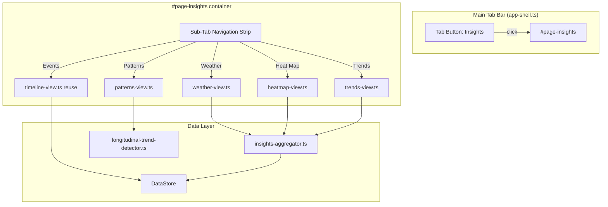

# Design Document: Visual Insight Engine

## Overview

The Visual Insight Engine replaces the existing Timeline tab with a new "Insights" tab that surfaces mood, behavioral, and longitudinal-trend data through five sub-tab views: Weather, Heat Map, Trends, Patterns, and Events. All visualizations are rendered with imperative DOM manipulation using native elements and `<canvas>` (for sparklines), consistent with the existing vanilla TypeScript SPA architecture. No external charting libraries are introduced.

The feature builds on top of the existing `DayMood` model (autoMood/overrideMood with `MoodColor`), the `Event` model, and the `longitudinal-trend-detector` module. A new data-aggregation layer computes rolling averages, mood scores, and per-day event counts that feed each visualization. The existing timeline event list is preserved as the "Events" sub-tab with all current filtering and pagination intact.

### Key Design Decisions

1. **Canvas for sparklines, DOM for everything else.** The sparkline chart requires smooth line rendering with color-coded segments and interactive tap targets — `<canvas>` handles this cleanly within the 375px phone-frame. The weather strip, heat map, and pattern cards use styled `<div>`/`<span>` elements since they are grid/badge layouts that benefit from CSS custom properties.

2. **Session-scoped Event Type Selector state.** Selected event-type chips persist via `sessionStorage` so they survive sub-tab switches but reset on page reload, matching the ephemeral nature of exploration.

3. **Aggregation layer as pure functions.** All data aggregation (rolling averages, mood scoring, day-bucketing) lives in a standalone `insights-aggregator.ts` module with pure functions that take events/moods and return computed structures. This keeps rendering code thin and makes aggregation independently testable.

4. **Sub-tab navigation inside the Insights tab.** A horizontal pill strip within the `#page-insights` container manages sub-views. This is separate from the main tab bar and uses a simple show/hide pattern matching the existing `initTabNavigation()` approach.

## Architecture



### Module Dependency Flow

1. `app-shell.ts` imports `renderInsightsView` from `insights-view.ts` (replaces `renderTimelineView` import for the tab).
2. `insights-view.ts` orchestrates sub-tab navigation and delegates to sub-view renderers.
3. Each sub-view renderer receives an `InsightsViewDeps` object containing `dataStore`, `eventCaptureSystem`, `contextEngine`, and `activeChildProfileId`.
4. Sub-views call pure functions from `insights-aggregator.ts` to compute display data.
5. The Patterns sub-view calls `detectLongitudinalTrends` (or reads cached insights from `dataStore.getInsights`).

## Components and Interfaces

### New Files

| File | Purpose |
|------|---------|
| `src/ui/insights-view.ts` | Top-level Insights tab renderer with sub-tab navigation |
| `src/ui/insights/weather-view.ts` | Mood Weather Strip sub-view |
| `src/ui/insights/heatmap-view.ts` | Heat Map Calendar sub-view |
| `src/ui/insights/trends-view.ts` | Trend Sparkline + Event Type Selector sub-view |
| `src/ui/insights/patterns-view.ts` | Pattern Summary Cards sub-view |
| `src/ui/insights-aggregator.ts` | Pure data aggregation functions |

### Modified Files

| File | Change |
|------|--------|
| `index.html` | Replace `page-timeline` with `page-insights`; update tab button icon/label |
| `src/ui/app-shell.ts` | Import `renderInsightsView` instead of `renderTimelineView`; wire to `#page-insights` |

### Interfaces

```typescript
// insights-view.ts
export interface InsightsViewDeps {
  dataStore: DataStore;
  eventCaptureSystem: EventCaptureSystem;
  contextEngine: ContextEngine;
  activeChildProfileId: () => string | null;
}

export function renderInsightsView(container: HTMLElement, deps: InsightsViewDeps): void;
```

```typescript
// insights-aggregator.ts

/** A single day's aggregated data for visualizations. */
export interface DayAggregate {
  dateKey: string;               // YYYY-MM-DD
  effectiveMood: MoodColor | null; // overrideMood ?? autoMood, or null if no DayMood
  moodScore: number | null;      // green=3, amber=2, red=1, null if no mood
  totalEventCount: number;
  eventCountsByType: Record<string, number>;
  maxSeverity: number;           // highest severity among the day's events, 0 if none
}

/** Rolling average data point for sparklines. */
export interface RollingDataPoint {
  dateKey: string;
  value: number;                 // rolling average value
}

/**
 * Build an array of DayAggregate for a date range.
 * Fills in every calendar day (including days with no events/mood).
 */
export function buildDayAggregates(
  dataStore: DataStore,
  childProfileId: string,
  startDate: Date,
  endDate: Date,
): DayAggregate[];

/**
 * Compute a rolling average over DayAggregate mood scores.
 * Days with null mood are skipped in the window.
 * Returns null value if the window has no mood data.
 */
export function computeRollingMoodAverage(
  aggregates: DayAggregate[],
  windowSize: number,
): RollingDataPoint[];

/**
 * Compute a rolling count of a specific event type.
 */
export function computeRollingEventCount(
  aggregates: DayAggregate[],
  eventType: string,
  windowSize: number,
): RollingDataPoint[];
```

```typescript
// insights/weather-view.ts
export function renderWeatherView(
  container: HTMLElement,
  deps: InsightsViewDeps,
): void;

// insights/heatmap-view.ts
export function renderHeatmapView(
  container: HTMLElement,
  deps: InsightsViewDeps,
): void;

// insights/trends-view.ts
export function renderTrendsView(
  container: HTMLElement,
  deps: InsightsViewDeps,
): void;

// insights/patterns-view.ts
export function renderPatternsView(
  container: HTMLElement,
  deps: InsightsViewDeps,
): void;
```

### Sub-Tab Navigation

`insights-view.ts` renders a horizontal strip of pill buttons at the top of `#page-insights`. Each pill has a `data-subtab` attribute. Clicking a pill:
1. Removes `.active` from all pills and sub-view containers.
2. Adds `.active` to the clicked pill and corresponding container.
3. Calls the sub-view's render function (lazy — only renders on first activation or when profile changes).

The strip is styled with `overflow-x: auto` and `scroll-snap-type: x mandatory` for horizontal scrolling on narrow screens, matching the existing quick-tap button grid pattern.

### Event Type Selector (Trends Sub-Tab)

The selector renders all event types as chip/pill buttons grouped into three categories:

- **Behavioral**: meltdown, shutdown, conflict, school_incident, positive_behavior, aggression, poor_transitions, overwhelm
- **Well-being**: mood, sleep, good_sleep, poor_sleep, diet, screen_time, physical_wellness, medication
- **Activity**: playdate, watched_tv, sick, family_adventure, played_outside, didnt_eat_dinner, wet_bed, great_day, good_dinner, drew_comics, stayed_home, fast_food, sugar, chores, focus, reading, kindness

Each chip shows the event type's emoji and label. Selected chips get an accent background. State is stored in `sessionStorage` under key `attune-insights-selected-types` as a JSON array of event type strings.

When a 4th chip is tapped while 3 are already selected, a brief inline message appears: "Max 3 overlays — deselect one first." The chip does not toggle.

### Sparkline Canvas Rendering

The trends sub-view creates a `<canvas>` element sized to the container width (≈339px after padding) × 180px height. The rendering function:

1. Clears the canvas.
2. Draws Y-axis labels: left axis for mood (Stormy/Mixed/Calm), right axis for event counts (0–max).
3. Plots the mood rolling-average line with color-coded segments (red < 1.5, amber 1.5–2.5, green > 2.5).
4. For each selected event type, plots an overlay line in a distinct color from a predefined palette.
5. Registers a click/tap handler on the canvas that maps pixel coordinates to the nearest data point and shows a tooltip `<div>` positioned above the point.

### Weather Strip Rendering

The weather strip is a horizontally scrollable `<div>` containing 60 day-cells. Each cell is a `<div>` with:
- Width: 40px, flex-shrink: 0
- An emoji icon (⛈️/⛅/☀️/·) centered
- A date label below (day number)
- Background tint matching the mood color

Consecutive same-mood days share a continuous background region via CSS — each cell gets a `border-radius: 0` except the first and last of a run, which get left/right rounding.

On initial render, the container's `scrollLeft` is set to `scrollWidth - clientWidth` to show the most recent days on the right.

Tapping a cell shows a tooltip `<div>` absolutely positioned within the strip container, displaying date, mood, and event count.

### Heat Map Rendering

A CSS Grid with 7 rows (Sun–Sat) and columns for each week of the displayed month. Each cell is a `<div>` sized 36×36px with:
- Background color from mood (or neutral gray)
- Opacity scaled: `0.4 + 0.6 * (eventCount / maxEventCount)` where `maxEventCount` is the month's peak
- A small date number label

Month navigation uses left/right arrow buttons above the grid. Tapping a cell shows a popover listing event types and counts for that day.

## Data Models

### Existing Models Used

- **`DayMood`**: `{ id, childProfileId, dateKey, autoMood, overrideMood?, updatedAt }` — effective mood is `overrideMood ?? autoMood`.
- **`Event`**: `{ id, childProfileId, eventType, timestamp, severity?, tags, notes?, ... }` — used for event counts and severity aggregation.
- **`Insight`**: Retrieved from `dataStore.getInsights(childProfileId)` — longitudinal trend insights contain correlations and patterns used by the Patterns sub-view.
- **`MoodColor`**: `'red' | 'amber' | 'green'` — maps to mood scores (red=1, amber=2, green=3).

### New Data Structures

All new structures are transient (computed on render, not persisted):

- **`DayAggregate`**: Per-day summary combining mood and event data (defined above in Interfaces).
- **`RollingDataPoint`**: Single point in a rolling average series (defined above).
- **Session storage key `attune-insights-selected-types`**: JSON array of `EventType` strings, max length 3.

### Mood Score Mapping

```typescript
function moodToScore(color: MoodColor): number {
  switch (color) {
    case 'green': return 3;
    case 'amber': return 2;
    case 'red': return 1;
  }
}
```

This mapping is used by `computeRollingMoodAverage` and the sparkline color-coding logic (red segment < 1.5, amber 1.5–2.5, green > 2.5).


## Correctness Properties

*A property is a characteristic or behavior that should hold true across all valid executions of a system — essentially, a formal statement about what the system should do. Properties serve as the bridge between human-readable specifications and machine-verifiable correctness guarantees.*

### Property 1: Mood-to-weather-icon mapping

*For any* `MoodColor` value (red, amber, green) or null (no DayMood record), the weather icon mapping function shall return the correct icon: red → ⛈️, amber → ⛅, green → ☀️, null → ·.

**Validates: Requirements 2.2, 2.3, 2.4, 2.5**

### Property 2: Weather strip renders exactly 60 day-cells

*For any* set of DayMood records and events for a child profile, the weather strip renderer shall produce exactly 60 day-cell elements, one per calendar day for the most recent 60 days.

**Validates: Requirements 2.1**

### Property 3: Mood-to-cell-color mapping

*For any* `MoodColor` value or null, the heat map cell color function shall return the correct hex color: red → #EB5757, amber → #F2C94C, green → #7FBF9F, null → #E0E0E0.

**Validates: Requirements 3.2, 3.4**

### Property 4: Heat map opacity scaling

*For any* non-negative event count and positive maximum event count for a month, the cell opacity shall equal `0.4 + 0.6 * (count / max)`, clamped to the range [0.4, 1.0].

**Validates: Requirements 3.3**

### Property 5: Heat map grid dimensions match calendar

*For any* valid year and month, the heat map grid shall have exactly 7 rows (one per day of week) and the number of week-columns shall equal the number of calendar weeks that contain at least one day of that month.

**Validates: Requirements 3.1**

### Property 6: Day detail display contains date, mood, and event counts

*For any* `DayAggregate` with a non-null mood and at least one event, the tooltip/popover content string shall contain the formatted date, the mood color name, and the total event count.

**Validates: Requirements 2.7, 3.6**

### Property 7: Consecutive same-mood grouping

*For any* sequence of `DayAggregate` values, the mood-run grouping function shall produce groups where every element within a group has the same effective mood, and adjacent groups have different moods (or one is null).

**Validates: Requirements 2.6**

### Property 8: Rolling mood average computation

*For any* sequence of `DayAggregate` values with at least `windowSize` entries, and a window size ≥ 1, the rolling mood average at index `i` shall equal the arithmetic mean of the non-null mood scores in the window `[i - windowSize + 1, i]`. If all scores in the window are null, the rolling value shall be null.

**Validates: Requirements 4.1**

### Property 9: Rolling event count computation

*For any* event type string and sequence of `DayAggregate` values with at least `windowSize` entries, the rolling event count at index `i` shall equal the sum of that event type's count in the window `[i - windowSize + 1, i]`.

**Validates: Requirements 4.4**

### Property 10: Event type selection invariant

*For any* sequence of toggle operations on the Event Type Selector, the number of selected event types shall never exceed 3. Toggling a selected type always deselects it. Toggling an unselected type when fewer than 3 are selected adds it. Toggling an unselected type when 3 are already selected leaves the set unchanged.

**Validates: Requirements 4.2, 4.5**

### Property 11: Event type selection round-trip via sessionStorage

*For any* array of 0–3 valid `EventType` strings, serializing to sessionStorage and deserializing shall produce an identical array.

**Validates: Requirements 4.10**

### Property 12: Mood average value to sparkline color segment

*For any* numeric mood average value in the range [1.0, 3.0], the color segment function shall return red when value < 1.5, amber when 1.5 ≤ value ≤ 2.5, and green when value > 2.5.

**Validates: Requirements 4.8**

### Property 13: Nearest data point lookup

*For any* non-empty array of `RollingDataPoint` values and a tap x-coordinate within the chart bounds, the nearest-point lookup function shall return the data point whose x-position is closest to the tap coordinate.

**Validates: Requirements 4.9**

### Property 14: Pattern card contains label, confidence, and data span

*For any* longitudinal trend `Insight` with at least one correlation, the pattern card renderer shall produce output containing the pattern description, the confidence level string, and the formatted data span (start–end dates).

**Validates: Requirements 5.1, 5.4**

### Property 15: Time-of-month split-bar ratio

*For any* time-of-month pattern with first-half count `f` and second-half count `s` where `f + s > 0`, the split-bar widths shall be proportional to `f / (f + s)` and `s / (f + s)` respectively.

**Validates: Requirements 5.2**

### Property 16: Sensitive topic communication scripts rendered

*For any* longitudinal trend `Insight` that includes `communicationScripts`, the pattern card renderer shall include each script's topic and script text in the output.

**Validates: Requirements 5.5**

### Property 17: Sub-tab selection shows exactly one view

*For any* sub-tab name from the set {Weather, Heat Map, Trends, Patterns, Events}, after selecting that sub-tab, exactly one sub-view container shall be visible and the remaining four shall be hidden.

**Validates: Requirements 1.2**

## Error Handling

### Empty / Insufficient Data States

| Scenario | Behavior |
|----------|----------|
| No child profile selected | Show placeholder prompt: "No profile selected — create a child profile in the Profile tab to get started." (Same pattern as existing views.) |
| Profile selected, zero events | Show onboarding message: "Start logging events to see your child's patterns come to life." Each sub-tab shows this same message. |
| Weather strip: no DayMood records | All 60 cells show the neutral placeholder (·). The strip is still scrollable. |
| Trends: fewer than 7 days of mood data | Show inline message: "7+ days of mood data needed for trends." No canvas is rendered. |
| Patterns: fewer than 30 days of data | Show encouraging message: "Patterns will appear after about 30 days of logging — keep going!" |
| Patterns: longitudinal-trend-detector throws | Catch the error, log to console, and show fallback: "Unable to load patterns right now. Try again later." The rest of the Insights tab remains functional. |

### Event Type Selector Overflow

When a 4th event type chip is tapped while 3 are selected, an inline message appears below the chip grid: "Max 3 overlays — deselect one first." The message auto-dismisses after 2 seconds. No error is thrown; the selection state is unchanged.

### Canvas Rendering Failures

If `canvas.getContext('2d')` returns null (e.g., in a test environment without canvas support), the trends view falls back to a text-based summary showing the rolling average values as a simple list.

## Testing Strategy

### Property-Based Testing

All correctness properties (1–17) will be implemented as property-based tests using **fast-check** for TypeScript. Each test runs a minimum of 100 iterations with randomly generated inputs.

Each property test will be tagged with a comment referencing its design property:
```
// Feature: visual-insight-engine, Property 8: Rolling mood average computation
```

Key generators needed:
- **`DayAggregate` generator**: Produces random day aggregates with optional mood (null or red/amber/green), random event counts by type, and random severity values.
- **`MoodColor` generator**: Produces one of `'red' | 'amber' | 'green'`.
- **`EventType` generator**: Produces a random event type from the full `EventType` union.
- **`Insight` generator**: Produces longitudinal trend insights with random correlations, patterns, confidence levels, and optional communication scripts.

### Unit Tests

Unit tests complement property tests by covering:
- **Specific examples**: Weather strip renders correctly for a known 5-day sequence (3 green, 1 red, 1 amber).
- **Edge cases**: Heat map for February in a leap year; rolling average with all-null mood window; empty event list.
- **Integration points**: `renderInsightsView` correctly delegates to sub-view renderers; sub-tab navigation wires up click handlers; `app-shell.ts` passes correct deps to the insights view.
- **Error conditions**: Pattern view handles detector errors gracefully; canvas fallback when `getContext` returns null.
- **UI state**: Default sub-tab is Weather on first load; sessionStorage round-trip for selected event types.

### Test File Organization

```
tests/
  unit/
    insights-aggregator.test.ts    # Properties 2, 4, 5, 7, 8, 9
    insights-view.test.ts          # Properties 6, 17; integration examples
    weather-view.test.ts           # Properties 1, 2, 7; edge cases
    heatmap-view.test.ts           # Properties 3, 4, 5; edge cases
    trends-view.test.ts            # Properties 8, 9, 10, 11, 12, 13
    patterns-view.test.ts          # Properties 14, 15, 16; error handling
  generators/
    day-aggregate.gen.ts           # DayAggregate generator
    insight.gen.ts                 # Insight generator for pattern tests
```
